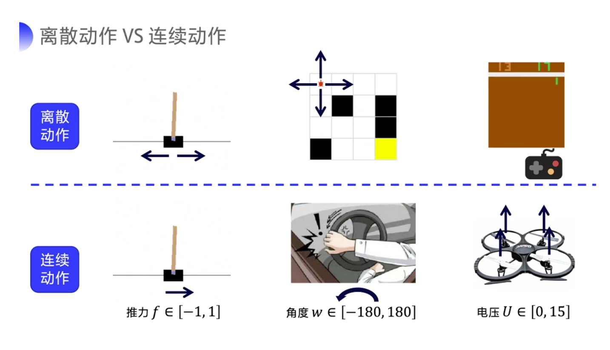
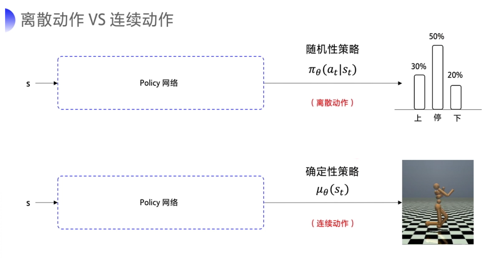
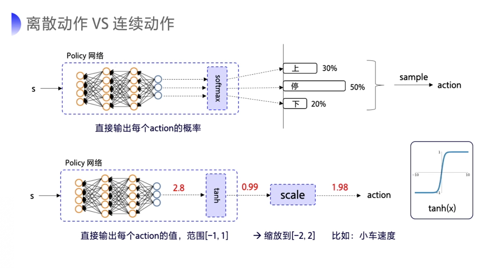
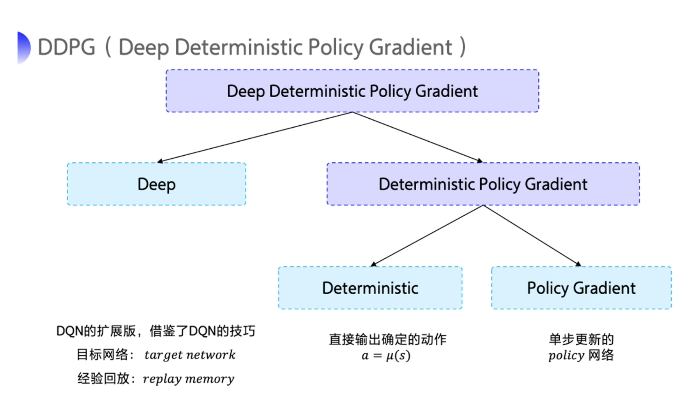
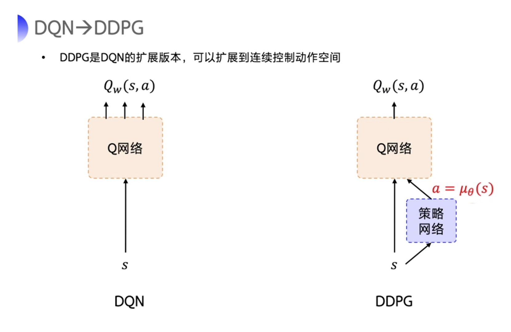
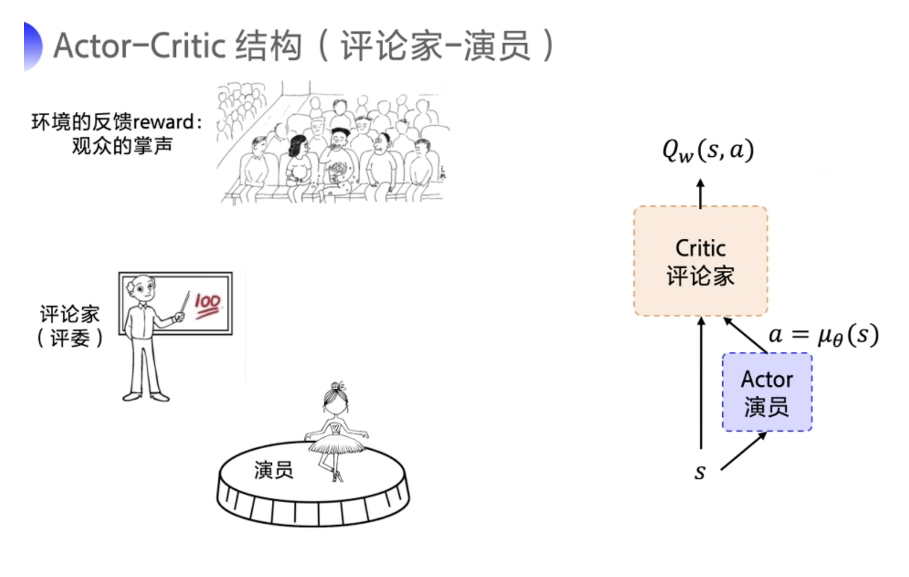
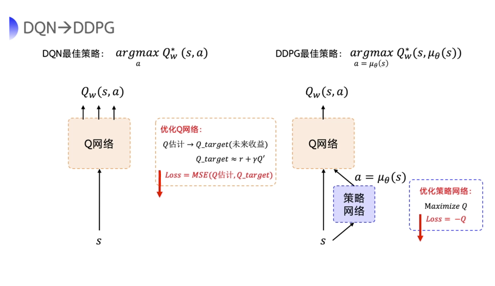
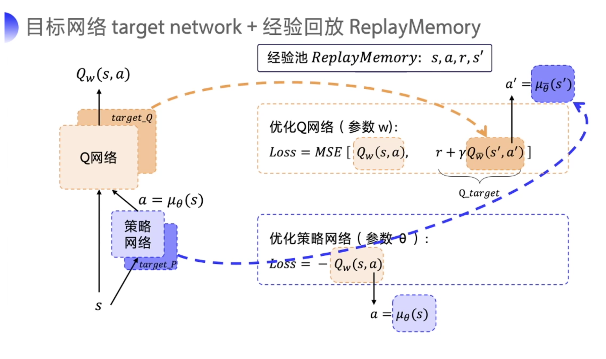

# DDPG

## 离散动作 vs. 连续动作

离散动作与连续动作是相对的概念，一个是可数的，一个是不可数的。 在 CartPole 环境中，可以有向左推小车、向右推小车两个动作。在 Frozen Lake 环境中，小乌龟可以有上下左右四个动作。在 Atari 的 Pong 游戏中，游戏有6个按键的动作可以输出。

但在实际情况中，经常会碰到连续动作空间的情况，也就是输出的动作是不可数的。比如说推小车力的大小， 选择下一时刻方向盘的转动角度或者四轴飞行器的四个螺旋桨给的电压的大小等等。

对于这些连续的动作控制空间，Q-learning、DQN 等算法是没有办法处理的。那我们怎么输出连续的动作呢，这个时候，万能的神经网络又出现了。在上面这个离散动作的场景下，比如说我输出上下或是停止这几个动作。有几个动作，神经网络就输出几个概率值。我们用 $\pi_\theta(a_t|s_t)$ 来表示这个随机性的策略。

然后在连续的动作场景下，比如说我要输出这个机器人手臂弯曲的角度，这样子的一个动作，我们就输出一个具体的浮点数。我们用 $\mu_{\theta}(s_t)$ 来代表这个确定性的策略。

我们再解释一下随机性策略跟确定性策略。

* 对随机性的策略来说，我们输入某一个状态 s，采取某一个 action 的可能性并不是百分之百，而是有一个概率 P 的，就好像抽奖一样，根据概率随机抽取一个动作。
* 而对于确定性的策略来说，它没有概率的影响。当神经网络的参数固定下来了之后，输入同样的state，必然输出同样的 action，这就是确定性的策略。

* 要输出离散动作的话，我们就是加一层 softmax 层来确保说所有的输出是动作概率，而且所有的动作概率加和为 1。
* 要输出连续的动作的话，一般我们可以在输出层这里加一层 tanh。tanh 的图像的像右边这样子，它的作用就是可以把输出限制到 [-1,1] 之间。我们拿到这个输出后，就可以根据实际动作的一个范围再做一下缩放，然后再输出给环境。比如神经网络输出一个浮点数是 2.8，然后经过 tanh 之后，它就可以被限制在 [-1,1] 之间，它输出 0.99。然后假设说小车的一个速度的那个动作范围是 [-2,2] 之间，那我们就按比例从 [-1,1] 扩放到 [-2,2]，0.99 乘 2，最终输出的就是1.98，作为小车的速度或者说推小车的力输出给环境。

## DDPG

在连续控制领域，比较经典的强化学习算法就是 `DDPG(Deep Deterministic Policy Gradient)`。DDPG 的特点可以从它的名字当中拆解出来，拆解成 Deep、Deterministic 和 Policy Gradient。

* Deep 是因为用了神经网络。
* Deterministic 表示 DDPG 输出的是一个确定性的动作，可以用于连续动作的一个环境。

* Policy Gradient 代表的是它用到的是策略网络。REINFORCE 算法每隔一个 episode 就更新一次，但 DDPG 网络是每个 step 都会更新一次 policy 网络，也就是说它是一个单步更新的 policy 网络。

DDPG 是 DQN 的一个扩展的版本。在 DDPG 的训练中，它借鉴了 DQN 的技巧：目标网络和经验回放。经验回放这一块跟 DQN 是一样的。但是 target network 这一块的更新跟 DQN 有点不一样。

提出 DDPG 是为了让 DQN 可以扩展到连续的动作空间，就是我们刚才提到的小车速度、角度和电压的电流量这样的连续值。所以 DDPG 直接在 DQN 基础上加了一个策略网络，就是蓝色的这个，用来直接输出动作值。所以 DDPG 需要一边学习 Q网络，一边学习策略网络。Q网络的参数用 $w$ 来表示。策略网络的参数用 $\theta$ 来表示。我们称这样的结构为 `Actor-Critic` 的结构。

通俗的去解释一下这个 Actor-Critic 的结构，策略网络扮演的就是 actor 的角色，它负责对外展示输出，输出舞蹈动作。Q网络就是评论家(critic)，它会在每一个 step 都对 actor 输出的动作做一个评估，打一个分，估计一下它做一次的 action 未来能有多少收益，也就是去估计这个 actor 输出的这个 action 的 Q值大概是多少，即 $Q_w(s,a)$。 Actor 就需要根据舞台目前的状态来做出一个 action。

评论家就是评委，它需要根据舞台现在的状态和演员输出的 action 这两个值对 actor 刚刚的表现去打一个分数 $Q_w(s,a)$。所以 actor 就是要根据评委的打分来调整自己的策略。也就是更新 actor 的神经网络参数 $\theta$， 争取下次可以做得更好。而 critic 就是要根据观众的反馈，也就是环境的反馈 reward 来调整自己的打分策略，也就是要更新 critic 的神经网络的参数 $w$ ，它的目标是要让每一场表演都获得观众尽可能多的欢呼声跟掌声，也就是要最大化未来的总收益。其实最开始训练的时候，这两个神经网络参数是随机的。所以 critic 最开始是随机打分的，然后 actor 也跟着乱来，就随机表演，随机输出动作。但是由于我们有环境反馈的 reward 存在，所以 critic 的评分会越来越准确，也会评判的那个 actor 的表现会越来越好。既然 actor 是一个神经网络，是我们希望训练好的这个策略网络，那我们就需要计算梯度来去更新优化它里面的参数 $\theta$ 。简单的说，我们希望调整 actor 的网络参数，使得评委打分尽可能得高。注意，这里的 actor 是不管观众的，它只关注评委，它就是迎合评委的打分，打的这个 $Q_w(s,a)$ 而已。

接下来就是类似 DQN。DQN 的最佳策略是想要学出一个很好的 Q网络。 学好这个网络之后，我们希望选取的那个动作使你的 Q值最大。DDPG 的目的也是为了求解让 Q值最大的那个 action。Actor 只是为了迎合评委的打分而已，所以用来优化策略网络的梯度就是要最大化这个 Q 值，所以构造的 loss 函数就是让 Q 取一个负号。我们写代码的时候要做的就是把这个 loss 函数扔到优化器里面，它就会自动最小化 loss，也就是最大化这个 Q。然后这里注意，除了策略网络要做优化，DDPG 还有一个 Q网络也要优化。评委一开始其实也不知道怎么评分，它也是在一步一步的学习当中，慢慢地去给出准确的打分。那我们优化 Q网络的方法其实跟 DQN 优化 Q网络的方法是一模一样的。我们用真实的 reward $r$ 和下一步的 Q 即 Q' 来去拟合未来的收益也就是 Q_target。

然后让 Q网络的输出去逼近这个 Q_target。所以构造的 loss function 就是直接求这两个值的均方差。构造好loss 后，之后我们就扔进去那个优化器，让它自动去最小化 loss 就好了。

那我们把两个网络的 loss function 就可以构造出来。我们可以看到策略网络的 loss function 是一个复合函数。我们把那个 $a = \mu_\theta(s)$ 代进去，最终策略网络要优化的是策略网络的参数  $\theta$ 。

Q 网络要优化的是那个 Q 的输出 $Q_w(s,a)$ 和那个 Q_target 之间的一个均方差。但是 Q网络的优化存在一个和 DQN 一模一样的问题就是它后面的这个 Q_target 是不稳定的。这个在之前的 DQN 有讲过。后面的 $Q_{\bar{w}}\left(s^{\prime}, a^{\prime}\right)$ 也是不稳定的。因为 $Q_{\bar{w}}\left(s^{\prime}, a^{\prime}\right)$ 也是一个预估的值。为了稳定这个 Q_target。DDPG 分别给 Q网络和策略网络都搭建了 target network，专门就是为了用来稳定这个 Q_target。

target Q 网络就为了来计算 Q_target 里面的 $Q_{\bar{w}}\left(s^{\prime}, a^{\prime}\right)$。然后 $Q_{\bar{w}}\left(s^{\prime}, a^{\prime}\right)$  里面的需要的 next action $a'$  就是通过 target_P 网络来去输出，即 $a^{\prime}=\mu_{\bar{\theta}}\left(s^{\prime}\right)$。

为了区分前面的 Q网络和策略网络以及后面的 target_Q 网络和 target_p 策略网络。前面的网络的参数是 $w$，后面的网络的参数是 $\bar{w}$。这就是为什么我们去看一些 DDPG 的文章，会发现 DDPG 会有四个网络。策略网络的 target 网络 和 Q网络的 target 网络就是颜色比较深的这两个。它只是为了让计算 Q_target 的时候能够更稳定一点而已。因为这两个网络也是固定一段时间的参数之后再跟评估网络同步一下最新的参数。

这里面训练需要用到的数据就是 $s,a,r,s'$。我们只需要用到这四个数据，我们就用 Replay Memory 把这些数据存起来，然后再 sample 进来训练就好了。这个经验回放的技巧跟 DQN 是一模一样的。注意，因为 DDPG 使用了经验回放这个技巧，所以 DDPG 是一个 `off-policy` 的算法。这边我们给出 [DDPG 的 PyTorch 实现](https://github.com/datawhalechina/leedeeprl-notes/tree/master/codes/ddpg)。

## Exploration vs. Exploitation
DDPG 通过 off-policy 的方式来训练一个确定性策略。因为策略是确定的，如果 agent 使用同策略来探索，在一开始的时候，它会很可能不会尝试足够多的 action 来找到有用的学习信号。为了让 DDPG 的策略更好地探索，我们在训练的时候给它们的 action 加了噪音。DDPG 的原作者推荐使用时间相关的 [OU noise](https://en.wikipedia.org/wiki/Ornstein–Uhlenbeck_process)，但最近的结果表明不相关的、均值为 0 的 Gaussian noise 的效果非常好。由于后者更简单，因此我们更喜欢使用它。为了便于获得更高质量的训练数据，你可以在训练过程中把噪声变小。

在测试的时候，为了查看策略利用它学到的东西的表现，我们不会在 action 中加噪音。

## References

* [百度强化学习课](https://aistudio.baidu.com/aistudio/education/lessonvideo/460292)

* [OpenAI Spinning Up ](https://spinningup.openai.com/en/latest/algorithms/ddpg.html#)

  

