# 表格型方法

这节课我们通过最简单的`表格型的方法`来讲解如何使用 value-based 方法去求解强化学习。

## Sarsa

### MDP

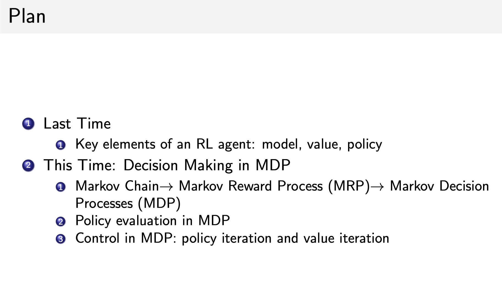

强化学习的三个重要的要素：状态动作和奖励。强化学习智能体跟环境是一步一步交互的，就是我先观察一下状态，然后再输入动作。再观察一下状态，再输出动作，拿到这些 reward 。它是一个跟时间相关的一个序列决策的问题。

举个例子，在 $t-1$ 时刻，我看到了熊对我招手，那我下意识的可能输出的动作就是我赶紧跑路。熊看到了有人跑了，可能就觉得发现猎物，开始发动攻击。而在 $t$ 时刻的话，我如果选择装死的动作，可能熊咬了咬我那个摔了几下就发现就觉得挺无趣的，可能会走开。那这个时候，我再跑路的话可能就跑路成功了，就是大概是这样子的一个序列决策的过程。

当然在输出每一个动作之前，其实你都是可以选择不同的动作。比如说在 $t$ 时刻，我选择跑路的时候，熊已经追上来了，如果说 $t$ 时刻，我没有选择装死，而我是选择跑路的话，这个时候熊已经追上了，那这个时候，其实我有两种情况转移到不同的状态去，就我有一定的概率可以逃跑成功，也有很大的概率我会逃跑失败。那我们就用状态转移概率 $p\left[s_{t+1}, r_{t} \mid s_{t}, a_{t}\right]$ 来表述说在 $s_t$ 的状态选择了 $a_t$ 的动作的时候，转移到 $s_{t+1}$ ，而且拿到  $r_t$ 的概率是多少。

这样子的一个状态转移概率是具有`马尔科夫性质(Markov Property)`的(系统下一时刻的状态仅由当前时刻的状态决定，不依赖于以往任何状态)。因为这个状态转移概率，它是下一时刻的状态是取决于当前的状态，它和之前的 $s_{t-1}$ 和 $s_{t-2}$  都没有什么关系。然后再加上说这个过程也取决于智能体跟环境交互的这个$a_t$ ，所以有一个决策的一个过程在里面。我们就称这样的一个过程为`马尔可夫决策过程(MDP)`。

MDP 就是序列决策这样一个经典的表达方式。MDP 也是强化学习里面一个非常基本的学习框架。状态、动作、奖励和状态转移概率(S，A，P，R)，这四个合集就构成了强化学习 MDP 的四元组，后面也可能会再加个衰减因子构成五元组。

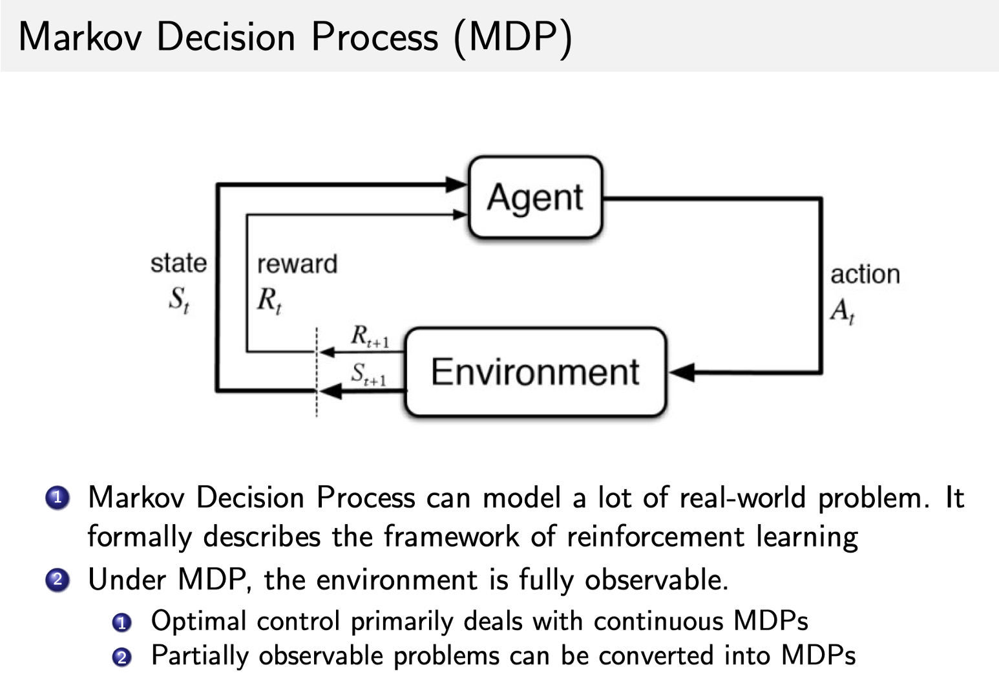

我们把这些可能的动作和可能的状态转移的关系画成这样子的一个树状图。它们之间的关系就是一个从 $s_t$ 到 $a_t$ ，再到 $s_{t+1}$ ，再到 $a_{t+1}$，再到 $s_{t+2}$ 这样子的一个过程。

我们去跟环境交互，我们只能走完整的一条通路。这里面产生了一系列的一个决策的过程，就是我们跟环境交互产生了一个经验。然后我们会使用 P 函数和 R 函数来去描述环境。P 函数就是状态转移的概率，R 函数就是 Reward function。P 函数实际上反映的是环境的一个随机性。比方说，在熊发怒的情况下，我如果选择装死，假设熊看到人装死就一定会走的话，我们就称在这里面的这个状态转移概率就是百分之百。但如果说在熊发怒的情况下，我选择跑路而导致说我有可能跑成功以及跑失败，出现这两种情况。那我们就可以用概率去表达一下说转移到其中一种情况的概率大概 10%，另外一种情况的概率大概是 90% 会跑失败。**如果我们知道这些状态转移概率和奖励函数的话，我们就说这个环境是已知的，因为我们是用这两个函数去描述环境的。**如果是已知的话，我们其实可以用动态规划去计算说，我如果要逃脱熊，那么能够逃脱熊概率最大的最优策略是什么。很多强化学习的经典的算法都是 model-free 的，就是环境是未知的这样子的一个情况下，我们强化学习怎么去解决。

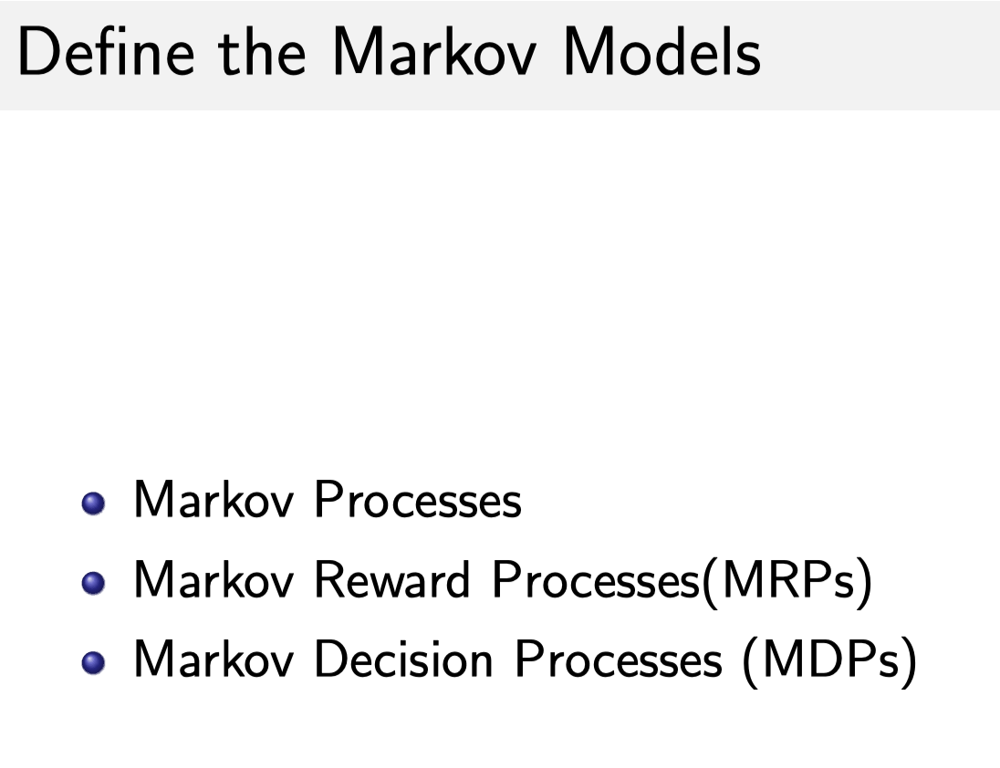
因为现实世界中人类第一次遇到熊之前，我们根本不知道我们能不能跑得过熊。所以刚刚那个10%、90%的概率也就是虚构出来的概率，熊到底在什么时候会往什么方向去转变的话，我们经常是不知道的。我们是处在一个未知的环境里的，也就是这一系列的决策的 P 函数和 R 函数是未知的。这就是 model-based 跟 model-free 的一个最大的区别。强化学习就是可以用来解决用完全未知的和随机的环境。

强化学习要像人类一样去学习了，人类学习的话就是一条路一条路的去尝试一下，先走一条路，我看看结果到底是什么。多试几次，只要能活命的，我们其实可以慢慢的了解哪个状态会更好。我们用价值函数 $V(s)$ 来代表这个状态是好的还是坏的。然后用这个 Q 函数来判断说在什么状态下做什么动作能够拿到最大奖励，我们用 Q 函数来表示这个状态-动作值。

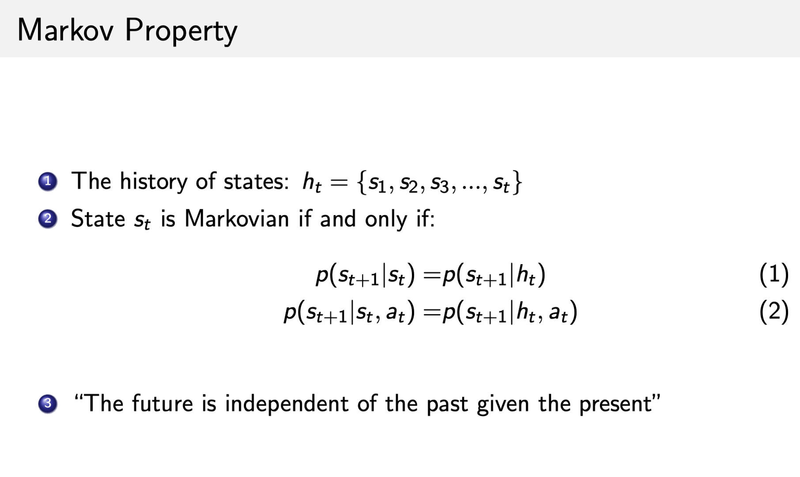

接下来就会介绍 Q 函数。在经过多次尝试和那个熊打交道之后，人类就可以对熊的不同的状态去做出判断，我们可以用状态动作价值的来表达说在某个状态下，为什么动作 1 会比动作 2 好。因为动作 1 的价值比动作 2 要高。这个价值就叫 Q 函数。如果说这个 Q 表格是一张已经训练好的表格的话，那这一张表格就像是我们的一本生活手册。我们就知道在熊发怒的时候，装死的价值会高一点。在熊离开的时候，我们可能偷偷逃跑的会比较容易获救。这张表格里面 Q 函数的物理意义就是我选择了这个动作之后我最后面能不能成功，就是我需要去计算我在这个状态下，我选择了这个动作，后续能够一共拿到多少总收益。如果我可以预估未来的总收益的大小，我们当然知道在当前的这个状态下选择哪个动作，价值更高。我选择某个动作是因为我未来一共可以拿到的那个价值会更高一点。所以强化学习它的目标导向性很强，环境给了这个 reward 是一个非常重要的反馈，它就是根据环境的 reward 的反馈来去做选择。

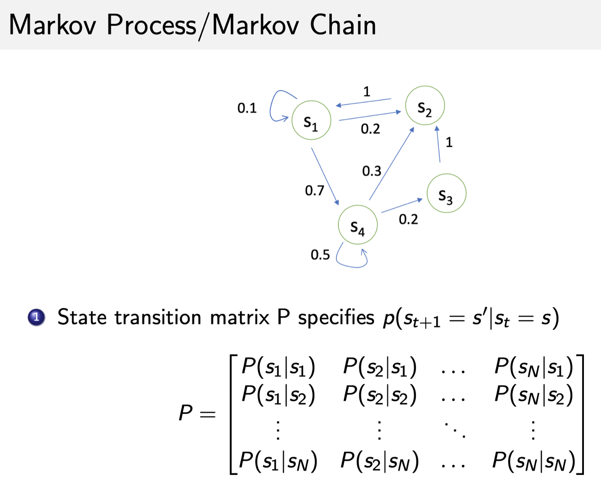未来的总收益是一个什么样的概念，为什么可以用这个来评价当前这个动作是好是坏。举个例子，假设说一辆车在路上，当前是红灯，我们直接走的那个收益就很低，因为违反交通规则，这是就是当前的单步收益。可是如果我们这是一辆救护车，我们正在运送病人，把病人快速送达医院的收益非常的高，而且越快你的收益越大。很可能是我们这个时候应该要闯红灯，因为未来的远期收益太高了。这也是为什么说强化学习需要去学习远期的收益，因为现实世界当中这个奖励往往是延迟的，是有delay 的。

所以我们一般会从当前状态开始，后续有可能会收到所有收益加起来计算。当前动作的 Q 的价值，让 Q 的价值可以真正的代表当前这个状态动作的真正的价值。

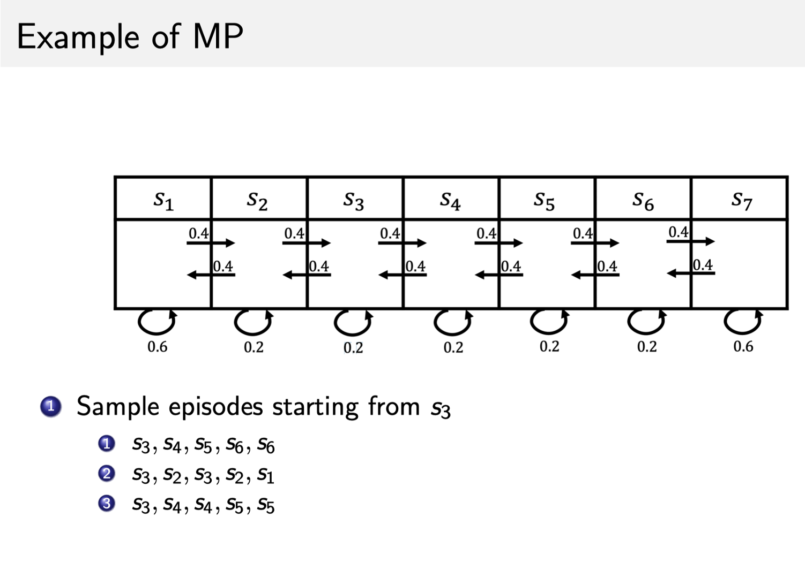

但是有的时候你目光放的太长远不好，因为如果说事情很快就结束的话，你考虑到最后一步的收益无可厚非，可是如果说是一个持续的没有尽头的任务，你单纯的把所有未来的收益全部相加，作为当前的状态价值就很不合理。股票的例子就很典型了，我们要关注的是累积的收益。可是如果说十年之后才有一次大涨大跌，你要把十年后的收益也作为当前动作的考虑因素，显然我们不会这么做。那我们会怎么办呢，就有句俗话说得好，就对远一点的东西呢，我们就当做近视就不需要看得太清楚，我们就可以适当引入这个衰减因子 $\gamma$ 来去计算这个未来总收益。$\gamma \in [0,1]$ 。越往后 $\gamma^n$ 就会越小，也就是说越后面的收益对当前价值的影响就会越小。

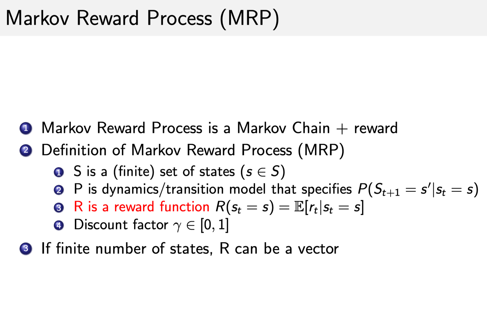

举个具体的例子来看看这些计算出来的是什么效果。这是一个悬崖问题。这个问题是需要智能体从出发点 S 出发，然后到达目的地 G，同时避免掉进悬崖(cliff)，掉进悬崖的话就会有负一百分的惩罚，但游戏不会结束，它会被直接拖回起点，游戏继续。为了到达目的地的话，我们可以沿着蓝线和红线走。

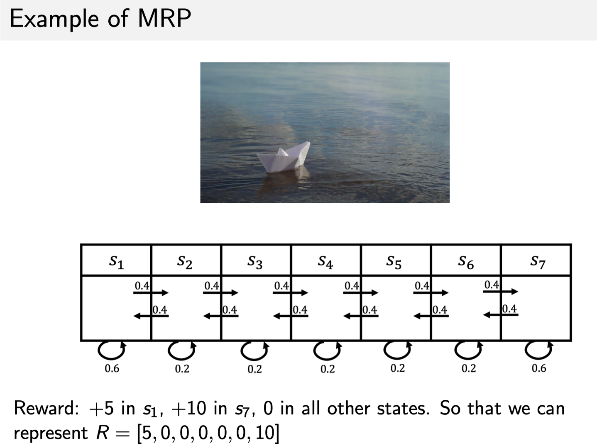

在这个环境当中，我们去怎么去计算状态动作价值，就是未来的总收益的话。假设我走一条路，然后这条路的话，我从这个状态出发，在这里选择是向上，这里选择向右，选择向右。

如果 $\gamma = 0$，然后用这个公式去计算的话，它相当于考虑的就是一个单步的收益。我们可以认为它是一个目光短浅的一个计算的方法。

但 $\gamma = 1$ 的话，那就等于是说把后续所有的收益可能都全部加起来。在这里悬崖问题，你每走一步都会拿到一个 -1 分的 reward。只有到了终点之后，它才会停止。如果说 $\gamma =1 $的话，我们用这个公式去计算，就这里是 -1。然后这里的话，未来的总收益就是 $-1+-1=-2$ 。

如果让 $\gamma = 0.6$ 的话，就是目光没有放得那么的长远，计算出来是这个样子的。

利用 $G_{t}=R_{t+1}+\gamma G_{t+1}$ 这个公式从后往前推。
$$
\begin{array}{l}
G_{7}=R+\gamma G_{8}=-1+0.6 *(-2.176)=-2.3056 \approx-2.3 \\
G_{8}=R+\gamma G_{9}=-1+0.6 *(-1.96)=-2.176 \approx-2.18 \\
G_{9}=R+\gamma G_{10}=-1+0.6 *(-1.6)=-1.96 \\
G_{10}=R+\gamma G_{11}=-1+0.6 *(-1)=-1.6 \\
G_{12}=R+\gamma G_{13}=-1+0.6 * 0=-1 \\
G_{13}=0
\end{array}
$$

这里的计算是我们选择了一条路，走完这条路径上每一个状态动作的价值，我们可以看一下右下角这个图，如果说我走的不是这条路，我走的是这一条路，那我算出来那个状态动作价值的 Q 值可能是这样。那我们就知道，当小乌龟在 -12 这个点的时候，往右边走是 -11，往上走是 -15。它自然就知道往右走的价值更大，小乌龟就会往右走

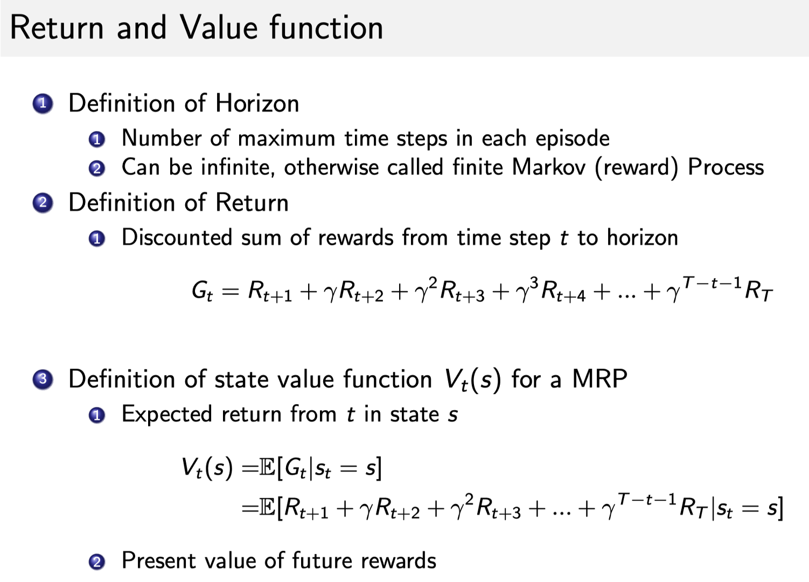
最后我们要求解的就是类似于这样子的一张 Q 表格。就是它的行数是所有的状态数量，一般可以用坐标来表示表示格子的状态，也可以用 1、2、3、4、5、6、7 来表示不同的位置。Q 表格一共四列的话就代表说是上下左右四个动作。最开始这张 Q 表格会全部初始化为零，然后在 agent 不断地去和环境交互得到不同的轨迹，当交互的次数足够多的时候，我们就可以估算出每一个状态下，每个行动的平均总收益去更新这个 Q  表格。怎么去更新 Q 表格就是我们接下来要引入的强化学习的强化概念。

强化概念的就是我们可以用下一个状态的价值来更新当前状态的价值。其实就是强化学习里面有一个bootstrap(自助)的概念。在强化学习里面，你可以每走一步更新一下 Q 表格，然后用下一个状态的 Q 值来更新这个状态的 Q 值。

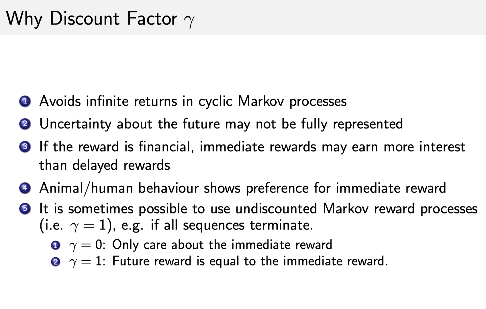

这种单步更新的方法叫做`时序差分`的更新方法。为了让大家更好理解强化学习里面时序差分的这种更新方法。我这里就找了一下它的的物理意义。我们先理解一下巴普洛夫的条件反射实验了。这个实验讲的是什么呢？就是小狗对盆里面的食物，它会产生无条件刺激分泌唾液。一开始小狗对于铃声这种中性刺激是没有反应的。可是我们把这个铃声和这个食物结合起来，每次先给它响一下铃，再给它喂食物。多次重复之后，当铃声响起的时候，小狗也会开始流口水。盆里的肉可以认为是强化学习里面最后面的那个延迟的 reward。声音的刺激可以认为是有 reward 的那个状态之前的一个状态。多次重复实验之后，最后的这个 reward 会强化小狗对于这个声音的条件反射，它会让小狗知道说这个声音代表着有食物，这个声音对于小狗来说也就有了价值，它听到这个声音也会也会流口水。

巴普洛夫效应揭示的是中性刺激(铃声)跟无条件刺激(食物)紧紧挨着反复出现的时候，条件刺激也可以引起无条件刺激引起的唾液分泌，然后形成这个条件刺激。这种中性刺激跟无条件刺激在时间上面的结合，我们就称之为强化。 强化的次数越多，条件反射就会越巩固。小狗原本不觉得铃声有价值的，经过强化之后，小狗就会慢慢地意识到铃声也是有价值的，它可能带来带来食物。更重要是一种条件反射巩固之后，我们再用另外一种新的刺激和条件反射去结合，还可以形成第二级条件反射，同样还可以形成第三级条件反射。在人的身上是可以建立多级的条件反射的。举个例子，比如说一般我们遇到熊都是这样一个顺序，看到树上有熊瓜，然后看到熊之后，突然熊发怒，扑过来了。经历这个过程之后，我们可能最开始看到熊才会瑟瑟发抖，后面就是看到树上有熊爪就已经有害怕的感觉了。也就说在不断的重复试验之后，下一个状态的价值，它是可以不断地去强化影响上一个状态的价值的。

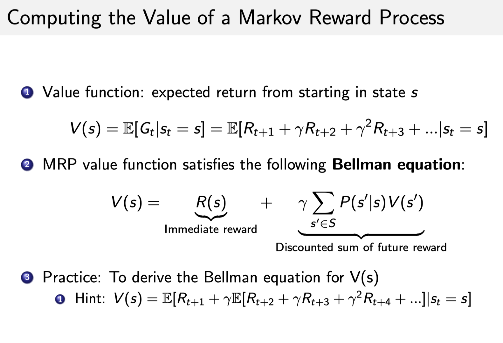

为了让大家更加直观感受下一个状态影响上一个状态效果，这里推荐那个斯坦福大学的一个网站：[Temporal Difference Learning Gridworld Demo](https://cs.stanford.edu/people/karpathy/reinforcejs/gridworld_td.html)。这个网站模拟了就是这种单步更新的过程中，所有格子的一个状态价值的变化过程。我们可以看到格子里面有几个 -1的 reward。只有一个 +1 reward 的那个格子。

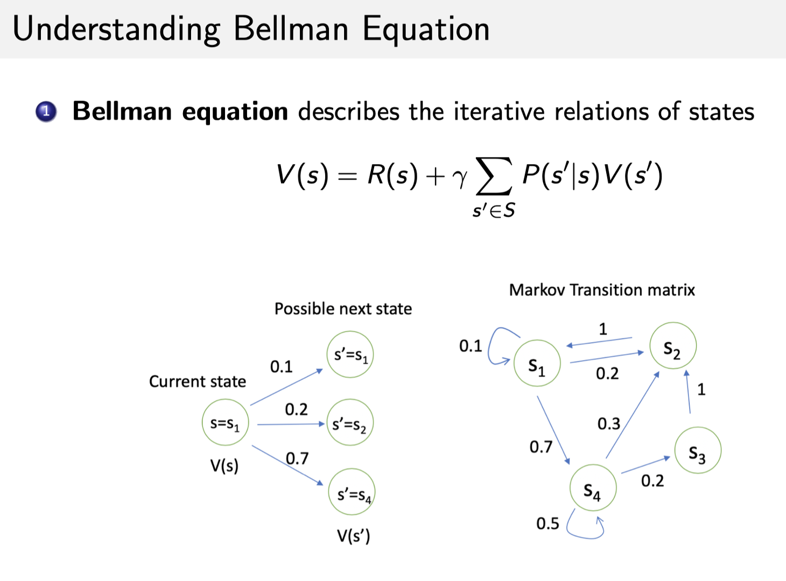

玩起来是这样的，先初始化一下，然后开始时序差分的更新过程，训练的过程你会看到这个小黄球不断的在试错。但探索当中会先迅速地发现有 reward 的地方。最开始的时候，只是这些有 reward 的格子 才有价值，当不断的重复走这些路线的时候，这些有价值的格子，它可以去慢慢的影响它附近的格子的价值。反复训练之后，有 reward 的这些格子周围的格子的状态就会慢慢的被强化，然后强化就是当它收敛到最后一个最优的状态了，就是把这些价值最终收敛到一个最优的情况之后，那个小黄球就会自动地知道，就是我一直往价值高的地方走，我就能够走到能够拿到 reward 的地方。

### Temporal Difference

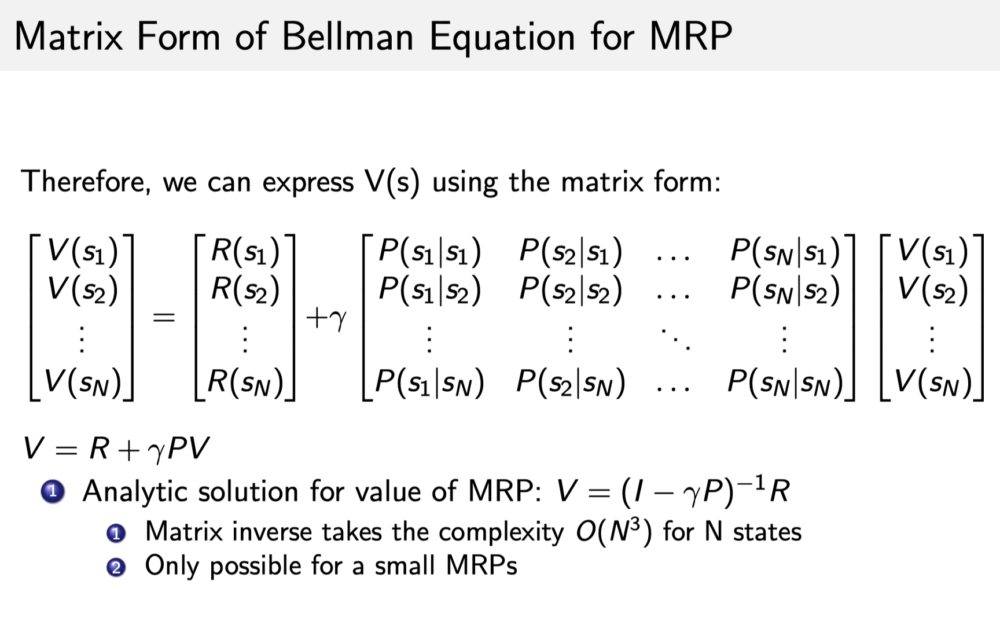

这种强化方式其实在数学上面一行公式就表达出来了。这种更新的方式叫做`时序差分`的一个更新的方式。这个公式它想要表达就是我可以拿下一步的 Q 值 $Q(S_{t+_1},A_{t+1})$ 来更新我这一步的 Q 值 $Q(S_t,A_t)$ 。

为了理解这个公式，如图所示，我们先把这一块当作是一个目标值，就是 $Q(S_t,A_t)$ 想要去逼近的一个目标值。我们想要计算的就是这个 $Q(S_t,A_t)$ 。因为最开始Q值都是随机初始化，或者是初始化为零。它需要不断的去逼近它理想中真实的Q 值，我们就叫 target 。Target 就是未来收益的总和大概是有多少，而且是带衰减的那个。

我们用 $G_t$ 来表示未来收益总和(return)，我们对 return 做一下简单的数学变化，然后我们可以知道 
$$
G_t = R_{t+1}+ \gamma G_{t+1}
$$

也就是说，我们拿 $Q(S_t,A_t)$ 来逼近这个 $G_t$ , 那 $Q(S_{t+1},A_{t+1})$ 其实就是近似这个 $G_{t+1}$ ，那我们可以把 $G_{t+1}$  放到这个目标值这里。$Q(S_t,A_t)$  就是要逼近这个目标值，怎么去逼近了。我们用软更新的方式。

软更新的方式就是 $\alpha$ ，每次我只更新一点点。这个 $\alpha$ 有点类似于像学习率一样的东西。最终的话，Q 值都是可以慢慢地逼近到真实的 target 值的。这样我们的更新公式只需要用到当前时刻的 $S_{t},A_t$  ，然后还有拿到的 $R_{t+1}, S_{t+1}，A_{t+1}$ 。

该算法由于每次更新值函数需要知道前一步的状态(state)，前一步的动作(action)、奖励(reward)、当前状态(state)、将要执行的动作(action)，即 $(S_{t}, A_{t}, R_{t+1}, S_{t+1}, A_{t+1})$ 这几个值 ，由此得名 `Sarsa` 算法。因为它走了一步之后，拿到了 $(S_{t}, A_{t}, R_{t+1}, S_{t+1}, A_{t+1})$ 之后，就可以做一次更新。

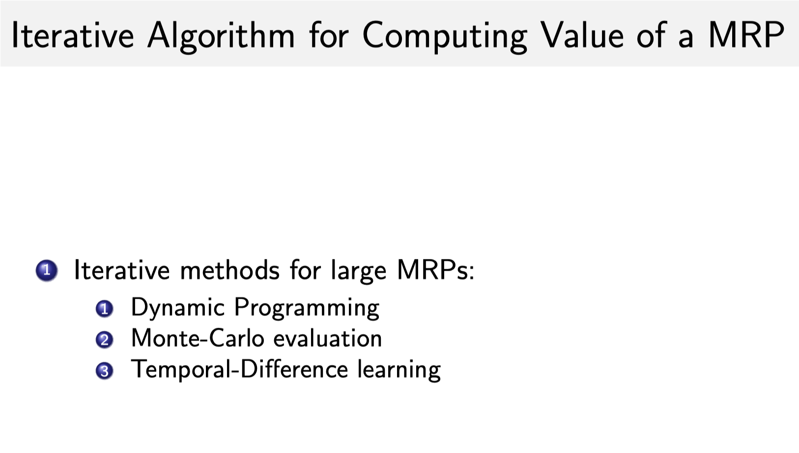

我们看看用代码去怎么去实现。了解单步更新的一个基本公式之后，代码实现就很简单了。这个是环境，这个是 agent 。我们每次跟环境交互一次之后呢，就可以 learn 一下。我们向环境输出 action，

然后从环境当中拿到那 state 和 reward。Agent 主要实现两个方法，一个就是根据 Q 表格去选择动作，输出 action。另外一个就是拿到 $(S_{t}, A_{t}, R_{t+1}, S_{t+1}, A_{t+1})$  这几个值去更新我们的 Q 表格。

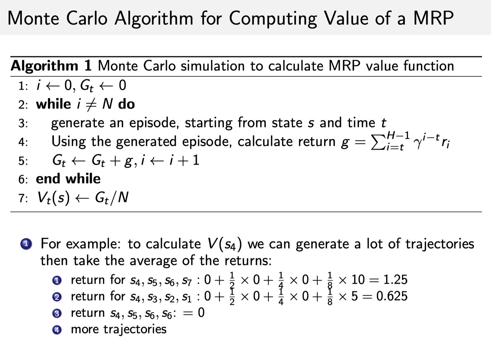我们直接看这个框框里面的更新公式， 和之前的公式是一模一样的。$S'$ 就是 $S_{t+1}$ 。我们就是拿下一步的 Q 值来更新这一步的 Q 值，不断地强化每一个 Q。
## Sarsa(λ) 

Sarsa 属于单步更新法，也就是说每执行一个动作，就会更新一次价值和策略。如果不进行单步更新，而是采取 $n$ 步更新或者回合更新，即在执行 $n$ 步之后再来更新价值和策略，这样就得到了 $n$ 步 Sarsa。具体来说，对于 Sarsa，在 $t$ 时刻其价值的计算公式为
$$
q_{t}=r_{t}+\gamma Q\left(s_{t+1}, a_{t+1}\right)
$$
而对于 $n$ 步 Sarsa，它的 $n$ 步 Q 收获为
$$
q_{t}^{(n)}=r_{t}+\gamma r_{t+1}+\cdots+\gamma^{n-1} r_{t+n-1}+\gamma^{n} Q\left(s_{t+n}, a_{t+n}\right)
$$
如果给 $q_t^{(n)}$ 加上衰减因子 $\lambda$ 并进行求和，即可得到 Sarsa($\lambda$) 的 Q 收获：
$$
q_{t}^{\lambda}=(1-\lambda) \sum_{n=1}^{\infty} \lambda^{n-1} q_{t}^{(n)}
$$
因此，$n$ 步 Sarsa($\lambda$)的更新策略可以表示为
$$
Q\left(s_{t}, a_{t}\right) \leftarrow Q\left(s_{t}, a_{t}\right)+\alpha\left(q_{t}^{\lambda}-Q\left(s_{t}, a_{t}\right)\right)
$$
总的来说，Sarsa 和 Sarsa($\lambda$) 的差别主要体现在价值的更新上。

## Q-learning

Sarsa 是一种 on-policy 策略。Sarsa 优化的是它实际执行的策略。它直接拿下一步，我一定会执行的 action 来去优化我的 Q 表格，所以 on-policy 在学习的过程中，只存在一种策略，它用一种策略去做 action 的选取，也用一种策略去做优化。所以 Sarsa 知道它下一步的动作有可能会跑到悬崖那边去，所以它就会在优化它自己的策略的时候，它会尽可能的离悬崖远一点哦。那这样子就会保证说，它下一步哪怕是有随机动作，它也还是在安全区域内。

而 off-policy 在学习的过程中，保留了两种不同的策略。第一个策略是我们希望学到一个最佳的目标策略，另外一个策略是探索环境的策略。它可以大胆地去探索到所有可能的轨迹，然后喂给这个目标策略去学习。而且喂给目标策略的数据中并不需要 $a_{t+1}$ 。注意，Sarsa 是有 $a_{t+1}$ 的。它喂给目标策略的数据不需要 $a_{t+1}$，比如说目标策略优化时候，它才不管你下一步去往哪里探索，会不会掉悬崖，我就只选我收益最大一个最优的策略。探索环境的策略，我们叫做 `behavior policy`，它像是一个战士，可以在环境里面探索所有的动作和轨迹和经验。然后把这些经验的交给目标策略去学习。目标策略就像是在后方指挥战术的一个军师，它可以根据自己的经验来学习最优的策略，它不需要去和环境交互。

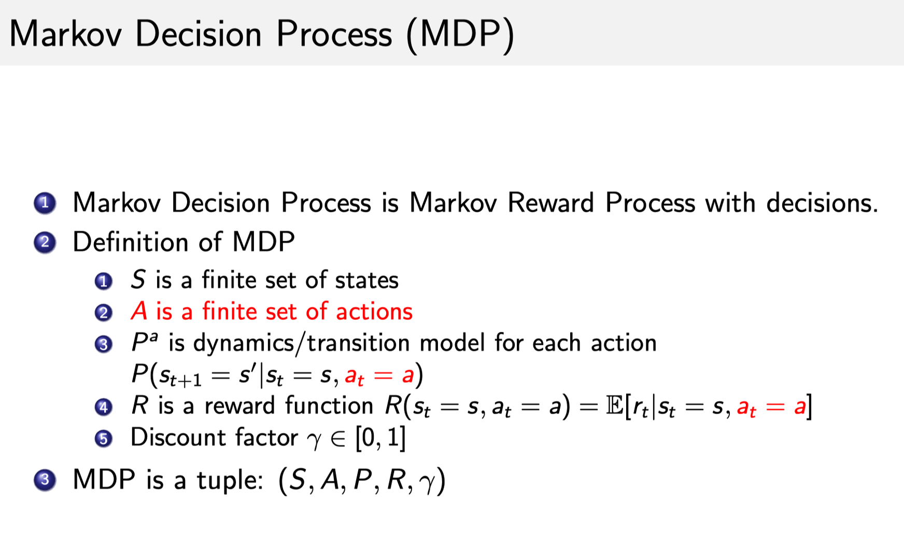

 我们通过对比的方式来去理解 `Q-learning`。Q-learning 是 off-policy 的时序差分学习方法，Sarsa 是 on-policy 的时序差分学习方法。

* Sarsa 在更新 Q 表格的时候，它用到的 A' 。我要获取下一个 Q 值的时候，A' 是下一个 step 一定会执行的 action 。这个 action 有可能是 $\varepsilon$-greddy 方法 sample 出来的值，也有可能是 max Q 对应的 action，也有可能是随机动作。但是就是它实实在在执行了的那个动作。

* 但是 Q-learning 在更新 Q 表格的时候，它用到这个的 Q 值 $Q(S',a')$ 对应的那个 action ，它不一定是下一个 step 会执行的实际的 action，因为你下一个实际会执行的那个 action 可能会探索。Q-learning 默认的 action 不是通过 behavior policy 来选取的，它是默认 A' 为最优策略选的动作，所以 Q-learning 在学习的时候，不需要传入 A'，即 $a_{t+1}$  的值。

在Q-learning 中，Q函数的估计方法为
$$
Q(s, a) \leftarrow Q(s, a)+\alpha\left(r+\gamma \max _{a^{\prime}} Q\left(s^{\prime}, a^{\prime}\right)-Q(s, a)\right)
$$
相当于让 $Q(s,a)$ 直接去估计最优状态值函数 $Q^*(s,a)$。

> 事实上，Q-learning 算法被提出的时间更早，Sarsa 算法是 Q-learning 算法的改进。

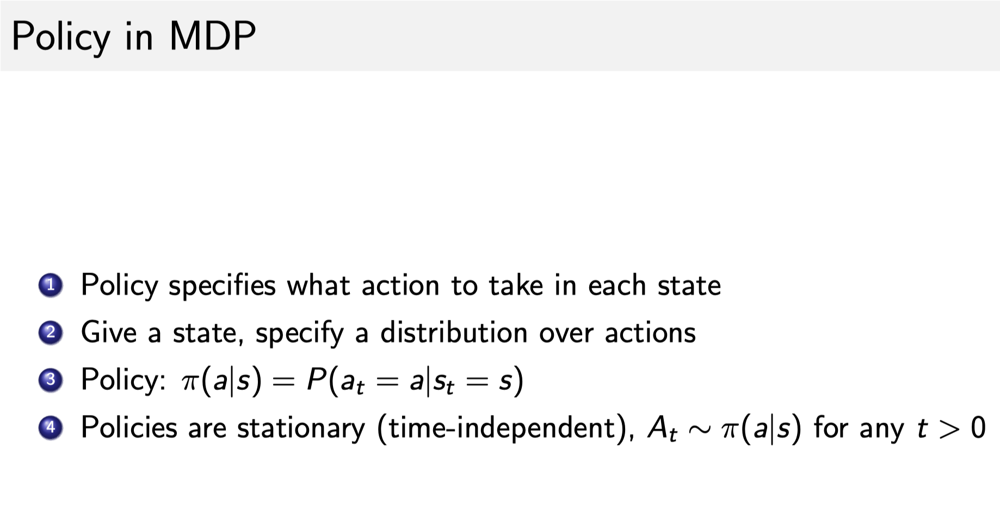

我们再仔细地对比一下两个更新公式，它们俩的更新公式都是一样的。区别只在 target 计算的这一部分。Sarsa 是 $R_{t+1}+\gamma Q(S_{t+1}, A_{t+1})$  ，Q-learning 是$R_{t+1}+\gamma  \underset{a}{\max} Q\left(S_{t+1}, a\right)$ 。

Sarsa 实际上都是用自己的策略产生了 S,A,R,S',A' 这一条轨迹。然后拿着 $Q(S_{t+1},A_{t+1})$ 去更新原本的Q值 $Q(S_t,A_t)$。 但是 Q-learning 并不需要知道，我实际上选择哪一个 action ，它默认下一个动作就是 Q 最大的那个动作。所以它知道实际上 behavior policy 可能会有 10% 的概率去选择别的动作，但是 Q-learning 并不担心受到探索的影响，它默认了就按照最优的策略来去优化我的目标策略，所以它可以更大胆地去寻找最优的路径，它其实会表现的比 Sarsa 大胆非常多。

然后Q-learning 的这个逐步的一个拆解的话，跟Sarsa 唯一一点不一样就是我并不需要提前知道我 $A_2$ ，我就能更新 $Q(S_1,A_1)$ 。在训练一个 episode 这个流程图当中，Q-leanring 在 learn 之前它也不需要去拿到 next action A'，它只需要前面四个 $(S,A,R,S')$也就可以了。这一点就是跟 Sarsa 有一个很明显的区别。

### Q-function Bellman Equation

记策略 $\pi $ 的状态-动作值函数为 $Q^{\pi}(s_t,a_t)$，它表示在状态 $s_t$ 下，执行动作 $a_t$ 会带来的累积奖励 $G_t$ 的期望，具体公式为：
$$
\begin{aligned} Q ^ { \pi } \left( s _ { t } , a _ { t } \right) & = \mathbb { E } \left[ G _ { t } \mid s _ { t } , a _ { t } \right] \\ & = \mathbb { E } \left[ r _ { t } + \gamma r _ { t + 1 } + \gamma ^ { 2 } r _ { t + 2 } + \cdots \mid s _ { t } , a _ { t } \right] \\ & = \mathbb { E } \left[ r _ { t } + \gamma \left( r _ { t + 1 } + \gamma r _ { t + 2 } + \cdots \right) \mid s _ { t } , a _ { t } \right]  
\\ & =\mathbb { E } [ r _ { t }|s_t,a_t] + \gamma \mathbb{E}[r_{t+1}+ \gamma r_{t+2}+\cdots|s_t,a_t] \\
& = \mathbb{E}[ r _ { t }|s_t,a_t]+ \gamma \mathbb{E}[G_{t+1}|s_t,a_t]
\\ &= \mathbb { E } \left[ r _ { t } + \gamma Q ^ { \pi } \left( s _ { t + 1 } , a _ { t + 1 } \right) \mid s _ { t } , a _ { t } \right] \end{aligned}
$$
上式是 MDP 中 Q-function 的 Bellman 方程的基本形式。累积奖励 $G_t$ 的计算，不仅考虑当下 $t$  时刻的动作 $a_t$  的奖励 $r_t$，还会累积计算对之后決策带来的影响（公式中的 $\gamma$ 是后续奖励的衰减因子）。从上式可以看出，当前状态的动作价值 $Q^{\pi}(s_t,a_t)$ ，与当前动作的奖励 $r_t$  以及下一状态的动作价值 $Q^{\pi}(s_{t+1},a_{t+1})$ 有关，因此，状态-动作值函数的计算可以通过动态规划算法来实现。

>Bellman Equation 就是当前状态与未来状态的迭代关系，表示当前状态的值函数可以通过下个状态的值函数来计算。Bellman Equation 因其提出者、动态规划创始人 Richard Bellman 而得名 ，也 叫作“动态规划方程”。

从另一方面考虑，在计算 $t$ 时刻的动作价值  $Q^{\pi}(s_t,a_t)$ 时，需要知道在 $t$、$t+1$、$t+2 \cdots \cdots$ 时刻的奖励，这样就不仅需要知道某一状态的所有可能出现的后续状态以及对应的奖励值，还要进行全宽度的回溯来更新状态的价值。这种方法无法在状态转移函数未知或者大规模问题中使用。因此，Q- learning 采用了浅层的时序差分采样学习，在计算累积奖励时，基于当前策略 $\pi$  预测接下来发生的 $n$ 步动作（$n$ 可以取 1 到 $+\infty$）并计算其奖励值。

具体来说，假设在状态 $s_t$ 下选择了动作 $a_t$，并得到了奖励 $r_t$ ，此时状态转移到 $s_{t+1}$，如果在此状态下根据同样的策略选择了动作 $a_{t+1}$ ，则 $Q^{\pi}(s_t,a_t)$ 可以表示为
$$
Q^{\pi}\left(s_{t}, a_{t}\right)=\mathbb{E}_{s_{t+1}, a_{t+1}}\left[r_{t}+\gamma Q^{\pi}\left(s_{t+1}, a_{t+1}\right) \mid s_{t}, a_{t}\right]
$$

Q-learning 算法在使用过程中，可以根据获得的累积奖励来选择策略，累积奖励的期望值越高，价值也就越大，智能体越倾向于选择这个动作。因此，最优策略 $\pi^*$ 对应的状态-动作值函数 $Q^*(s_t,a_t)$ 满足如下关系式：

$$
Q^{*}\left(s_{t}, a_{t}\right)=\max _{\pi} Q^{\pi}\left(s_{t}, a_{t}\right)=\mathbb{E}_{s_{t+1}}\left[r_{t}+\gamma \max _{a_{t+1}} Q\left(s_{t+1}, a_{t+1}\right) \mid s_{t}, a_{t}\right]
$$

Q-learning 算法在学习过程中会不断地更新 Q 值，但它并没有直接采用上式中的项进行更新，而是采用类似于梯度下降法的更新方式，即状态  $s_t$ 下的动作价值 $Q^*(s_t,a_t)$ 会朝着状态 $s_{t+1}$ 下的动作价值  $r_{t}+\gamma \max _{a_{t+1}} Q^{*}\left(s_{t+1}, a_{t+1}\right)$ 做一定比例的更新：
$$
\begin{aligned}
Q^{*}\left(s_{t}, a_{t}\right) \leftarrow Q^{*}\left(s_{t}, a_{t}\right)+\alpha\left(r_{t}+\gamma \max _{a_{t+1}} Q^{*}\left(s_{t+1}, a_{t+1}\right)-Q^{*}\left(s_{t}, a_{t}\right)\right)
\end{aligned}
$$
其中 $\alpha$ 是更新比例(学习速率)。这种渐进式的更新方式，可以减少策略估计造成的影响，并且最终会收敛至最优策略。

下面我讲一下 on-policy 和 off-policy 的区别。

Sarsa 就是一个典型的 on-policy 策略，它只用一个 $\pi$ ，为了兼顾探索和利用，所以它训练的时候会显得有一点点胆小怕事。它在解决悬崖问题的时候，会尽可能地离悬崖边上远远的，确保说哪怕自己不小心探索了一点了，也还是在安全区域内不不至于跳进悬崖。Q-learning 是一个比较典型的 off-policy 的策略，它有目标策略 target policy，一般用 $\pi$ 来表示。然后还有行为策略 behavior policy，用 $\mu$ 来表示。它分离了目标策略跟行为策略。Q-learning 就可以大胆的用 behavior policy 去探索得到的经验轨迹来去优化我的目标策略。这样子我更有可能去探索到最优的策略。

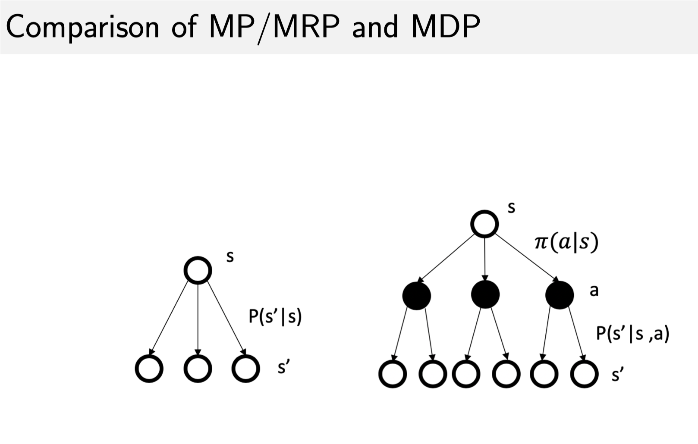

总结如上图所示。

## References

* [百面深度学习](https://book.douban.com/subject/35043939/)

