# Q-learning

## Q-learning

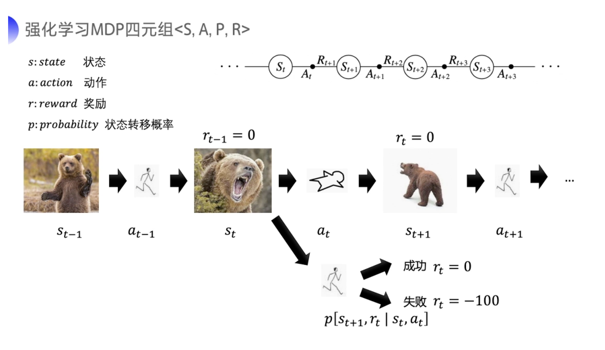

Q-learning 是 `value-based` 的方法。在 value based 的方法里面，我们 learn 的不是 policy，我们要 learn 的是一个 `critic`。Critic 并不直接采取行为，它想要做的事情是评价现在的行为有多好或是有多不好。假设有一个 actor $\pi$ ，critic 的工作就是来评价这个 actor 的 policy $\pi$  好还是不好，即 `Policy Evaluation(策略评估)`。

举例来说，有一种 critic 叫做 `state value function`。State value function 的意思就是说，假设 actor 叫做 $\pi$，拿 $\pi$  跟环境去做互动。假设 $\pi$  看到了某一个state s，如果在玩 Atari 游戏的话，state s 是某一个画面，看到某一个画面的时候，接下来一直玩到游戏结束，累积的 reward 的期望值有多大。所以 $V^{\pi}$ 是一个function，这个 function input 一个 state，然后它会 output 一个 scalar。这个 scalar 代表说，$\pi$ 这个 actor 看到 state s 的时候，接下来预期到游戏结束的时候，它可以得到多大的 value。

举个例子，假设你是玩 space invader 的话，

* 左边这个 state s，这一个游戏画面，你的 $V^{\pi}(s)$  也许会很大，因为还有很多的怪可以杀， 所以你会得到很大的分数。一直到游戏结束的时候，你仍然有很多的分数可以吃。
* 右边那个case，也许你得到的 $V^{\pi}(s)$ 就很小，因为剩下的怪也不多了，并且红色的防护罩已经消失了，所以可能很快就会死掉。所以接下来得到预期的 reward，就不会太大。

这边需要强调的一个点是说，当你在讲这一个 critic 的时候，critic 都是绑一个 actor 的，critic 没有办法去凭空去 evaluate 一个 state 的好坏，它所 evaluate 的东西是在给定某一个 state 的时候， 假设接下来互动的 actor 是 $\pi$，那我会得到多少 reward。因为就算是给同样的 state，你接下来的 $\pi$ 不一样，你得到的 reward 也是不一样的。举例来说，在左边那个case，虽然假设是一个正常的 $\pi$，它可以杀很多怪，那假设他是一个很弱的 $\pi$，它就站在原地不动，然后马上就被射死了，那你得到的 V 还是很小。所以 critic output 值有多大，其实是取决于两件事：state 和 actor。所以你的 critic 其实都要绑一个 actor，它是在衡量某一个 actor 的好坏，而不是 generally 衡量一个 state 的好坏。这边要强调一下，critic output 是跟 actor 有关的，state value 其实是 depend on 你的 actor。当你的 actor 变的时候，state value function 的output 其实也是会跟着改变的。

再来问题就是，怎么衡量这一个 state value function 呢？怎么衡量这一个$V^{\pi}(s)$ 呢？有两种不同的做法。

怎么 estimate 这些critic，那怎么 estimate $V^{\pi}(s)$  呢。有两个方向，一个是用` Monte-Carlo(MC) based` 的方法。MC based 的方法就是让 actor 去跟环境做互动，你要看 actor 好不好， 你就让 actor 去跟环境做互动，给critic 看。然后，critic 就统计说，actor 如果看到 state $s_a$，接下来 accumulated reward 会有多大。如果它看到 state $s_b$，接下来accumulated reward 会有多大。但是实际上，你当然不可能把所有的state 通通都扫过。如果你是玩 Atari 游戏的话，你的 state 是 image ，你没有办法把所有的state 通通扫过。所以实际上我们的 $V^{\pi}(s)$ 是一个network。对一个network 来说，就算是 input state 是从来都没有看过的，它也可以想办法估测一个 value 的值。

怎么训练这个 network 呢？因为如果在state $s_a$，接下来的 accumulated reward 就是 $G_a$。也就是说，对这个 value function 来说，如果 input 是 state $s_a$，正确的 output 应该是$G_a$。如果 input state $s_b$，正确的output 应该是value $G_b$。所以在 training 的时候， 它就是一个 `regression problem`。Network 的 output 就是一个 value，你希望在 input $s_a$ 的时候，output value 跟 $G_a$ 越近越好，input $s_b$ 的时候，output value 跟 $G_b$ 越近越好。接下来把 network train 下去，就结束了。这是第一个方法，MC based 的方法。

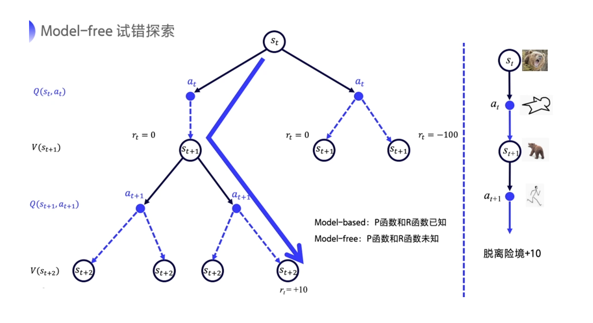

第二个方法是`Temporal-difference(时序差分)` 的方法， `即 TD based ` 的方法。在 MC based 的方法中，每次我们都要算 accumulated reward，也就是从某一个 state $s_a$ 一直玩到游戏结束的时候，得到的所有reward 的总和。所以你要 apply MC based 的 approach，你必须至少把这个游戏玩到结束。但有些游戏非常的长，你要玩到游戏结束才能够 update network，你可能根本收集不到太多的资料，花的时间太长了。所以我们会采用 TD based 的方法。TD based 的方法不需要把游戏玩到底，只要在游戏的某一个情况，某一个 state $s_t$ 的时候，采取 action $a_t$ 得到 reward $r_t$ ，跳到 state $s_{t+1}$，就可以 apply TD 的方法。

怎么 apply TD 的方法呢？这边是基于以下这个式子：
$$
V^{\pi}\left(s_{t}\right)=V^{\pi}\left(s_{t+1}\right)+r_{t}
$$

假设我们现在用的是某一个 policy $\pi$，在 state $s_t$，它会采取 action $a_t$，给我们 reward $r_t$ ，接下来进入$s_{t+1}$ 。state $s_{t+1}$ 的 value 跟 state $s_t$ 的 value，它们的中间差了一项 $r_t$。因为你把 $s_{t+1}$ 得到的 value 加上得到的 reward $r_t$ 就会等于 $s_t$ 得到的 value。有了这个式子以后，你在 training 的时候，你并不是直接去估测 V，而是希望你得到的结果 V 可以满足这个式子。也就是说你会是这样 train 的，你把 $s_t$ 丢到 network 里面，因为 $s_t$ 丢到 network 里面会得到 $V^{\pi}(s_t)$，把 $s_{t+1}$ 丢到你的 value network 里面会得到$V^{\pi}(s_{t+1})$，这个式子告诉我们，$V^{\pi}(s_t)$ 减 $V^{\pi}(s_{t+1})$ 的值应该是 $r_t$。然后希望它们两个相减的 loss 跟 $r_t$ 越接近，train 下去，update V 的参数，你就可以把 V function learn 出来。

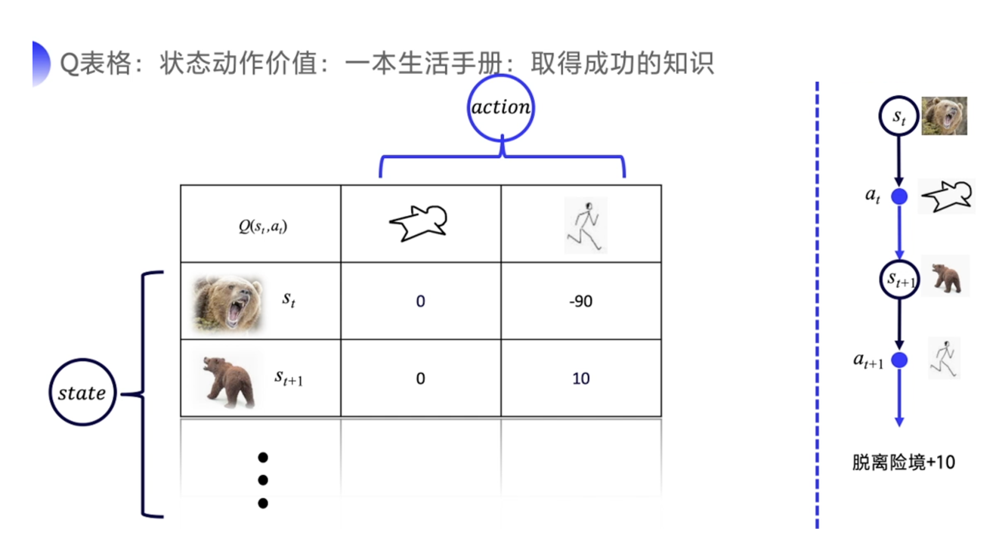

MC 跟 TD 有什么样的差别呢？**MC 最大的问题就是 variance 很大**。因为我们在玩游戏的时候，它本身是有随机性的。所以你可以把 $G_a$ 看成一个 random 的 variable。因为你每次同样走到 $s_a$ 的时候，最后你得到的 $G_a$ 其实是不一样的。你看到同样的state $s_a$，最后玩到游戏结束的时候，因为游戏本身是有随机性的，玩游戏的 model 搞不好也有随机性，所以你每次得到的 $G_a$ 是不一样的，每一次得到$G_a$ 的差别其实会很大。为什么它会很大呢？因为 $G_a$ 其实是很多个不同的 step 的 reward 的和。假设你每一个step 都会得到一个reward，$G_a$ 是从 state $s_a$  开始，一直玩到游戏结束，每一个timestamp reward 的和。

举例来说，我在右上角就列一个式子是说，

$$
\operatorname{Var}[k X]=k^{2} \operatorname{Var}[X]
$$
Var 就是指 variance。 
通过这个式子，我们知道 $G_a$ 的 variance  相较于某一个 state 的 reward，它会是比较大的，$G_a$ 的variance 是比较大的。

现在，如果说用TD 的话呢？用 TD 的话，你是要去 minimize 这样的一个式子：

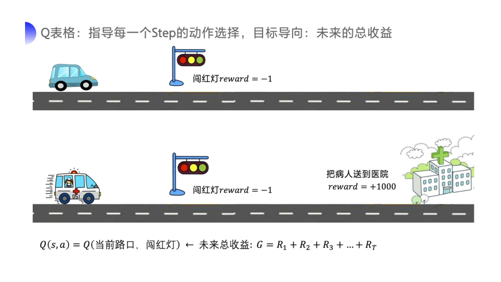

在这中间会有随机性的是 r。因为计算你在 $s_t$ 采取同一个 action，你得到的 reward 也不一定是一样的，所以 r 是一个 random variable。但这个 random variable 的 variance 会比 $G_a$ 还要小，因为 $G_a$ 是很多 r 合起来，这边只是某一个 r  而已。$G_a$ 的 variance 会比较大，r  的 variance 会比较小。但是这边你会遇到的**一个问题是你这个 V 不一定估得准**。假设你的这个 V 估得是不准的，那你 apply 这个式子 learn 出来的结果，其实也会是不准的。所以 MC 跟 TD各有优劣。**今天其实 TD 的方法是比较常见的，MC 的方法其实是比较少用的。**

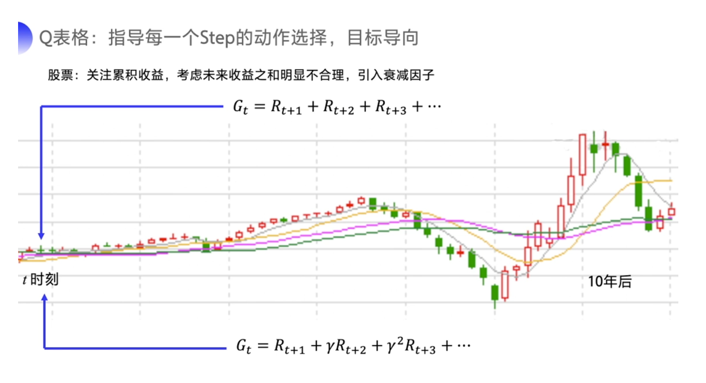
上图是讲 TD 跟 MC 的差异。假设有某一个 critic，它去观察某一个 policy $\pi$  跟环境互动的 8 个 episode 的结果。有一个actor $\pi$ 跟环境互动了8 次，得到了8 次玩游戏的结果。接下来这个 critic 去估测 state 的 value。

* 我们看看 $s_b$ 的 value 是多少。$s_b$ 这个state 在 8 场游戏里面都有经历过，其中有6 场得到 reward 1，有两场得到 reward 0，所以如果你是要算期望值的话，就看到 state $s_b$ 以后得到的 reward，一直到游戏结束的时候得到的 accumulated reward 期望值是 3/4。
* 但 $s_a$ 期望的 reward 到底应该是多少呢？这边其实有两个可能的答案：一个是0，一个是3/4。为什么有两个可能的答案呢？这取决于你用MC 还是TD。用MC 跟用TD 算出来的结果是不一样的。

假如你用 MC 的话，你会发现这个$s_a$ 就出现一次，看到$s_a$ 这个state，接下来 accumulated reward 就是 0。所以今天 $s_a$ expected reward 就是 0。

但 TD 在计算的时候，它要update 下面这个式子。
$$
V^{\pi}\left(s_{a}\right)=V^{\pi}\left(s_{b}\right)+r
$$

因为我们在 state $s_a$ 得到 reward r=0 以后，跳到 state $s_b$。所以 state $s_b$ 的 reward 会等于 state $s_b$ 的 reward 加上在state $s_a$ 跳到 state $s_b$ 的时候可能得到的 reward r。而这个得到的 reward r 的值是 0，$s_b$ expected reward 是3/4，那$s_a$ 的reward 应该是3/4。

用 MC 跟 TD 估出来的结果，其实很有可能是不一样的。就算 critic observed 到一样的 training data，它最后估出来的结果。也不见得会是一样。那为什么会这样呢？你可能问说，那一个比较对呢？其实就都对。

因为在第一个 trajectory， $s_a$ 得到 reward 0 以后，再跳到 $s_b$ 也得到 reward 0。这边有两个可能。

* 一个可能是$s_a$，它就是一个带 sign 的 state，所以只要看到 $s_a$ 以后，$s_b$ 就会拿不到reward，有可能$s_a$ 其实影响了$s_b$。如果是用 MC 的算法的话，它会把 $s_a$ 影响 $s_b$ 这件事考虑进去。所以看到 $s_a$ 以后，接下来 $s_b$ 就得不到 reward，所以看到$s_a$ 以后，期望的reward 是 0。

* 另一个可能是，看到$s_a$ 以后， $s_b$ 的 reward 是0 这件事只是一个巧合，就并不是 $s_a$ 所造成，而是因为说 $s_b$ 有时候就是会得到 reward 0，这只是单纯运气的问题。其实平常 $s_b$ 会得到 reward 期望值是3/4，跟 $s_a$ 是完全没有关系的。所以假设 $s_a$ 之后会跳到 $s_b$，那其实得到的 reward 按照 TD 来算应该是3/4。

所以不同的方法考虑了不同的假设，运算结果不同。

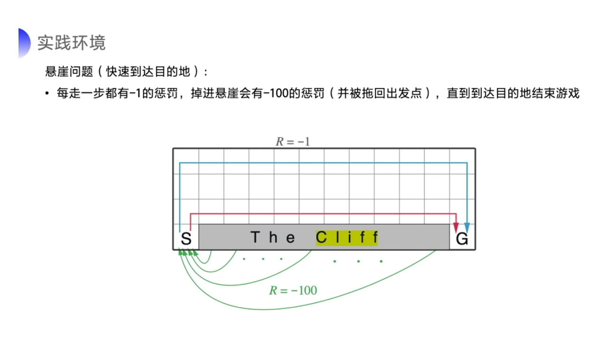

还有另外一种critic，这种critic 叫做 `Q-function`。它又叫做`state-action value function`。

* state value function 的 input 是一个 state，它是根据 state 去计算出，看到这个state 以后的 expected accumulated reward 是多少。
* state-action value function 的 input 是一个 state 跟 action 的 pair，它的意思是说，在某一个 state 采取某一个action，假设我们都使用 actor $\pi$ ，得到的 accumulated reward 的期望值有多大。

Q-function 有一个需要注意的问题是，这个 actor $\pi$，在看到 state s 的时候，它采取的 action 不一定是 a。Q-function 假设在 state s 强制采取 action a。不管你现在考虑的这个actor $\pi$， 它会不会采取action a，这不重要。在state s 强制采取 action a。接下来都用 actor $\pi$ 继续玩下去，就只有在 state s，我们才强制一定要采取action a，接下来就进入自动模式，让actor $\pi$ 继续玩下去，得到的 expected reward 才是$Q^{\pi}(s,a)$。

Q-function 有两种写法：

* input 是 state 跟action，output 就是一个 scalar；
* input  是一个 state s，output 就是好几个 value。

假设 action 是 discrete 的，action 就只有3 个可能，往左往右或是开火。那这个 Q-function output 的3 个 values 就分别代表 a 是向左的时候的 Q value，a 是向右的时候的Q value，还有 a 是开火的时候的 Q value。

那你要注意的事情是，上图右边的 function 只有discrete action 才能够使用。如果 action 是无法穷举的，你只能够用上图左边这个式子，不能够用右边这个式子。

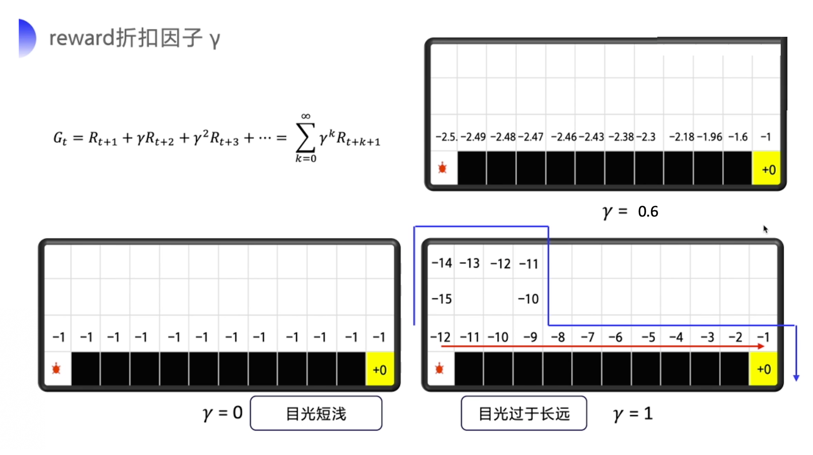

上图是文献上的结果，你去 estimate Q-function 的话，看到的结果可能会像是这个样子。这是什么意思呢？它说假设我们有 3 个 actions，3 个 actions 就是原地不动、向上、向下。

* 假设是在第一个state，不管是采取哪个action，最后到游戏结束的时候，得到的 expected reward 其实都差不多。因为球在这个地方，就算是你向下，接下来你其实应该还来的急救，所以今天不管是采取哪一个action，就差不了太多。

* 假设在第二个state，这个乒乓球它已经反弹到很接近边缘的地方，这个时候你采取向上，你才能得到positive 的reward，才接的到球。如果你是站在原地不动或向下的话，接下来你都会miss 掉这个球。你得到的reward 就会是负的。

* 假设在第三个state，球很近了，所以就要向上。

* 假设在第四个state，球被反弹回去，这时候采取那个action就都没有差了。

这个是 state-action value 的一个例子。

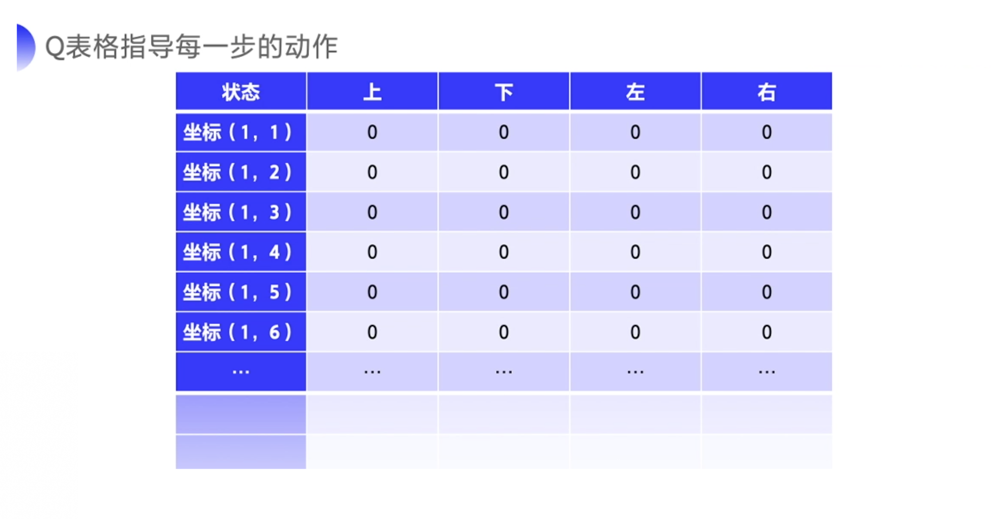

虽然表面上我们 learn 一个 Q-function，它只能拿来评估某一个 actor $\pi$ 的好坏，但只要有了这个 Q-function，我们就可以做 reinforcement learning。有了这个 Q-function，我们就可以决定要采取哪一个 action，我们就可以进行`策略改进(Policy Improvement)`。

它的大原则是这样，假设你有一个初始的 actor，也许一开始很烂， 随机的也没有关系。初始的 actor 叫做 $\pi$，这个 $\pi$ 跟环境互动，会 collect data。接下来你 learn 一个 $\pi$ 这个 actor 的 Q value，你去衡量一下 $\pi$ 这个actor 在某一个 state 强制采取某一个 action，接下来用 $\pi$ 这个 policy 会得到的 expected reward，那用 TD 或 MC 也是可以的。你 learn 出一个 Q-function 以后，就保证你可以找到一个新的 policy $\pi'$ ，policy $\pi'$ 一定会比原来的 policy $\pi$ 还要好。那等一下会定义说，什么叫做好。所以这边神奇的地方是，假设你有一个 Q-function 和 某一个policy $\pi$，你根据 policy $\pi$ learn 出 policy $\pi$ 的 Q-function，接下来保证你可以找到一个新的 policy  $\pi'$ ，它一定会比 $\pi$ 还要好，然后你用 $\pi'$ 取代 $\pi$，再去找它的 Q-function，得到新的以后，再去找一个更好的 policy。 然后这个循环一直下去，你的 policy 就会越来越好。 

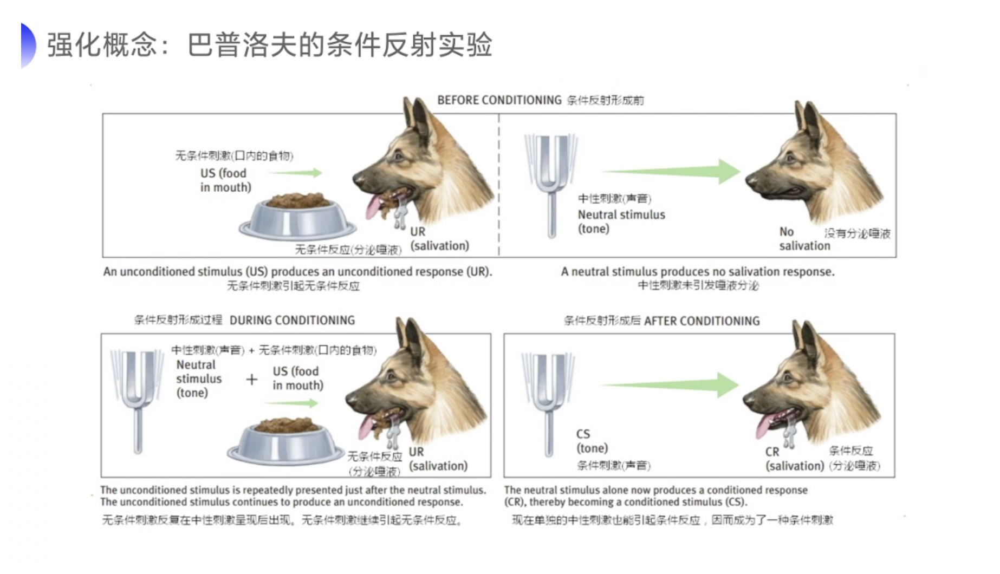
上图就是讲我们刚才讲的到底是什么。

* 首先要定义的是什么叫做比较好？我们说$\pi'$ 一定会比$\pi$ 还要好，什么叫做好呢？这边所谓好的意思是说，对所有可能的state s 而言，对同一个state s 而言，$\pi$ 的 value function 一定会小于$\pi'$ 的value function。也就是说我们走到同一个 state s 的时候，如果拿 $\pi$ 继续跟环境互动下去，我们得到的 reward 一定会小于用$\pi'$ 跟环境互动下去得到的reward。所以不管在哪一个state，你用$\pi'$ 去做interaction，得到的expected reward 一定会比较大。所以 $\pi'$ 是比 $\pi$  还要好的一个policy。

* 有了这个 Q-function 以后，怎么找这个 $\pi'$ 呢？事实上这个 $\pi'$ 是什么？这个$\pi'$ 就是， 如果你根据以下的这个式子去决定你的action，

$$
\pi^{\prime}(s)=\arg \max _{a} Q^{\pi}(s, a)
$$

根据上式去决定你的action 的步骤叫做 $\pi'$ 的话，那这个 $\pi'$ 一定会比$\pi$ 还要好。这个意思是说，假设你已经 learn 出 $\pi$ 的Q-function，今天在某一个 state s，你把所有可能的 action a 都一一带入这个 Q-function，看看说那一个 a 可以让 Q-function 的 value 最大，那这一个 action，就是 $\pi'$ 会采取的 action。这边要注意一下，给定这个 state s，你的 policy $\pi$ 并不一定会采取 action a。我们是 给定某一个 state s 强制采取 action a，用 $\pi$ 继续互动下去得到的 expected reward，这个才是 Q-function 的定义。所以在 state s 里面不一定会采取 action a。假设用这一个 $\pi'$ 在 state s 采取action a 跟 $\pi$ 所谓采取 action 是不一定会一样的。然后 $\pi'$ 所采取的 action 会让他得到比较大的 reward。

* 所以根本就没有一个 policy 叫做 $\pi'$，这个$\pi'$ 是用 Q-function 推出来的。所以没有另外一个 network 决定 $\pi'$ 怎么interaction，有 Q-function 就可以找出$\pi'$。
* 但是这边有另外一个问题就是，在这边要解一个 arg max 的 problem。所以 a 如果是continuous 的就会有问题，如果是discrete 的，a 只有3 个选项，一个一个带进去， 看谁的 Q 最大，没有问题。但如果是 continuous 要解 arg max problem，你就会有问题，但这个是之后才会解决的。

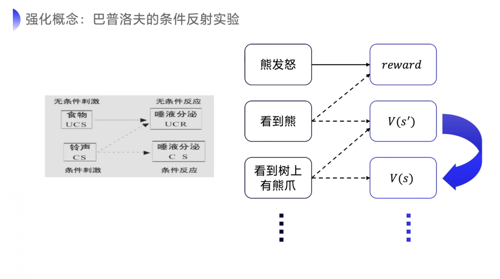

上图想要跟大家讲的是说，为什么用 $Q^{\pi}(s,a)$ 这个 Q-function 所决定出来的 $\pi'$，一定会比 $\pi$ 还要好。

假设有一个policy 叫做 $\pi'$，它是由 $Q^{\pi}$ 决定的。我们要证对所有的 state s 而言，$V^{\pi^{\prime}}(s) \geq V^{\pi}(s)$。怎么证呢？我们先把$V^{\pi^{\prime}}(s)$写出来：
$$
V^{\pi}(s)=Q^{\pi}(s, \pi(s))
$$
假设在 state s 这个地方，你 follow $\pi$ 这个actor，它会采取的action，也就是$\pi(s)$，那你算出来的$Q^{\pi}(s, \pi(s))$ 会等于$V^{\pi}(s)$。In general 而言，$Q^{\pi}(s, \pi(s))$ 不见得等于$V^{\pi}(s)$ ，因为 action 不见得是$\pi(s)$。但如果这个 action 是 $\pi(s)$ 的话，$Q^{\pi}(s, \pi(s))$ 是等于$V^{\pi}(s)$的。

$Q^{\pi}(s, \pi(s))$ 还满足如下的关系：
$$
Q^{\pi}(s, \pi(s)) \le \max _{a} Q^{\pi}(s, a)
$$

因为这边是所有action 里面可以让 Q 最大的那个action，所以今天这一项一定会比它大。那我们知道说这一项是什么，这一项就是$Q^{\pi}(s, a)$，$a$ 就是 $\pi'(s)$。因为$\pi'(s)$ output 的 a， 就是可以让$Q^\pi(s,a)$ 最大的那一个。所以我们得到了下面的式子：
$$
\max _{a} Q^{\pi}(s, a)=Q^{\pi}\left(s, \pi^{\prime}(s)\right)
$$

于是：
$$
V^{\pi}(s) \leq Q^{\pi}\left(s, \pi^{\prime}(s)\right)
$$
也就是说某一个 state，如果你按照policy $\pi$，一直做下去，你得到的 reward 一定会小于等于，在这个 state s。你故意不按照 $\pi$ 所给你指示的方向，而是按照 $\pi'$ 的方向走一步，但之后只有第一步是按照 $\pi'$ 的方向走，只有在state s 这个地方，你才按照 $\pi'$ 的指示走，但接下来你就按照 $\pi$ 的指示走。虽然只有一步之差， 但是我从上面这个式子知道说，只有一步之差，你得到的 reward 一定会比完全 follow $\pi$ 得到的 reward 还要大。

那接下来你想要证的东西就是：
$$
Q^{\pi}\left(s, \pi^{\prime}(s) \right) \le V^{\pi'}(s)
$$

也就是说，只有一步之差，你会得到比较大的reward。但假设每步都是不一样的， 每步都是 follow $\pi'$ 而不是$\pi$ 的话，那你得到的reward 一定会更大。如果你要用数学式把它写出来的话，你可以这样写 

$Q^{\pi}\left(s, \pi^{\prime}(s)\right)$这个式子，它的意思就是说，我们在state $s_t$ 采取 action $a_t$，得到 reward $r_{t+1}$，然后跳到state $s_{t+1}$，即如下式所示：
$$
Q^{\pi}\left(s, \pi^{\prime}(s)\right)=E\left[r_{t+1}+V^{\pi}\left(s_{t+1}\right) \mid s_{t}=s, a_{t}=\pi^{\prime}\left(s_{t}\right)\right]
$$
这边有一个地方写得不太好，这边应该写成$r_t$ 跟之前的notation 比较一致，但这边写成了$r_{t+1}$，其实这都是可以的。在文献上有时候有人会说 在state $s_t$ 采取action $a_t$ 得到reward $r_{t+1}$， 有人会写成$r_t$，但意思其实都是一样的。在state s，按照$\pi'$ 采取某一个action $a_t$ ，得到reward $r_{t+1}$，然后跳到state $s_{t+1}$，$V^{\pi}\left(s_{t+1}\right)$是state $s_{t+1}$，根据$\pi$ 这个actor 所估出来的value。这边要取一个期望值，因为在同样的state 采取同样的action，你得到的reward，还有会跳到的 state 不一定是一样， 所以这边需要取一个期望值。 

接下来我们会得到如下的式子：
$$
\begin{array}{l}
E\left[r_{t+1}+V^{\pi}\left(s_{t+1}\right) | s_{t}=s, a_{t}=\pi^{\prime}\left(s_{t}\right)\right] \\
\leq E\left[r_{t+1}+Q^{\pi}\left(s_{t+1}, \pi^{\prime}\left(s_{t+1}\right)\right) | s_{t}=s, a_{t}=\pi^{\prime}\left(s_{t}\right)\right]
\end{array}
$$
上式为什么成立呢？因为
$$
V^{\pi}(s) \leq Q^{\pi}\left(s, \pi^{\prime}(s)\right)
$$
也就是
$$
V^{\pi}(s_{t+1}) \leq Q^{\pi}\left(s_{t+1}, \pi^{\prime}(s_{t+1})\right)
$$

也就是说，现在你一直follow $\pi$，跟某一步follow $\pi'$，接下来都follow $\pi$ 比起来，某一步follow $\pi'$ 得到的reward 是比较大的。

接着我们得到下式：
$$
\begin{array}{l}
E\left[r_{t+1}+Q^{\pi}\left(s_{t+1}, \pi^{\prime}\left(s_{t+1}\right)\right) | s_{t}=s, a_{t}=\pi^{\prime}\left(s_{t}\right)\right] \\
=E\left[r_{t+1}+r_{t+2}+V^{\pi}\left(s_{t+2}\right) | \ldots\right]
\end{array}
$$

因为
$$
Q^{\pi}\left(s_{t+1}, \pi^{\prime}\left(s_{t+1}\right)\right) = r_{t+2}+V^{\pi}\left(s_{t+2}\right)
$$

然后你再代入

$$
V^{\pi}(s) \leq Q^{\pi}\left(s, \pi^{\prime}(s)\right)
$$

一直算到底，算到episode 结束。那你就知道说
$$
V^{\pi}(s)\le V^{\pi'}(s)
$$

**从这边我们可以知道，你可以 estimate 某一个 policy 的 Q-function，接下来你就可以找到另外一个 policy  $\pi'$ 比原来的 policy 还要更好。**

## Target Network

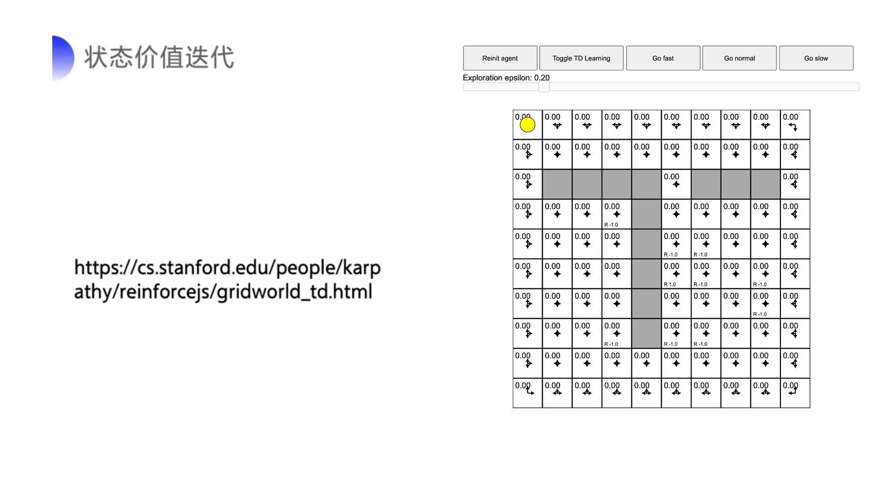

接下来讲一下在 Q-learning 里你一定会用到的 tip。第一个是 `target network`，什么意思呢？我们在 learn Q-function 的时候，也会用到 TD 的概念。那怎么用 TD？你现在收集到一个 data， 是说在state $s_t$，你采取action $a_t$ 以后，你得到reward $r_t$ ，然后跳到state $s_{t+1}$。然后根据这个Q-function，你会知道说
$$
\mathrm{Q}^{\pi}\left(s_{t}, a_{t}\right) 
=r_{t}+\mathrm{Q}^{\pi}\left(s_{t+1}, \pi\left(s_{t+1}\right)\right)
$$

所以你在 learn 的时候，你会说我们有 Q-function，input $s_t$, $a_t$ 得到的 value，跟 input $s_{t+1}$, $\pi (s_{t+1})$ 得到的 value 中间，我们希望它差了一个$r_t$， 这跟刚才讲的TD 的概念是一样的。

但是实际上在 learn 的时候，你会发现这样的一个function 并不好 learn，因为假设这是一个 regression problem，$\mathrm{Q}^{\pi}\left(s_{t}, a_{t}\right) $ 是 network 的 output，$r_{t}+\mathrm{Q}^{\pi}\left(s_{t+1}, \pi\left(s_{t+1}\right)\right)$是 target，你会发现 target 是会动的。当然你要 implement 这样的 training，其实也没有问题，就是你在做 backpropagation 的时候， $Q^{\pi}$ 的参数会被 update，你会把两个 update 的结果加在一起。因为它们是同一个 model $Q^{\pi}$， 所以两个 update 的结果会加在一起。但这样会导致 training 变得不太稳定。因为假设你把 $\mathrm{Q}^{\pi}\left(s_{t}, a_{t}\right) $ 当作你model 的output， $r_{t}+\mathrm{Q}^{\pi}\left(s_{t+1}, \pi\left(s_{t+1}\right)\right)$ 当作 target 的话。你要去 fit 的 target 是一直在变的，这种一直在变的 target 的 training 是不太好 train 的。所以你会把其中一个 Q-network，通常是你会把右边这个 Q-network 固定住。也就是说你在 training 的时候，你只 update 左边这个 Q-network 的参数，而右边这个 Q-network  的参数会被固定住。因为右边的 Q-network 负责产生 target，所以叫做 `target network`。因为 target network 是固定的，所以你现在得到的 target  $r_{t}+\mathrm{Q}^{\pi}\left(s_{t+1}, \pi\left(s_{t+1}\right)\right)$ 的值也是固定的。因为 target network 是固定的，我们只调左边 network 的参数，它就变成是一个 regression problem。我们希望  model 的 output 的值跟目标越接近越好，你会 minimize 它的 mean square error。

在实现的时候，你会把左边的 Q-network update 好几次以后，再去用 update 过的 Q-network 替换这个 target network 。但它们两个不要一起动，它们两个一起动的话， 结果会很容易坏掉。一开始这两个 network 是一样的，然后在 train 的时候，你会把右边的 Q-network fix 住。你在做 gradient decent 的时候，只调左边这个 network 的参数，那你可能update 100 次以后才把这个参数复制到右边的 network 去，把它盖过去。把它盖过去以后，你这个 target value 就变了。就好像说你本来在做一个 regression problem，那你 train 后把这个 regression problem 的 loss 压下去以后，接下来你把这边的参数把它 copy 过去以后，你的 target 就变掉了，接下来就要重新再 train。

###  Intuition

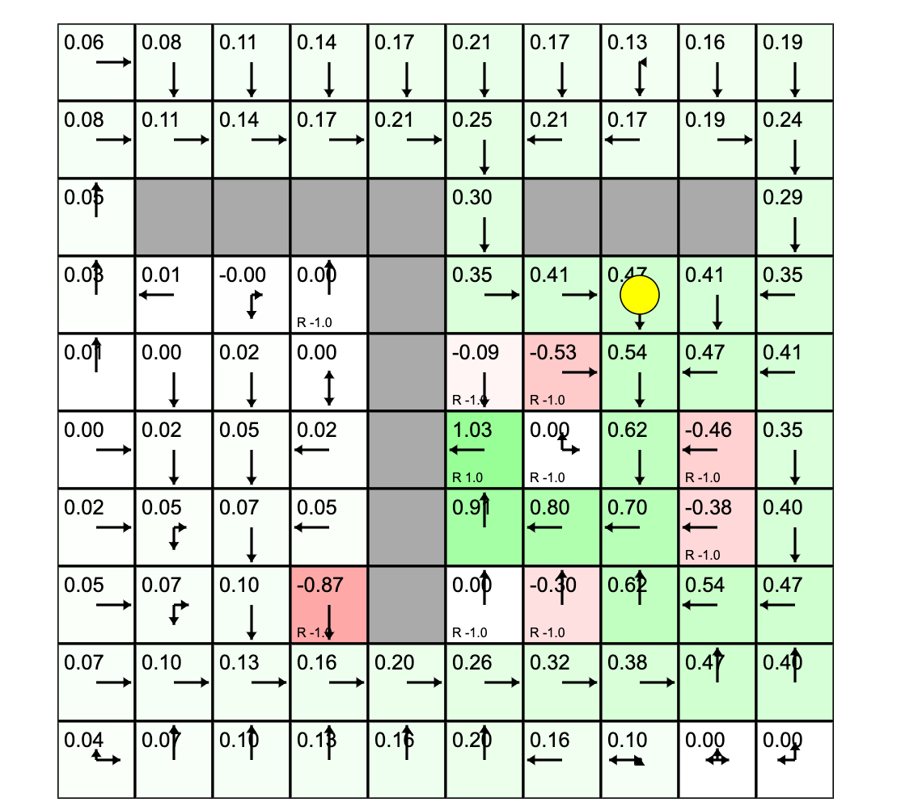

下面我们通过猫追老鼠的例子来直观地理解为什么要 fix target network。猫是 `Q estimation`，老鼠是 `Q target`。一开始的话，猫离老鼠很远，所以我们想让这个猫追上老鼠。

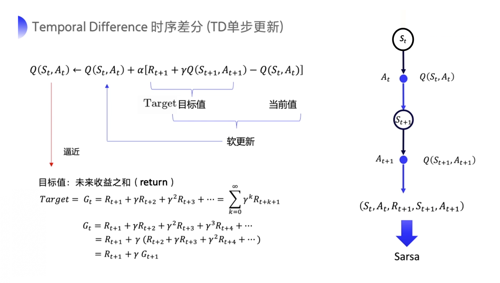

因为 Q target 也是跟模型参数相关的，所以每次优化后，Q target 也会动。这就导致一个问题，猫和老鼠都在动。

然后它们就会在优化空间里面到处乱动，就会产生非常奇怪的优化轨迹，这就使得训练过程十分不稳定。所以我们可以固定 Q target，让老鼠动得不是那么频繁，可能让它每 5 步动一次，猫则是每一步都在动。如果老鼠每 5 次动一步的话，猫就有足够的时间来接近老鼠。然后它们之间的距离会随着优化过程越来越小，最后它们就可以拟合，拟合过后就可以得到一个最好的 Q-network。

## Exploration

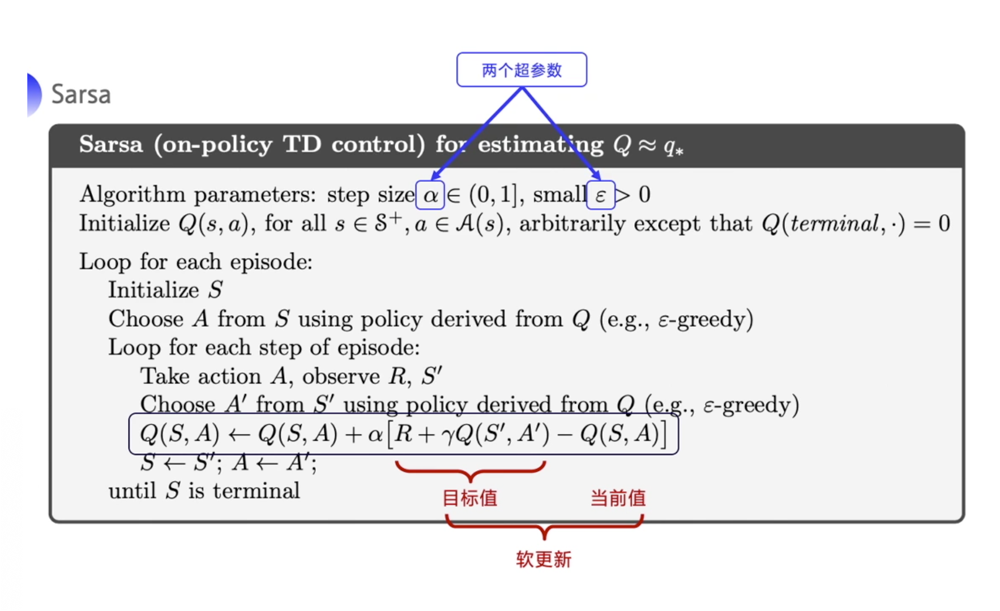第二个 tip 是`Exploration`。当我们使用 Q-function 的时候，policy 完全 depend on  Q-function。给定某一个 state，你就穷举所有的 a， 看哪个 a 可以让 Q value 最大，它就是采取的action。那其实这个跟 policy gradient 不一样，在做 policy gradient 的时候，output 其实是 stochastic 的。我们 output 一个action 的distribution，根据这个action 的distribution 去做sample， 所以在policy gradient 里面，你每次采取的action 是不一样的，是有随机性的。那像这种Q-function， 如果你采取的action 总是固定的，会有什么问题呢？你会遇到的问题就是这不是一个好的收集 data 的方式。因为假设我们今天真的要估某一个state，你可以采取action $a_{1}$, $a_{2}$, $a_{3}$。你要估测在某一个state 采取某一个action 会得到的Q value，你一定要在那一个 state 采取过那一个action，才估得出它的value。如果你没有在那个state 采取过那个action，你其实估不出那个value 的。当然如果是用deep 的network，就你的Q-function 其实是一个network，这种情形可能会没有那么严重。但是 in general 而言，假设 Q-function 是一个table，没有看过的  state-action pair，它就是估不出值来。Network 也是会有一样的问题就是， 只是没有那么严重。所以今天假设你在某一个state，action $a_{1}$, $a_{2}$, $a_{3}$ 你都没有采取过，那你估出来的 $Q(s,a_{1})$, $Q(s,a_{2})$, $Q(s,a_{3})$ 的 value 可能都是一样的，就都是一个初始值，比如说 0，即

$$
\begin{array}{l}
Q(s, a_1)=0 \\
Q(s, a_2)=0 \\
Q(s, a_3)=0
\end{array}
$$

但是假设你在state s，你sample 过某一个action $a_{2}$ ，它得到的值是 positive 的 reward。那 $Q(s, a_2)$ 就会比其他的action 都要好。在采取action 的时候， 就看说谁的Q value 最大就采取谁，所以之后你永远都只会sample 到$a_{2}$，其他的action 就再也不会被做了，所以就会有问题。就好像说你进去一个餐厅吃饭，其实你都很难选。你今天点了某一个东西以后，假说点了某一样东西， 比如说椒麻鸡，你觉得还可以。接下来你每次去就都会点椒麻鸡，再也不会点别的东西了，那你就不知道说别的东西是不是会比椒麻鸡好吃，这个是一样的问题。

如果你没有好的 exploration 的话， 你在training 的时候就会遇到这种问题。举一个实际的例子， 假设你今天是用 Q-learning 来玩比如说`slither.io`。在玩`slither.io` 你会有一个蛇，然后它在环境里面就走来走去， 然后就吃到星星，它就加分。假设这个游戏一开始，它采取往上走，然后就吃到那个星星，它就得到分数，它就知道说往上走是positive。接下来它就再也不会采取往上走以外的action 了，所以接下来就会变成每次游戏一开始，它就往上冲，然后就死掉，再也做不了别的事。所以今天需要有exploration 的机制，需要让 machine 知道说，虽然根据之前sample 的结果，$a_2$ 好像是不错的，但你至少偶尔也试一下$a_{1}$ 跟$a_{3}$，搞不好他们更好也说不定。

有两个方法解这个问题，一个是`Epsilon Greedy`。Epsilon Greedy 的意思是说，我们有$1-\varepsilon$ 的机率，通常$\varepsilon$ 就设一个很小的值， $1-\varepsilon$ 可能是90%，也就是90% 的机率，完全按照Q-function 来决定action。但是你有10% 的机率是随机的。通常在实现上 $\varepsilon$ 会随着时间递减。也就是在最开始的时候。因为还不知道那个action 是比较好的，所以你会花比较大的力气在做 exploration。接下来随着training 的次数越来越多。已经比较确定说哪一个Q 是比较好的。你就会减少你的exploration，你会把 $\varepsilon$ 的值变小，主要根据Q-function 来决定你的action，比较少做random，这是Epsilon Greedy。

还有一个方法叫做 `Boltzmann Exploration`，这个方法就比较像是 policy gradient。在 policy gradient 里面我们说network 的output 是一个 expected action space 上面的一个的 probability distribution。再根据 probability distribution 去做sample。那其实你也可以根据 Q value 去定一个probability distribution，你可以说，假设某一个action 的Q value 越大，代表它越好，那我们采取这个action 的机率就越高。但是某一个action 的Q value 小，不代表我们不能try，try 看它好不好用。所以我们有时候也要try，try 那些 Q value 比较差的 action，怎么做呢？因为Q value 是有正有负的。所以你要把它弄成一个概率，你可能就先取exponential，然后再做normalize。然后把 $exp(Q(s,a))$ 做normalize 的这个概率当作是你在决定action 的时候sample 的概率。在实现上，Q 是一个network，所以你有点难知道， 在一开始的时候network 的output 到底会长怎么样子。但是你可以猜测说， 假设你一开始没有任何的training data，你的参数是随机的，那给定某一个state s，不同的 a output 的值，可能就是差不多的。所以一开始$Q(s,a)$ 应该会倾向于是uniform。也就是在一开始的时候，你这个probability distribution 算出来，它可能是比较uniform 的。

## Experience Replay

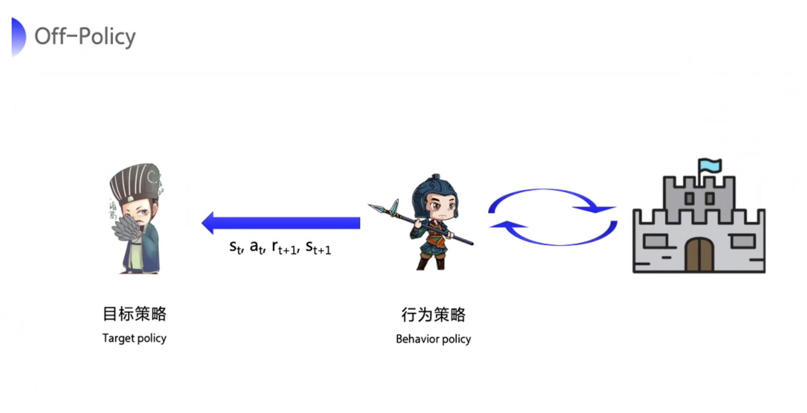

第三个tip是`Experience Replay(经验回放)`。 Experience Replay 会构建一个 `Replay Buffer`，replay buffer 是说现在会有某一个 policy $\pi$ 去跟环境做互动，然后它会去收集 data。我们会把所有的 data 放到一个buffer 里面，buffer 里面就存了很多data。比如说 buffer 是 5 万，这样它里面可以存 5 万笔资料，每一笔资料就是记得说，我们之前在某一个 state $s_t$，采取某一个action $a_t$，得到了 reward $r_t$。然后跳到 state $s_{t+1}$。那你用 $\pi$ 去跟环境互动很多次，把收集到的资料都放到这个 replay buffer 里面。

这边要注意是 replay buffer 里面的 experience 可能是来自于不同的 policy，你每次拿 $\pi$ 去跟环境互动的时候，你可能只互动 10000 次，然后接下来你就更新你的$\pi$ 了。但是这个 buffer 里面可以放 5 万笔资料，所以 5 万笔资料可能是来自于不同的 policy。Buffer 只有在它装满的时候，才会把旧的资料丢掉。所以这个buffer 里面它其实装了很多不同的 policy 的 experiences。

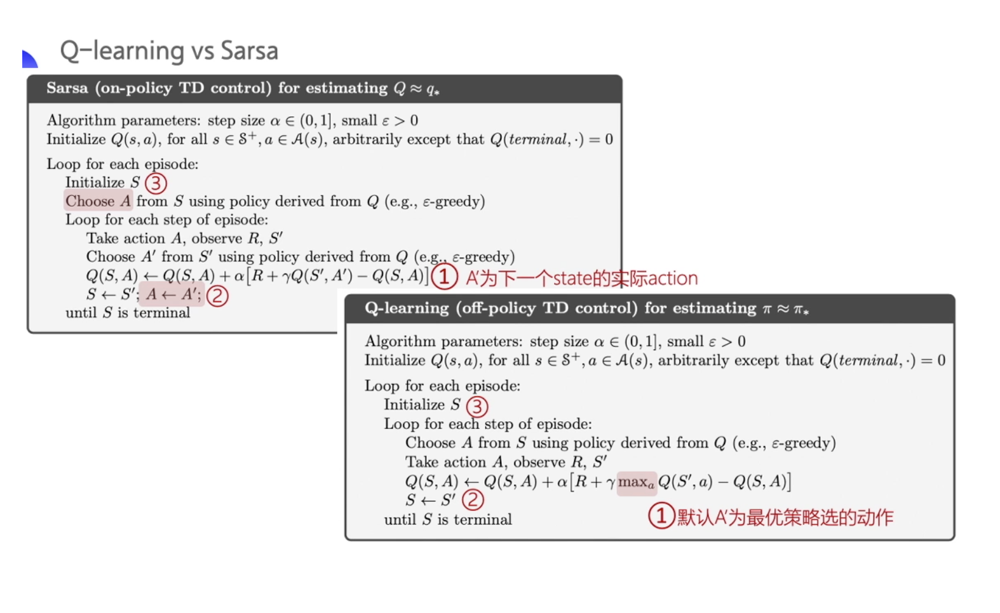

有了这个buffer 以后，你做的事情就是怎么train 这个 Q 的model 呢，怎么估 Q-function？你的做法是这样：你会iterative 去 train 这个Q-function，在每一个 iteration 里面，你从这个buffer 里面，随机挑一个batch 出来，就跟一般的network training 一样，你从那个 training data set 里面，去挑一个batch 出来。你去sample 一个batch 出来，里面有一把的experiences，根据这把experiences 去update 你的Q-function。就跟我们刚才讲那个 TD learning 要有一个target network 是一样的。你去sample 一堆batch，sample 一个batch 的data，sample 一堆 experiences，然后再去update 你的Q-function。

当我们这么做的时候， 它变成了一个off-policy 的做法。因为本来我们的 Q 是要观察 $\pi$ 这个 action 的 value，但实际上存在你的 replay buffer 里面的这些 experiences 不是通通来自于 $\pi$，有些是过去其他的 $\pi$ 所遗留下来的 experience。因为你不会拿某一个$\pi$ 就把整个buffer 装满，然后拿去测 Q-function，这个$\pi$ 只是 sample 一些 data塞到那个 buffer 里面去，然后接下来就让 Q 去t rain。所以 Q 在 sample 的时候， 它会 sample 到过去的一些资料。

但是这样做有什么好处呢？这么做有两个好处。

* 第一个好处，其实在做 reinforcement learning 的时候， 往往最花时间的 step 是在跟环境做互动，train network 反而是比较快的。因为你用 GPU train 其实很快， 真正花时间的往往是在跟环境做互动。用 replay buffer 可以减少跟环境做互动的次数，因为在做 training 的时候，你的experience 不需要通通来自于某一个policy。一些过去的 policy 所得到的 experience 可以放在 buffer 里面被使用很多次，被反复的再利用，这样让你的 sample 到 experience 的利用是比较 efficient。

* 第二个好处，在 train network 的时候，其实我们希望一个 batch 里面的 data 越 diverse 越好。如果你的 batch 里面的 data 都是同样性质的，你 train 下去是容易坏掉的。如果 batch 里面都是一样的data，你 train 的时候，performance 会比较差。我们希望 batch data 越 diverse 越好。那如果你今天，你的这个buffer 里面的那些experience 通通来自于不同的policy ，那你sample 到的一个batch 里面的data 会是比较diverse 。

Q：我们明明是要观察 $\pi$ 的value，里面混杂了一些不是 $\pi$ 的 experience ，这有没有关系？

A：没关系。这并不是因为过去的 $\pi$ 跟现在的 $\pi$ 很像， 就算过去的$\pi$ 没有很像，其实也是没有关系的。主要的原因是因为， 我们并不是去sample 一个trajectory，我们只sample 了一笔experience，所以跟是不是 off-policy 这件事是没有关系的。就算是off-policy，就算是这些 experience 不是来自于 $\pi$，我们其实还是可以拿这些 experience 来估测 $Q^{\pi}(s,a)$。这件事有点难解释，不过你就记得说 Experience Replay 在理论上也是没有问题的。

## DQN

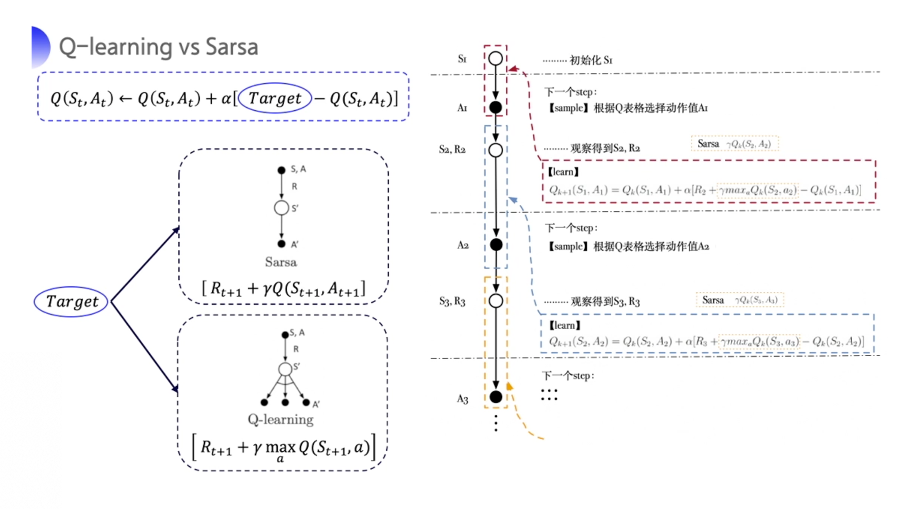

上图就是一般的 `Deep Q-network(DQN)` 的算法。

这个算法是这样的。Initialize 的时候，你 initialize 2 个network，一个是 Q，一个是 $\hat{Q}$，其实 $\hat{Q}$ 就等于 Q。一开始这个 target Q-network，跟你原来的 Q-network 是一样的。在每一个 episode，你拿你的 actor 去跟环境做互动，在每一次互动的过程中，你都会得到一个 state $s_t$，那你会采取某一个action $a_t$。怎么知道采取哪一个action $a_t$ 呢？你就根据你现在的 Q-function。但是你要有 exploration 的机制。比如说你用 Boltzmann exploration 或是 Epsilon Greedy 的 exploration。那接下来你得到 reward $r_t$，然后跳到 state $s_{t+1}$。所以现在 collect 到一笔 data，这笔 data 是 ($s_t$, $a_t$ ,$r_t$, $s_{t+1}$)。这笔 data 就塞到你的 buffer 里面去。如果 buffer 满的话， 你就再把一些旧的资料丢掉。接下来你就从你的buffer 里面去 sample data，那你 sample 到的是 $(s_{i}, a_{i}, r_{i}, s_{i+1})$。这笔data 跟你刚放进去的不一定是同一笔，你可能抽到一个旧的。要注意的是，其实你 sample 出来不是一笔 data，你 sample 出来的是一个 batch 的 data，你 sample 一个batch 出来，sample 一把 experiences 出来。接下来就是计算你的 target。假设你 sample 出这么一笔 data。根据这笔 data 去算你的 target。你的 target 是什么呢？target 记得要用 target network $\hat{Q}$ 来算。Target 是：

$$
y=r_{i}+\max _{a} \hat{Q}\left(s_{i+1}, a\right)
$$
其中 a 就是让 $\hat{Q}$ 的值最大的 a。因为我们在 state $s_{i+1}$会采取的action a，其实就是那个可以让 Q value 的值最大的那一个 a。接下来我们要update Q 的值，那就把它当作一个 regression problem。希望$Q(s_i,a_i)$  跟你的target 越接近越好。然后假设已经 update 了某一个数量的次，比如说 C 次，设 C = 100， 那你就把 $\hat{Q}$ 设成 Q，这就是 DQN。最后，我们给出 [DQN 的 PyTorch 实现](https://github.com/qfettes/DeepRL-Tutorials/blob/master/01.DQN.ipynb) 。

## References

* [Intro to Reinforcement Learning (强化学习纲要）](https://github.com/zhoubolei/introRL)

