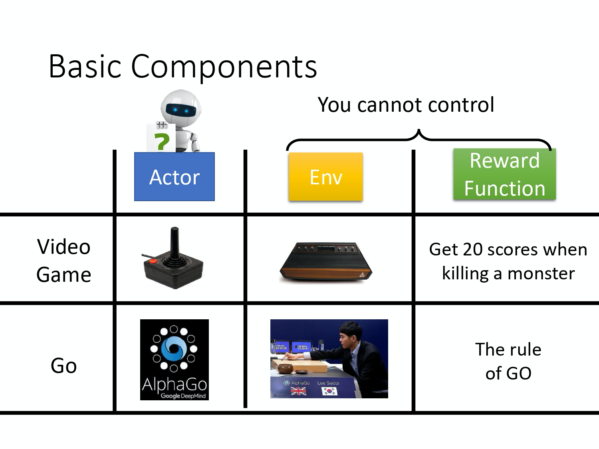
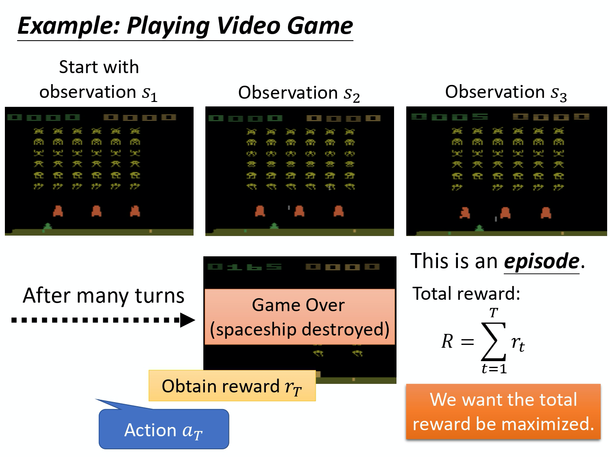
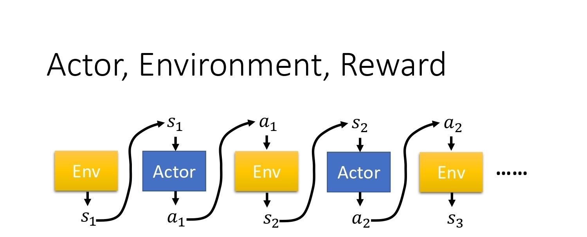
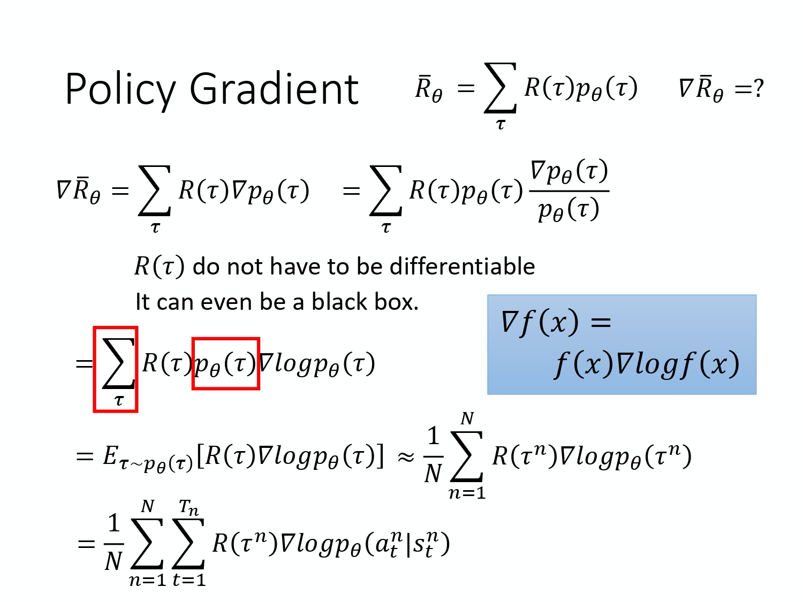
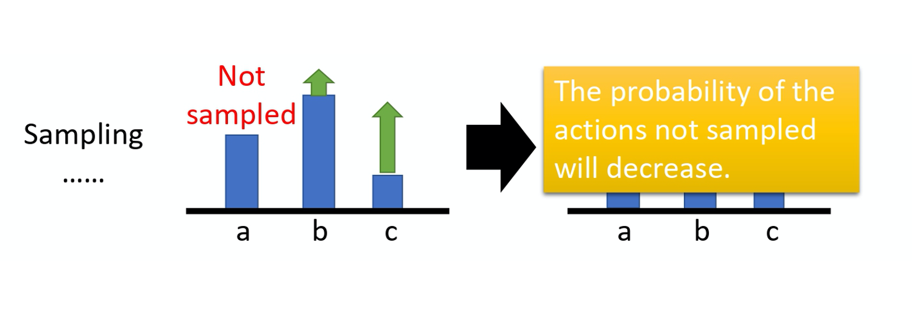

# Tips of Q-learning
## Double DQN

接下来我们要讲的是 train Q-learning 的一些 tip。第一个 tip 是做 `Double DQN`。那为什么要有Double DQN 呢？因为在实现上，你会发现 Q value 往往是被高估的。上图来自于 Double DQN 的原始paper，它想要显示的结果就是Q value 往往是被高估的。这边有 4 个不同的小游戏，横轴是training 的时间，红色锯齿状一直在变的线就是 Q-function 对不同的 state estimate 出来的平均Q value，有很多不同的 state，每个state 你都sample 一下，然后算它们的Q value，把它们平均起来。红色这一条线，它在training 的过程中会改变，但它是不断上升的，为什么它不断上升，因为 Q-function 是 depend on 你的policy 的。learn 的过程中你的 policy 越来越强，所以你得到Q 的value 会越来越大。在同一个state， 你得到expected reward 会越来越大，所以general 而言，这个值都是上升的，但这是Q network 估测出来的值。

接下来你真地去算它，那怎么真地去算？你有那个policy，然后真的去玩那个游戏。，就玩很多次，玩个1 百万次。然后就去真的估说，在某一个state， 你会得到的Q value，到底有多少。你会得到说在某一个state，采取某一个action。你接下来会得到accumulated reward 的总和是多少。你会发现估测出来的值是远比实际的值大。在每一个游戏都是这样，都大很多。所以今天要 propose Double DQN 的方法，它可以让估测的值跟实际的值是比较接近的。我们先看它的结果，蓝色的锯齿状的线是Double DQN 的Q network 所估测出来的Q value，蓝色的无锯齿状的线是真正的Q value，你会发现它们是比较接近的。 用 network 估测出来的就不用管它，比较没有参考价值。用 Double DQN 得出来真正的accumulated reward，在这3 个case，都是比原来的DQN 高的，代表 Double DQN learn 出来那个policy 比较强。所以它实际上得到的reward 是比较大的。虽然一般的DQN 的Q network 高估了自己会得到的reward，但实际上它得到的reward 是比较低的。

Q: 为什么Q value 总是被高估了呢？

A: 因为实际上在做的时候，是要让左边这个式子跟右边我们这个target，越接近越好。那你会发现说，target 的值很容易一不小心就被设得太高。因为在算这个 target 的时候，我们实际上在做的事情是看哪一个a 可以得到最大的Q value，就把它加上去，就变成我们的target。所以假设有某一个action它得到的值是被高估的。

举例来说， 现在有4 个actions，本来其实它们得到的值都是差不多的，它们得到的reward 都是差不多的。但是在estimate 的时候，那毕竟是个network。所以estimate 的时候是有误差的。所以假设今天是第一个action它被高估了，假设绿色的东西代表是被高估的量，它被高估了，那这个target 就会选这个action。然后就会选这个高估的Q value来加上$r_t$，来当作你的target。如果第4 个action 被高估了，那就会选第4 个action 来加上$r_t$ 来当作你的target value。所以你总是会选那个Q value 被高估的，你总是会选那个reward 被高估的action 当作这个max 的结果去加上$r_t$ 当作你的target。所以你的target 总是太大。

Q: 怎么解决这target 总是太大的问题呢？

A: 在 Double DQN 里面，选action 的Q-function 跟算value 的Q-function，不是同一个。在原来的DQN 里面，你穷举所有的 a，把每一个a 都带进去， 看哪一个a 可以给你的Q value 最高，那你就把那个Q value 加上$r_t$。但是在 Double DQN 里面，你有两个Q network，第一个Q network，决定哪一个action 的Q value 最大，你用第一个Q network 去带入所有的 a，去看看哪一个Q value 最大，然后你决定你的action 以后。实际上你的Q value 是用$Q'$所算出来的，这样子有什么好处呢？为什么这样就可以避免over estimate 的问题呢？因为今天假设我们有两个 Q-function，假设第一个Q-function 它高估了它现在选出来的action a，那没关系，只要第二个Q-function $Q'$ 没有高估这个action a 的值，那你算出来的，就还是正常的值。假设反过来是 $Q'$ 高估了某一个action 的值，那也没差， 因为反正只要前面这个Q 不要选那个action 出来就没事了。这个就是 Double DQN 神奇的地方。

Q: 哪来两个Q 跟$Q'$ 呢？哪来两个network 呢？

A: 在实现上，你有两个Q network， 一个是target 的Q network，一个是真正你会update 的Q network。所以在 Double DQN 里面，你的实现方法会是拿你会update 参数的那个Q network 去选action，然后你拿target 的network，那个固定住不动的network 去算value。而那 Double DQN 相较于原来的DQN 的更改是最少的，它几乎没有增加任何的运算量。连新的network 都不用，因为你原来就有两个network 了。你唯一要做的事情只有，本来你在找最大的a 的时候，你在决定这个a 要放哪一个的时候，你是用$Q'$ 来算，你是用target network 来算，现在改成用另外一个会update 的Q network 来算。

假如你今天只选一个tip 的话，正常人都是implement Double DQN，因为很容易实现。

## Dueling DQN

第二个 tip 是 `Dueling DQN`。其实 Dueling DQN 也蛮好做的，相较于原来的DQN。它唯一的差别是改了network 的架构，Dueling DQN 唯一做的事情是改network 的架构。Q network 就是input state，output 就是每一个action 的Q value。dueling DQN 唯一做的事情，是改了network 的架构，其它的算法，你都不要去动它。

Q: Dueling DQN 是怎么改了network 的架构呢？

A: 本来的DQN 就是直接output Q value 的值。现在这个dueling 的DQN，就是下面这个network 的架构。它不直接output Q value 的值，它分成两条path 去运算，第一个path，它算出一个scalar，这个scalar 我们叫做$V(s)$。因为它跟input s 是有关系，所以叫做$V(s)$，$V(s)$ 是一个scalar。下面这个会output 一个vector，这个vector 叫做$A(s,a)$。下面这个vector，它是每一个action 都有一个value。然后你再把这两个东西加起来，就得到你的Q value。

Q: 这么改有什么好处？

A : 那我们假设说，原来的$Q(s,a)$ 就是一个table。我们假设 state 是discrete 的，实际上state 不是discrete 的。那为了说明方便，我们假设就是只有4 个不同的state，只有3 个不同的action，所以$Q(s,a)$ 你可以看作是一个table。

我们知道：
$$
Q(s,a) = V(s) + A(s,a)
$$

其中

* $V(s)$ 是对不同的state 它都有一个值。 
* $A(s,a)$ 它是对不同的state，不同的action都有一个值。

你把这个 V 的值加到 A 的每一个 column 就会得到Q 的值。把 2+1，2+(-1)，2+0，就得到 3，1，2，以此类推。

如上图所示，假设说你在train network 的时候，target 是希望这一个值变成 4，这一个值变成 0。但是你实际上能更改的并不是Q 的值，你的network 更改的是V 跟A 的值。根据network 的参数，V 跟A 的值output 以后，就直接把它们加起来，所以其实不是更动Q 的值。然后在learn network 的时候，假设你希望这边的值，这个3 增加1 变成 4，这个-1 增加1 变成 0。最后你在train network 的时候，network 可能会说，我们就不要动这个 A 的值，就动 V 的值，把 V 的值从0 变成 1。把0 变成1 有什么好处呢？你会发现说，本来你只想动这两个东西的值，那你会发现说，这个第三个值也动了，-2 变成 -1。所以有可能说你在某一个state，你明明只sample 到这2 个action，你没sample 到第三个action，但是你其实也可以更改第三个action 的Q value。这样的好处就是你不需要把所有的 state-action pair 都sample 过，你可以用比较efficient 的方式去 estimate Q value 出来。因为有时候你update 的时候，不一定是update 下面这个table。而是只update 了$V(s)$，但update $V(s)$ 的时候，只要一改所有的值就会跟着改。这是一个比较有效率的方法，去使用你的data，这个是Dueling DQN 可以带给我们的好处。

那可是接下来有人就会问说会不会最后learn 出来的结果是说，反正machine 就学到 V 永远都是 0，然后反正A 就等于 Q，那你就没有得到任何 Dueling DQN 可以带给你的好处， 就变成跟原来的DQN 一模一样。为了避免这个问题，实际上你要给 A 一些constrain，让update A 其实比较麻烦，让network 倾向于会想要去用V 来解问题。

举例来说，你可以看原始的文献，它有不同的constrain 。那一个最直觉的constrain 是你必须要让这个A 的每一个column 的和都是 0，所以看我这边举的例子，我的column 的和都是 0。那如果这边column 的和都是 0，这边这个V 的值，你就可以想成是上面 Q 的每一个column 的平均值。这个平均值，加上这些值才会变成是Q 的value。所以今天假设你发现说你在update 参数的时候，你是要让整个row 一起被update。你就不会想要update 这边，因为你不会想要update Ａ这个matrix。因为 A 这个matrix 的每一个column 的和都要是 0，所以你没有办法说，让这边的值，通通都+1，这件事是做不到的。因为它的constrain 就是你的和永远都是要 0。所以不可以都+1，这时候就会强迫network 去update V 的值，然后让你可以用比较有效率的方法，去使用你的data。

实现时，你要给这个A 一个constrain。举个例子，假设你有3 个actions，然后在这边 output 的 vector 是7 3 2，你在把这个 A 跟这个 V 加起来之前，先加一个normalization，就好像做那个layer normalization 一样。加一个normalization，这个normalization 做的事情就是把7+3+2 加起来等于12，12/3 = 4。然后把这边通通减掉4，变成3, -1, 2。再把3, -1, 2 加上1.0，得到最后的Q value。这个normalization 的 step 就是 network 的其中一部分，在train 的时候，你从这边也是一路 back propagate 回来的，只是 normalization 是没有参数的，它只是一个normalization 的operation。把它可以放到network 里面，跟network 的其他部分 jointly trained，这样A 就会有比较大的constrain。这样network 就会给它一些benefit， 倾向于去update V 的值，这个是Dueling DQN。

## Prioritized Replay

有一个技巧叫做`Prioritized Replay`。Prioritized Replay 是什么意思呢？

我们原来在sample data 去train 你的Q-network 的时候，你是 uniformly 地从experience buffer，从buffer 里面去sample data。你就是uniform 地去sample 每一笔data，那这样不见得是最好的， 因为也许有一些data 比较重要。假设有一些data，你之前有sample 过。你发现说那一笔data 的 TD error 特别大（TD error 就是你的network 的output 跟target 之间的差距），那这些data 代表说你在train network 的时候， 你是比较train 不好的。那既然比较train 不好， 那你就应该给它比较大的概率被sample 到，这样在training 的时候，才会考虑那些train 不好的training data 多次一点。实际上在做 prioritized replay 的时候，你不只会更改 sampling 的process，你还会因为更改了sampling 的process，你会更改update 参数的方法。所以 prioritized replay 并不只是改变了sample data 的distribution 这么简单，你也会改training process。
## Balance between MC and TD

另外一个可以做的方法是，你可以balance MC 跟TD。MC 跟 TD 的方法各自有各自的优劣。我们怎么在MC 跟TD 里面取得一个平衡呢？我们的做法是这样，在TD 里面，在某一个state $s_t$采取某一个action $a_t$ 得到 reward $r_t$，接下来跳到那一个state $s_{t+1}$。但是我们可以不要只存一个step 的data，我们存 N 个step 的data。

我们记录在$s_t$ 采取$a_t$，得到$r_t$，会跳到什么样$s_t$。一直纪录到在第N 个step 以后，在$s_{t+N}$采取$a_{t+N}$得到 reward $r_{t+N}$，跳到$s_{t+N+1}$的这个经验，通通把它存下来。实际上你今天在做update 的时候， 在做你Q network learning 的时候，你的learning 的方法会是这样，你learning 的时候，要让 $Q(s_t,a_t)$ 跟你的target value 越接近越好。$\hat{Q}$ 所计算的不是$s_{t+1}$，而是$s_{t+N+1}$的。你会把 N 个step 以后的state 丢进来，去计算 N 个step 以后，你会得到的reward。要算 target value 的话，要再加上multi-step 的reward $\sum_{t^{\prime}=t}^{t+N} r_{t^{\prime}}$ ，multi-step 的 reward 是从时间 t 一直到 t+N 的 N 个reward 的和。然后希望你的 $Q(s_t,a_t)$ 和 target value 越接近越好。

你会发现说这个方法就是MC 跟TD 的结合。因为它就有 MC 的好处跟坏处，也有 TD 的好处跟坏处。如果看它的这个好处的话，因为我们现在 sample 了比较多的step，之前是只sample 了一个step， 所以某一个step 得到的data 是real 的，接下来都是Q value 估测出来的。现在sample 比较多step，sample N 个step 才估测value，所以估测的部分所造成的影响就会比小。当然它的坏处就跟MC 的坏处一样，因为你的 r 比较多项，你把 N 项的 r 加起来，你的variance 就会比较大。但是你可以去调这个N 的值，去在variance 跟不精确的 Q 之间取得一个平衡。N 就是一个hyper parameter，你要调这个N 到底是多少，你是要多 sample 三步，还是多 sample 五步。

## Noisy Net

有一个技术是要improve 这个exploration 这件事，我们之前讲的Epsilon Greedy 这样的 exploration 是在action 的space 上面加noise，但是有另外一个更好的方法叫做`Noisy Net`，它是在参数的space 上面加noise。Noisy Net 的意思是说，每一次在一个episode 开始的时候，在你要跟环境互动的时候，你就把你的Q-function 拿出来，Q-function 里面其实就是一个network ，就变成你把那个network 拿出来，在network 的每一个参数上面加上一个Gaussian noise。那你就把原来的Q-function 变成$\tilde{Q}$ 。因为$\hat{Q}$ 已经用过，$\hat{Q}$ 是那个target network，我们用 $\tilde{Q}$  来代表一个`Noisy Q-function`。我们把每一个参数都可能都加上一个Gaussian noise，就得到一个新的network 叫做$\tilde{Q}$。这边要注意在每个episode 开始的时候，开始跟环境互动之前，我们就 sample network。接下来你就会用这个固定住的 noisy network 去玩这个游戏，直到游戏结束，你才重新再去sample 新的noise。OpenAI  跟 Deep mind 又在同时间 propose 一模一样的方法，通通都publish 在ICLR 2018，两篇paper 的方法就是一样的。不一样的地方是，他们用不同的方法，去加noise。OpenAI 加的方法好像比较简单，他就直接加一个 Gaussian noise 就结束了，就你把每一个参数，每一个weight都加一个Gaussian noise 就结束了。Deep mind 做比较复杂，他们的noise 是由一组参数控制的，也就是说 network 可以自己决定说它那个noise 要加多大，但是概念就是一样的。总之就是把你的Q-function的里面的那个network 加上一些noise，把它变得有点不一样，跟原来的Q-function 不一样，然后拿去跟环境做互动。两篇paper 里面都有强调说，你这个参数虽然会加noise，但在同一个episode 里面你的参数就是固定的，你是在换episode， 玩第二场新的游戏的时候，你才会重新sample noise，在同一场游戏里面就是同一个noisy Q network 在玩那一场游戏，这件事非常重要。为什么这件事非常重要呢？因为这是导致了Noisy Net 跟原来的Epsilon Greedy 或其它在action 做sample 方法的本质上的差异。

有什么样本质上的差异呢？在原来sample 的方法，比如说Epsilon Greedy 里面，就算是给同样的state，你的agent 采取的action 也不一定是一样的。因为你是用sample 决定的，given 同一个state，要根据 Q-function 的network，你会得到一个action，你 sample 到random，你会采取另外一个action。所以 given 同样的state，如果你今天是用Epsilon Greedy 的方法，它得到的 action 是不一样的。但实际上你的policy 并不是这样运作的啊。在一个真实世界的policy，给同样的state，他应该会有同样的回应。而不是给同样的state，它其实有时候吃 Q-function，然后有时候又是随机的，所以这是一个不正常的action，是在真实的情况下不会出现的action。但是如果你是在Q-function 上面去加noise 的话， 就不会有这个情形。因为如果你今天在Q-function 上加 noise，在Q-function 的network 的参数上加noise，那在整个互动的过程中，在同一个episode 里面，它的network 的参数总是固定的，所以看到同样的state，或是相似的state，就会采取同样的action，那这个是比较正常的。在paper 里面有说，这个叫做 `state-dependent exploration`，也就是说你虽然会做 explore 这件事， 但是你的explore 是跟state 有关系的，看到同样的state， 你就会采取同样的exploration 的方式，而 noisy 的 action 只是随机乱试。但如果你是在参数下加noise，那在同一个episode 里面，里面你的参数是固定的。那你就是有系统地在尝试，每次会试说，在某一个state，我都向左试试看。然后再下一次在玩这个同样游戏的时候，看到同样的state，你就说我再向右试试看，你是有系统地在explore 这个环境。

## Distributional Q-function

还有一个技巧叫做 Distributional Q-function。我们不讲它的细节，只告诉你大致的概念。Distributional Q-function 还蛮有道理的， 但是它没有红起来。你就发现说没有太多人真的在实现的时候用这个技术，可能一个原因就是它不好实现。它的意思是什么？Q-function 到底是什么意思啊，Q-function 是 accumulated reward 的期望值，所以我们算出来的这个Q value 其实是一个期望值。因为环境是有随机性的，在某一个state 采取某一个action 的时候，我们把所有的reward 玩到游戏结束的时候所有的 reward 进行一个统计，你其实得到的是一个distribution。也许在reward 得到0 的机率很高，在-10 的概率比较低，在+10 的概率比较低，但是它是一个distribution。我们对这一个distribution 算它的mean才是这个Q value，我们算出来是 expected accumulated reward。所以这accumulated reward 是一个distribution，对它取expectation，对它取mean，你得到了Q value。但不同的distribution，它们其实可以有同样的mean。也许真正的distribution 是右边的distribution，它算出来的 mean 跟左边的 distribution 算出来的mean 其实是一样的，但它们背后所代表的distribution 其实是不一样的。假设我们只用一个 expected 的 Q value 来代表整个reward 的话，其实可能会丢失一些 information，你没有办法 model reward 的distribution。

Distributional Q-function 它想要做的事情是model distribution，怎么做呢？在原来的 Q-function 里面，假设你只能够采取 $a_1$, $a_2$, $a_3$, 3 个actions，那你就是input 一个state，output 3 个values。3 个values 分别代表3 个actions 的Q value，但是这个 Q value 是一个distribution 的期望值。所以 Distributional Q-function 的想法就是何不直接output 那个 distribution。但是要直接output 一个distribution 也不知道怎么做嘛。实际上的做法是说， 假设 distribution 的值就分布在某一个 range 里面，比如说-10 到10，那把-10 到10 中间拆成一个一个的bin，拆成一个一个的长条图。举例来说，在这个例子里面，每一个action 的 reward 的space 就拆成 5 个bin。假设reward 可以拆成5 个bin 的话，今天你的Q-function 的output 是要预测说，你在某一个 state，采取某一个action，你得到的reward，落在某一个bin 里面的概率。所以其实这边的概率的和，这些绿色的bar 的和应该是 1，它的高度代表说，在某一个state，采取某一个action 的时候，它落在某一个bin 的机率。这边绿色的代表action 1，红色的代表action 2，蓝色的代表action 3。所以今天你就可以真的用Q-function 去 estimate $a_1$ 的distribution，$a_2$ 的distribution，$a_3$ 的distribution。那实际上在做testing 的时候， 我们还是要选某一个action去执行嘛，那选哪一个action 呢？实际上在做的时候，还是选这个mean 最大的那个action 去执行。但假设我们今天可以 model distribution 的话，除了选mean 最大的以外，也许在未来你可以有更多其他的运用。举例来说，你可以考虑它的distribution 长什么样子。若distribution variance 很大，代表说采取这个action 虽然mean 可能平均而言很不错，但也许风险很高，你可以train一个network 它是可以规避风险的。就在 2 个action mean 都差不多的情况下，也许可以选一个风险比较小的 action 来执行，这是 Distributional Q-function 的好处。关于怎么train 这样的Q network  的细节，我们就不讲，你只要记得说 Q network 有办法output 一个distribution 就对了。我们可以不只是估测得到的期望reward mean 的值。我们其实是可以估测一个distribution 的。

## Rainbow

最后一个技巧叫做 rainbow 。Rainbow 就是把刚才所有的方法都综合起来就变成 rainbow 。因为刚才每一个方法，就是有一种自己的颜色，把所有的颜色通通都合起来，就变成rainbow，它把原来的DQN 也算是一种方法，故有 7 色。

那我们来看看这些不同的方法。横轴是 training process，纵轴是玩了10 几个 Atari 小游戏的平均的分数的和，但它取的是median 的分数，为什么是取 median 不是直接取平均呢？因为它说每一个小游戏的分数，其实差很多。如果你取平均的话，到时候某几个游戏就dominate 你的结果，所以它取median 的值。

如果你是一般的DQN，就灰色这一条线，就没有很强。那如果是你换noisy DQN，就强很多。如果这边每一个单一颜色的线是代表说只用某一个方法，那紫色这一条线是DDQN(Double DQN)，DDQN 还蛮有效的。然后 Prioritized DDQN、Dueling DDQN 和 Distributional DQN 都蛮强的，它们都差不多很强的。A3C 其实是 Actor-Critic 的方法。单纯的 A3C 看起来是比DQN 强的。这边怎么没有 multi-step 的方法，multi-step 的方法就是 balance TD 跟MC，我猜是因为 A3C 本身内部就有做 multi-step 的方法，所以他可能觉得说有 implement A3C 就算是有 implement multi-step 的方法。所以可以把这个 A3C 的结果想成是 multi-step 方法的结果。其实这些方法他们本身之间是没有冲突的，所以全部都用上去就变成七彩的一个方法，就叫做rainbow，然后它很高。

上图是说，在rainbow 这个方法里面， 如果我们每次拿掉其中一个技术，到底差多少。因为现在是把所有的方法都加在一起，发现说进步很多，但会不会有些方法其实是没用的。所以看看说， 每一个方法哪些方法特别有用，哪些方法特别没用。这边的虚线就是拿掉某一种方法以后的结果，你会发现说，黄色的虚线，拿掉 multi-step 掉很多。Rainbow 是彩色这一条，拿掉 multi-step 会掉下来。拿掉Prioritized Replay 后也马上就掉下来。拿掉这个distribution，它也掉下来。

这边有一个有趣的地方是说，在开始的时候，distribution 训练的方法跟其他方法速度差不多。但是如果你拿掉distribution 的时候，你的训练不会变慢，但是 performance 最后会收敛在比较差的地方。拿掉 Noisy Net 后performance 也是差一点。拿掉Dueling 也是差一点。拿掉 Double 没什么差，所以看来全部合在一起的时候，Double 是比较没有影响的。其实在paper 里面有给一个make sense 的解释，其实当你有用 Distributional DQN的 时候，本质上就不会over estimate 你的reward。我们是为了避免over estimate reward 才加了Double DQN。那在paper 里面有讲说，如果有做 Distributional DQN，就比较不会有over estimate 的结果。 事实上他有真的算了一下发现说，其实多数的状况是 under estimate reward 的，所以会变成Double DQN 没有用。那为什么做 Distributional DQN，不会over estimate reward，反而会under estimate reward 呢？因为这个 distributional DQN 的 output 的是一个distribution 的range，output 的 range 不可能是无限宽的，你一定是设一个range， 比如说我最大output range 就是从-10 到10。假设今天得到的reward 超过10 怎么办？是100 怎么办，就当作没看到这件事。所以 reward 很极端的值，很大的值其实是会被丢掉的， 所以用 Distributional DQN 的时候，你不会有over estimate 的现象，反而会 under estimate。