# Policy Gradient
##  Policy Gradient

在 reinforcement learning 中有 3 个components，一个`actor`，一个`environment`，一个`reward function`。

让机器玩 video game 时，

* actor 做的事情就是去操控游戏的摇杆， 比如说向左、向右、开火等操作；
* environment 就是游戏的主机， 负责控制游戏的画面负责控制说，怪物要怎么移动， 你现在要看到什么画面等等；
* reward function 就是当你做什么事情，发生什么状况的时候，你可以得到多少分数， 比如说杀一只怪兽得到 20 分等等。

同样的概念用在围棋上也是一样的，

* actor 就是 alpha Go，它要决定下哪一个位置；
* environment 就是对手；
* reward function 就是按照围棋的规则， 赢就是得一分，输就是负一分等等。

在 reinforcement learning 里面，environment 跟 reward function 不是你可以控制的，environment 跟 reward function 是在开始学习之前，就已经事先给定的。你唯一能做的事情是调整 actor 里面的 policy，使得 actor 可以得到最大的 reward。Actor 里面会有一个 policy， 这个 policy 决定了 actor 的行为。Policy 就是给一个外界的输入，然后它会输出 actor 现在应该要执行的行为。

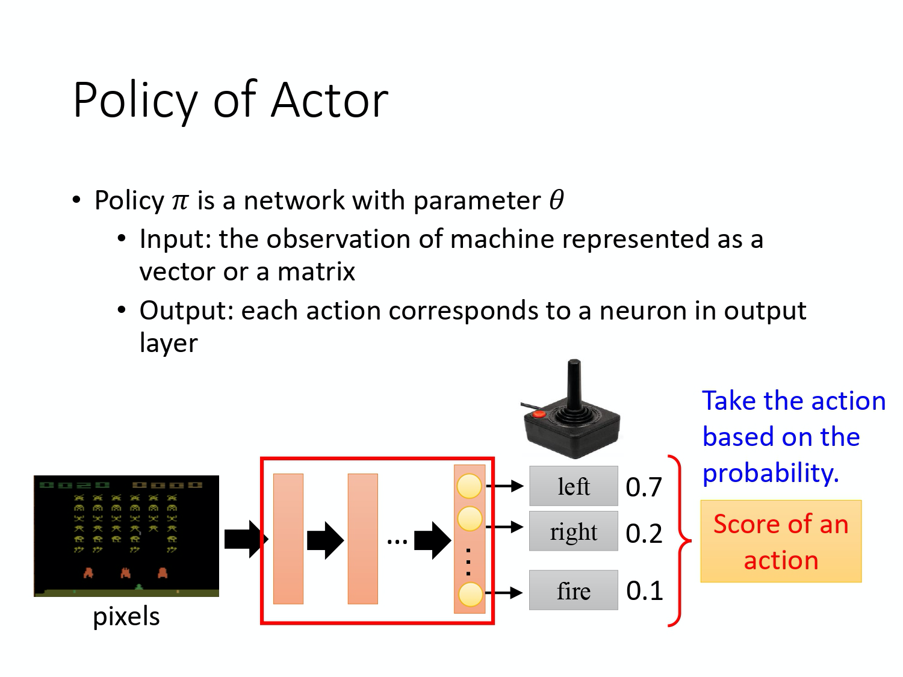

* Policy 一般写成 $\pi$。假设你是用 deep learning 的技术来做 reinforcement learning 的话，**policy 就是一个 network**。Network 里面就有一堆参数， 我们用 $\theta$ 来代表 $\pi$ 的参数。

* **Network 的 input 就是现在 machine 看到的东西**，如果让 machine 打电玩的话，machine 看到的东西就是游戏的画面。Machine 看到什么东西，会影响你现在 training 到底好不好 train。举例来说，在玩游戏的时候， 也许你觉得游戏的画面，前后是相关的，也许你觉得说，你应该让你的 policy，看从游戏初始到现在这个时间点，所有画面的总和。你可能会觉得你要用到 RNN 来处理它，不过这样子会比较难处理。要让你的 machine，你的 policy 看到什么样的画面， 这个是你自己决定的。让你知道说给机器看到什么样的游戏画面，可能是比较有效的。
* **Output 的就是机器要采取什么样的行为。**

上图就是具体的例子，

* policy 就是一个 network；
* input 就是游戏的画面，它通常是由 pixels 所组成的；
* output 就是看看说有哪些选项是你可以去执行的，output layer 就有几个 neurons。

假设你现在可以做的行为有 3 个，output layer 就是有 3 个 neurons。每个 neuron 对应到一个可以采取的行为。Input 一个东西后，network 就会给每一个可以采取的行为一个分数。接下来，你把这个分数当作是概率。 actor 就是看这个概率的分布，根据这个机率的分布，决定它要采取的行为。比如说 70% 会走 left，20% 走 right，10% 开火等等。概率分布不同，actor 采取的行为就会不一样。

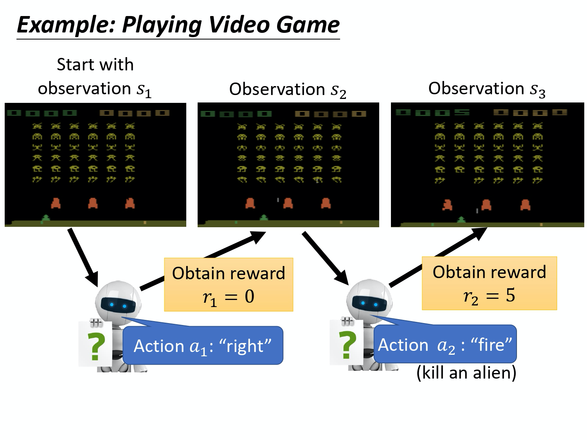
接下来用一个例子来说明 actor 是怎么样跟环境互动的。 首先 actor 会看到一个游戏画面，我们用 $s_1$ 来表示这个游戏画面，它代表游戏初始的画面。接下来 actor 看到这个游戏的初始画面以后，根据它内部的 network，根据它内部的 policy 来决定一个 action。假设它现在决定的 action 是向右，它决定完 action 以后，它就会得到一个 reward ，代表它采取这个 action 以后得到的分数。

我们把一开始的初始画面记作 $s_1$， 把第一次执行的动作记作 $a_1$，把第一次执行动作完以后得到的 reward 记作 $r_1$。不同的书会有不同的定义，有人会觉得说这边应该要叫做 $r_2$，这个都可以，你自己看得懂就好。Actor 决定一个的行为以后， 就会看到一个新的游戏画面，这边是 $s_2$。然后把这个 $s_2$ 输入给 actor，这个 actor 决定要开火，然后它可能杀了一只怪，就得到五分。这个 process 就反复地持续下去，直到今天走到某一个 timestamp 执行某一个 action，得到 reward 之后， 这个 environment 决定这个游戏结束了。比如说，如果在这个游戏里面，你是控制绿色的船去杀怪，如果你被杀死的话，游戏就结束，或是你把所有的怪都清空，游戏就结束了。

一场游戏叫做一个 `Episode(回合)` 或者 `Trial(试验)`。把这个游戏里面，所有得到的 reward 都总合起来，就是 `Total reward`，我们称其为`Return(回报)`，用 R 来表示它。Actor 要想办法去 maximize 它可以得到的 reward。

首先，`environment` 是一个`function`，游戏的主机也可以把它看作是一个 function，虽然它不一定是 neural network，可能是 rule-based 的规则，但你可以把它看作是一个 function。这个 function，一开始就先吐出一个 state，也就是游戏的画面，接下来你的 actor 看到这个游戏画面 $s_1$ 以后，它吐出 $a_1$，然后 environment 把 $a_1$ 当作它的输入，然后它再吐出 $s_2$，吐出新的游戏画面。Actor 看到新的游戏画面，再采取新的行为 $a_2$，然后 environment 再看到 $a_2$，再吐出 $s_3$。这个 process 会一直持续下去，直到 environment 觉得说应该要停止为止。

在一场游戏里面，我们把 environment 输出的 $s$ 跟 actor 输出的行为 $a$，把这个 $s$ 跟 $a$ 全部串起来， 叫做一个 `Trajectory`，如下式所示。
$$
\text { Trajectory } \tau=\left\{s_{1}, a_{1}, s_{2}, a_{2}, \cdots, s_{t}, a_{t}\right\}
$$

每一个 trajectory，你可以计算它发生的概率。假设现在 actor 的参数已经被给定了话，就是 $\theta$。根据 $\theta$，你其实可以计算某一个 trajectory 发生的概率，你可以计算某一个回合，某一个 episode 里面， 发生这样子状况的概率。

$$
\begin{aligned}
p_{\theta}(\tau)
&=p\left(s_{1}\right) p_{\theta}\left(a_{1} | s_{1}\right) p\left(s_{2} | s_{1}, a_{1}\right) p_{\theta}\left(a_{2} | s_{2}\right) p\left(s_{3} | s_{2}, a_{2}\right) \cdots \\
&=p\left(s_{1}\right) \prod_{t=1}^{T} p_{\theta}\left(a_{t} | s_{t}\right) p\left(s_{t+1} | s_{t}, a_{t}\right)
\end{aligned}
$$

怎么算呢，如上式所示。在假设 actor 的参数就是 $\theta$ 的情况下，某一个 trajectory $\tau$ 的概率就是这样算的，你先算 environment 输出 $s_1$ 的概率，再计算根据 $s_1$ 执行 $a_1$ 的概率，这是由你 policy 里面的 network 参数 $\theta$ 所决定的， 它是一个概率，因为你的 policy 的 network 的 output 是一个 distribution，actor 是根据这个 distribution 去做 sample，决定现在实际上要采取的 action是哪一个。接下来 environment 根据 $a_1$ 跟 $s_1$ 产生 $s_2$，因为 $s_2$ 跟$s_1$  还是有关系的，下一个游戏画面，跟前一个游戏画面通常还是有关系的，至少要是连续的， 所以给定前一个游戏画面 $s_1$ 和现在 actor 采取的行为 $a_1$，就会产生 $s_2$。

这件事情可能是概率，也可能不是概率，这个取决于 environment，就是主机它内部设定是怎样。看今天这个主机在决定，要输出什么样的游戏画面的时候，有没有概率。因为如果没有概率的话，这个游戏的每次的行为都一样，你只要找到一条 path 就可以过关了，这样感觉是蛮无聊的 。所以游戏里面，通常是还是有一些概率的，你做同样的行为，给同样的前一个画面， 下次产生的画面不见得是一样的。Process 就反复继续下去，你就可以计算一个 trajectory $s_1$,$a_1$, $s_2$ , $a_2$ 出现的概率有多大。

**这个概率取决于两部分**， 

* 一部分是 `environment 的行为`， environment 的 function 它内部的参数或内部的规则长什么样子。 $p(s_{t+1}|s_t,a_t)$这一项代表的是 environment， environment 这一项通常你是无法控制它的，因为那个是人家写好的，你不能控制它。
* 另一部分是 `agent 的行为`。你能控制的是 $p_\theta(a_t|s_t)$。给定一个 $s_t$， actor 要采取什么样的 $a_t$ 会取决于你 actor 的参数 $\theta$， 所以这部分是 actor 可以自己控制的。随着 actor 的行为不同，每个同样的 trajectory， 它就会有不同的出现的概率。

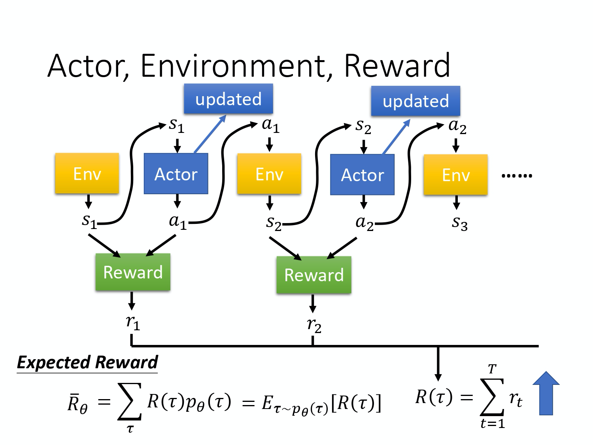

在 reinforcement learning 里面，除了 environment 跟 actor 以外， 还有`reward function`。Reward function 根据在某一个 state 采取的某一个 action 决定说现在这个行为可以得到多少的分数。 它是一个 function，给它 $s_1$，$a_1$，它告诉你得到 $r_1$。给它 $s_2$ ，$a_2$，它告诉你得到 $r_2$。 把所有的 $r$ 都加起来，我们就得到了 $R(\tau)$ ，代表某一个 trajectory $\tau$ 的 reward。在某一场游戏里面， 某一个 episode 里面，我们会得到 R。**我们要做的事情就是调整 actor 内部的参数 $\theta$， 使得 R 的值越大越好。** 但实际上 reward 并不只是一个 scalar，reward 其实是一个 random variable，R 其实是一个 random variable。 因为 actor 在给定同样的 state 会做什么样的行为，这件事情是有随机性的。environment 在给定同样的 observation 要采取什么样的 action，要产生什么样的 observation，本身也是有随机性的。所以 R 是一个 random variable，你能够计算的，是它的期望值。你能够计算的是说，在给定某一组参数 $\theta$ 的情况下，我们会得到的 R 的期望值是多少。

$$
\bar{R}_{\theta}=\sum_{\tau} R(\tau) p_{\theta}(\tau)
$$
这个期望值的算法如上式所示，穷举所有可能的 trajectory $\tau$， 每一个 trajectory $\tau$ 都有一个概率。比如 $\theta$ 是一个很强的 model， 那它都不会死。如果有一个 episode 很快就死掉了， 它的概率就很小；如果有一个 episode 都一直没有死， 那它的概率就很大。根据你的 $\theta$， 你可以算出某一个 trajectory $\tau$ 出现的概率，接下来你计算这个 $\tau$ 的 total reward 是多少。 Total reward weighted by 这个 $\tau$ 出现的概率，对所有的 $\tau$ 进行求和，就是期望值。给定一个参数，你会得到的期望值。
$$
\bar{R}_{\theta}=\sum_{\tau} R(\tau) p_{\theta}(\tau)=E_{\tau \sim p_{\theta}(\tau)}[R(\tau)]
$$
我们还可以写成上式那样，从 $p_{\theta}(\tau)$ 这个 distribution sample 一个 trajectory $\tau$，然后计算 $R(\tau)$ 的期望值，就是你的 expected reward。 我们要做的事情就是 maximize expected reward。

怎么 maximize expected reward 呢？我们用的是 `gradient ascent`，因为要让它越大越好，所以是 gradient ascent。Gradient ascent 在 update 参数的时候要加。要进行 gradient ascent，我们先要计算 expected reward $\bar{R}$ 的 gradient 。我们对 $\bar{R}$ 取一个 gradient，这里面只有 $p_{\theta}(\tau)$ 是跟 $\theta$ 有关，所以 gradient 就放在 $p_{\theta}(\tau)$ 这个地方。$R(\tau)$ 这个 reward function 不需要是 differentiable，我们也可以解接下来的问题。举例来说，如果是在 GAN 里面，$R(\tau)$ 其实是一个 discriminator，它就算是没有办法微分，也无所谓，你还是可以做接下来的运算。

取 gradient之后，我们背一个公式，
$$
\nabla f(x)=f(x)\nabla \log f(x)
$$
我们可以对 $\nabla p_{\theta}(\tau)$ 使用这个公式，然后会得到 $\nabla p_{\theta}(\tau)=p_{\theta}(\tau)  \nabla \log p_{\theta}(\tau)$。

接下来， 分子分母，上下同乘$p_{\theta}(\tau)$，然后我们可以得到下式：
$$
\frac{\nabla p_{\theta}(\tau)}{p_{\theta}(\tau)}=\log p_{\theta}(\tau)
$$

 然后如下式所示， 对 $\tau$ 进行求和，把 $R(\tau)$  和  $\log p_{\theta}(\tau)$ 这两项 weighted by $ p_{\theta}(\tau)$， 既然有 weighted by  $p_{\theta}(\tau)$，它们就可以被写成这个 expected 的形式。也就是你从 $p_{\theta}(\tau)$ 这个 distribution 里面 sample $\tau$ 出来， 去计算 $R(\tau)$ 乘上 $\nabla\log p_{\theta}(\tau)$，然后把它对所有可能的 $\tau$ 进行求和，就是这个 expected value 。

$$
\begin{aligned}
\nabla \bar{R}_{\theta}&=\sum_{\tau} R(\tau) \nabla p_{\theta}(\tau)\\&=\sum_{\tau} R(\tau) p_{\theta}(\tau) \frac{\nabla p_{\theta}(\tau)}{p_{\theta}(\tau)} \\&=
\sum_{\tau} R(\tau) p_{\theta}(\tau) \nabla \log p_{\theta}(\tau) \\
&=E_{\tau \sim p_{\theta}(\tau)}\left[R(\tau) \nabla \log p_{\theta}(\tau)\right]
\end{aligned}
$$

实际上这个 expected value 没有办法算，所以你是用 sample 的方式来 sample 一大堆的 $\tau$。你 sample $N$ 笔  $\tau$， 然后你去计算每一笔的这些 value，然后把它全部加起来，最后你就得到你的 gradient。你就可以去 update 你的参数，你就可以去 update 你的 agent，如下式所示。
$$
\begin{aligned}
E_{\tau \sim p_{\theta}(\tau)}\left[R(\tau) \nabla \log p_{\theta}(\tau)\right] &\approx \frac{1}{N} \sum_{n=1}^{N} R\left(\tau^{n}\right) \nabla \log p_{\theta}\left(\tau^{n}\right) \\
&=\frac{1}{N} \sum_{n=1}^{N} \sum_{t=1}^{T_{n}} R\left(\tau^{n}\right) \nabla \log p_{\theta}\left(a_{t}^{n} \mid s_{t}^{n}\right)
\end{aligned}
$$
注意 $p_{\theta}(\tau)$ 里面有两项，$p(s_{t+1}|s_t,a_t)$ 来自于 environment，$p_\theta(a_t|s_t)$ 是来自于 agent。 $p(s_{t+1}|s_t,a_t)$ 由环境决定从而与 $\theta$ 无关，因此 $\nabla \log p(s_{t+1}|s_t,a_t) =0 $。因此 $\nabla p_{\theta}(\tau)=
\nabla \log p_{\theta}\left(a_{t}^{n} | s_{t}^{n}\right)$。

你可以非常直观的来理解这个部分，也就是在你 sample 到的 data 里面， 你 sample 到，在某一个 state $s_t$ 要执行某一个 action $a_t$， 这个 $s_t$ 跟 $a_t$ 它是在整个 trajectory $\tau$ 的里面的某一个 state and action 的 pair。

*  假设你在 $s_t$ 执行 $a_t$，最后发现 $\tau$ 的 reward 是正的， 那你就要增加这一项的概率，你就要增加在 $s_t$ 执行 $a_t$ 的概率。
*  反之，在 $s_t$ 执行 $a_t$ 会导致$\tau$  的 reward 变成负的， 你就要减少这一项的概率。

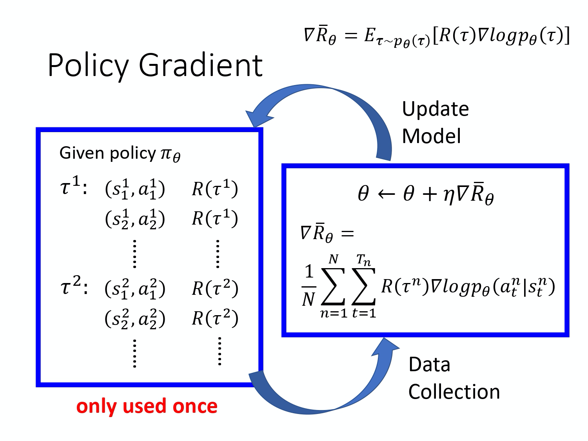
这个怎么实现呢？ 你用 gradient ascent 来 update 你的参数，你原来有一个参数 $\theta$ ，把你的 $\theta$  加上你的 gradient 这一项，那当然前面要有个 learning rate，learning rate 其实也是要调的，你可用 Adam、RMSProp 等方法对其进行调整。

我们可以套下面这个公式来把 gradient 计算出来: 

$$
\nabla \bar{R}_{\theta}=\frac{1}{N} \sum_{n=1}^{N} \sum_{t=1}^{T_{n}} R\left(\tau^{n}\right) \nabla \log p_{\theta}\left(a_{t}^{n} | s_{t}^{n}\right)
$$
实际上，要套上面这个公式， 首先你要先收集一大堆的 s 跟 a 的 pair，你还要知道这些 s 跟 a 在跟环境互动的时候，你会得到多少的 reward。 这些资料怎么收集呢？你要拿你的 agent，它的参数是 $\theta$，去跟环境做互动， 也就是拿你已经 train 好的 agent 先去跟环境玩一下，先去跟那个游戏互动一下， 互动完以后，你就会得到一大堆游戏的纪录，你会记录说，今天先玩了第一场，在第一场游戏里面，我们在 state $s_1$ 采取 action $a_1$，在 state $s_2$ 采取 action $a_2$ 。

玩游戏的时候是有随机性的，所以 agent 本身是有随机性的，在同样 state $s_1$，不是每次都会采取 $a_1$，所以你要记录下来。在 state $s_1^1$ 采取 $a_1^1$，在 state $s_2^1$ 采取 $a_2^1$。整场游戏结束以后，得到的分数是$R(\tau^1)$。你会 sample 到另外一笔 data，也就是另外一场游戏。在另外一场游戏里面，你在 state $s_1^2$ 采取 $a_1^2$，在 state $s_2^2$ 采取 $a_2^2$，然后你 sample 到的就是 $\tau^2$，得到的 reward 是 $R(\tau^2)$。

你就可以把 sample 到的东西代到这个 gradient 的式子里面，把 gradient 算出来。也就是把这边的每一个 s 跟 a 的 pair 拿进来，算一下它的 log probability 。你计算一下在某一个 state 采取某一个 action 的 log probability，然后对它取 gradient，然后这个 gradient 前面会乘一个 weight，weight 就是这场游戏的 reward。 有了这些以后，你就会去 update 你的 model。

Update 完你的 model 以后。你要重新去收集 data，再 update model。这边要注意一下，一般 policy gradient sample 的 data 就只会用一次。你把这些 data sample 起来，然后拿去 update 参数，这些 data 就丢掉了。接着再重新 sample data，才能够去 update 参数， 等一下我们会解决这个问题。

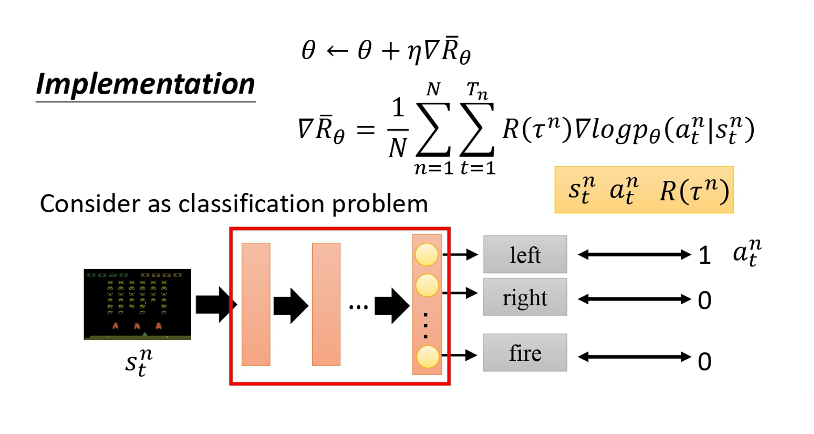

接下来讲一些实现细节。实现方法是这个样子，把它想成一个分类的问题，在 classification 里面就是 input 一个 image，然后 output 决定说是 10 个 class 里面的哪一个。在做 classification 时，我们要收集一堆 training data，要有 input 跟 output 的 pair。

在实现的时候，你就把 state 当作是 classifier 的 input。 你就当在做 image classification 的 problem，只是现在的 class 不是说 image 里面有什么 objects。 现在的 class 是说，看到这张 image 我们要采取什么样的行为，每一个行为就是一个 class。比如说第一个 class 叫做向左，第二个 class 叫做向右，第三个 class 叫做开火。

这些训练的数据从哪里来的呢？ 做分类的问题时，要有 input 和正确的 output。  这些训练数据是从 sampling 的 process 来的。假设在 sampling 的 process 里面，在某一个 state，你 sample 到你要采取 action a， 你就把这个 action a 当作是你的 ground truth。你在这个 state，你 sample 到要向左。 本来向左这件事概率不一定是最高， 因为你是 sample，它不一定概率最高。假设你 sample 到向左，在 training 的时候 你叫告诉 machine 说，调整 network 的参数， 如果看到这个 state，你就向左。在一般的 classification 的 problem 里面，其实你在 implement classification 的时候， 你的 objective function 都会写成 minimize cross entropy，其实 minimize cross entropy 就是 maximize log likelihood。

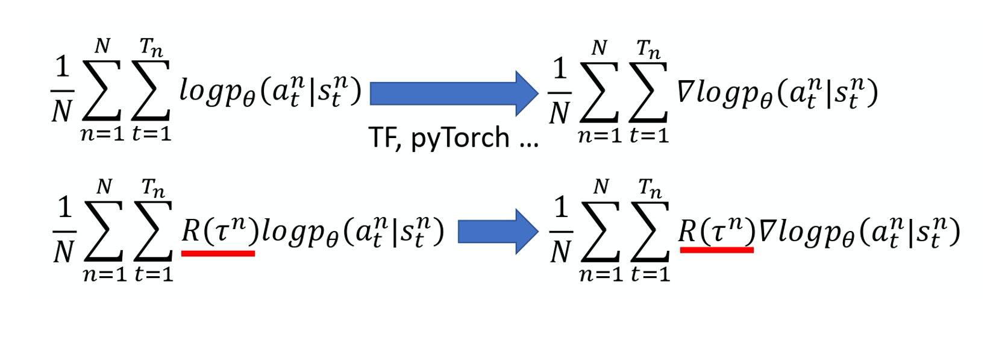

做 classification 的时候，objective function 就是 maximize 或 minimize 的对象， 因为我们现在是 maximize likelihood 所以其实是 maximize， 你要 maximize 的对象，如下式所示:
$$
\frac{1}{N} \sum_{n=1}^{N} \sum_{t=1}^{T_{n}} \log p_{\theta}\left(a_{t}^{n} \mid s_{t}^{n}\right)
$$

像这种 loss function。你可在 TensorFlow 里 call 现成的 function，它就会自动帮你算。
然后你就可以把 gradient 计算出来，这是一般的分类问题。RL 唯一不同的地方是 loss 前面乘上一个 weight，这个是整场游戏的时候得到的 total reward R， 它并不是在 state s 采取 action a 的时候得到的 reward。 你要把你的每一笔 training data，都 weighted by 这个 R。然后你用 TensorFlow 或 PyTorch 去帮你算 gradient 就结束了，跟一般 classification 差不多。

## Tips
这边有一些在实现的时候，你也许用得上的 tip。
### Tip 1: Add a Baseline

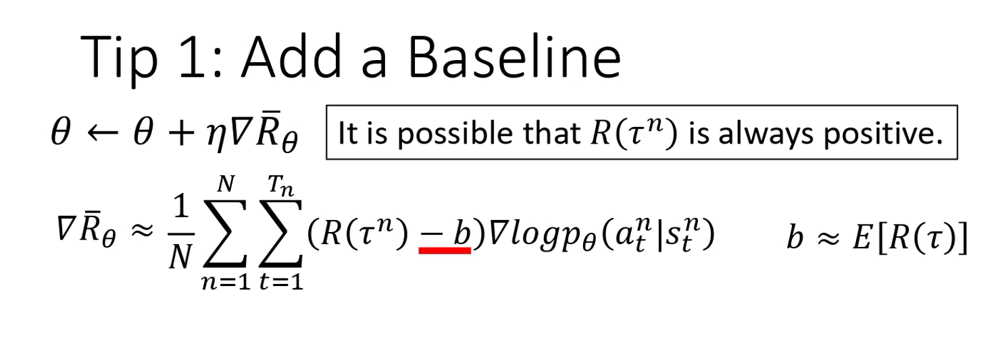

第一个 tip 是 add 一个 baseline。add baseline 是什么意思呢？如果 given state s 采取 action a 会给你整场游戏正面的 reward，就要增加它的概率。如果 state s 执行 action a，整场游戏得到负的 reward，就要减少这一项的概率。

但在很多游戏里面， reward 总是正的，就是说最低都是 0。比如说打乒乓球游戏， 你的分数就是介于 0 到 21 分之间，所以这个 R 总是正的。假设你直接套用这个式子， 在 training 的时候，告诉 model 说，不管是什么 action 你都应该要把它的概率提升。 在理想上，这么做并不一定会有问题。因为虽然说 R 总是正的，但它正的量总是有大有小，你在玩乒乓球那个游戏里面，得到的 reward 总是正的，但它是介于 0~21分之间，有时候你采取某些 action 可能是得到 0 分，采取某些 action 可能是得到 20 分。

假设你有 3 个 action a/b/c 可以执行，在某一个 state 有 3 个 action a/b/c可以执行。根据这个式子，你要把这 3 项的概率， log probability 都拉高。 但是它们前面 weight 的这个 R 是不一样的。 R 是有大有小的，weight 小的，它上升的就少，weight 多的，它上升的就大一点。 因为这个 log probability，它是一个概率，所以action a、b、c 的和要是 0。 所以上升少的，在做完 normalize 以后， 它其实就是下降的，上升的多的，才会上升。

 

这个是一个理想上的状况，但是实际上，我们是在做 sampling 就本来这边应该是一个 expectation， summation over 所有可能的 s 跟 a 的 pair。 但你真正在学的时候，当然不可能是这么做的，你只是 sample 了少量的 s 跟 a 的 pair 而已。 因为我们做的是 sampling，有一些 action 可能从来都没有 sample 到。在某一个 state1，虽然可以执行的 action 有 a/b/c 3 个，但你可能只 sample 到 action b，你可能只 sample 到 action c，你没有 sample 到 action a。但现在所有 action 的 reward 都是正的，所以根据这个式子，它的每一项的概率都应该要上升。你会遇到的问题是，因为 a 没有被 sample 到，其它 action 的概率如果都要上升，a 的概率就下降。 所以 a 不一定是一个不好的 action， 它只是没被 sample 到。但只是因为它没被 sample 到， 它的概率就会下降，这个显然是有问题的，要怎么解决这个问题呢？你会希望你的 reward 不要总是正的。

为了解决 reward 总是正的这个问题，你可以把 reward 减掉一项叫做 b，这项 b 叫做 baseline。你减掉这项 b 以后，就可以让 $R(\tau^n)-b$ 这一项， 有正有负。 所以如果得到的 total reward $R(\tau^n)$ 大于 b 的话，就让它的概率上升。如果这个 total reward 小于 b，就算它是正的，正的很小也是不好的，你就要让这一项的概率下降。 如果$R(\tau^n)<b$  ， 你就要让这个 state 采取这个 action 的分数下降 。这个 b 怎么设呢？一个最简单的做法就是， 你把 $\tau^n$ 的值取 expectation， 算一下 $\tau^n$的平均值。
$$
b \approx E[R(\tau)]
$$

这是其中一种做法， 你可以想想看有没有其它的做法。

 所以在 implement training 的时候，你会不断地把 $R(\tau)$ 的分数记录下来 然后你会不断地去计算 $R(\tau)$ 的平均值， 你会把这个平均值，当作你的 b 来用。 这样就可以让你在 training 的时候， $\nabla \log p_{\theta}\left(a_{t}^{n} | s_{t}^{n}\right)$ 乘上前面这一项， 是有正有负的，这个是第一个 tip。

### Tip 2: Assign Suitable Credit

第二个 tip：给每一个 action 合适的 credit。什么意思呢，如果我们看今天下面这个式子的话，
$$
\nabla \bar{R}_{\theta} \approx \frac{1}{N} \sum_{n=1}^{N} \sum_{t=1}^{T_{n}}\left(R\left(\tau^{n}\right)-b\right) \nabla \log p_{\theta}\left(a_{t}^{n} \mid s_{t}^{n}\right)
$$
我们原来会做的事情是，在某一个 state，假设你执行了某一个 action a，它得到的 reward ，它前面乘上的这一项 $R(\tau^n)-b$。

只要在同一个 Episode 里面，在同一场游戏里面， 所有的 state 跟 a 的 pair，它都会 weighted by 同样的 reward term，这件事情显然是不公平的，因为在同一场游戏里面 也许有些 action 是好的，有些 action 是不好的。 假设整场游戏的结果是好的， 并不代表这个游戏里面每一个行为都是对的。若是整场游戏结果不好， 但不代表游戏里面的所有行为都是错的。所以我们希望可以给每一个不同的 action 前面都乘上不同的 weight。每一个 action 的不同 weight， 它反映了每一个 action 到底是好还是不好。 

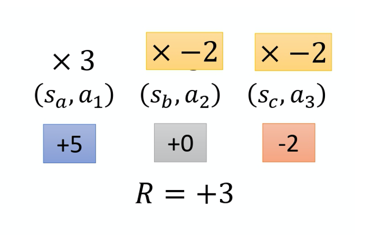

举个例子， 假设这个游戏都很短，只有 3~4 个互动， 在 $s_a$ 执行 $a_1$ 得到 5 分。在 $s_b$ 执行 $a_2$ 得到 0 分。在 $s_c$ 执行 $a_3$ 得到 -2 分。 整场游戏下来，你得到 +3 分，那你得到 +3 分 代表在 state $s_b$ 执行 action $a_2$ 是好的吗？并不见得代表 state $s_b$ 执行 $a_2$ 是好的。因为这个正的分数，主要来自于在 state $s_a$ 执行了 $a_1$，跟在 state $s_b$ 执行 $a_2$ 是没有关系的，也许在 state $s_b$ 执行 $a_2$ 反而是不好的， 因为它导致你接下来会进入 state $s_c$，执行 $a_3$ 被扣分，所以整场游戏得到的结果是好的， 并不代表每一个行为都是对的。

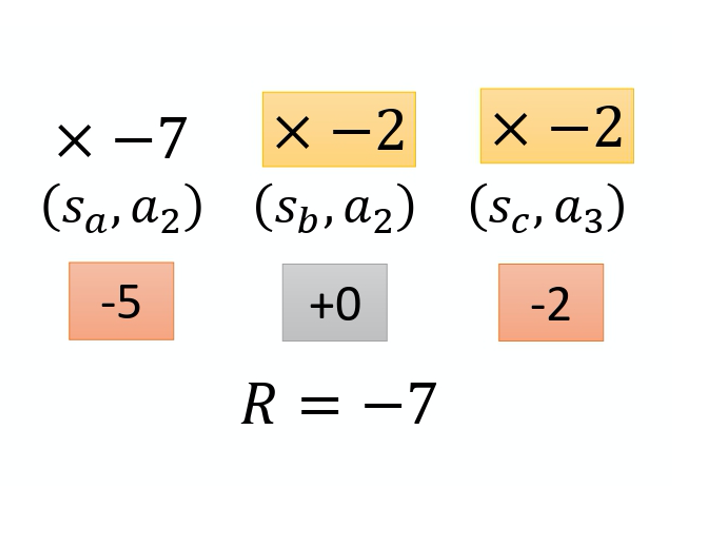

如果按照我们刚才的讲法，整场游戏得到的分数是 3 分，那到时候在 training 的时候， 每一个 state 跟 action 的 pair，都会被乘上 +3。 在理想的状况下，这个问题，如果你 sample 够多就可以被解决。因为假设你 sample 够多，在 state $s_b$ 执行 $a_2$ 的这件事情，被 sample 到很多。就某一场游戏，在 state $s_b$ 执行 $a_2$，你会得到 +3 分。 但在另外一场游戏，在 state $s_b$ 执行 $a_2$，你却得到了 -7 分，为什么会得到 -7 分呢？ 因为在 state $s_b$ 执行 $a_2$ 之前， 你在 state $s_a$ 执行 $a_2$ 得到 -5 分，-5 分这件事可能也不是在 $s_b$ 执行 $a_2$ 的错，这两件事情，可能是没有关系的，因为它先发生了，这件事才发生，所以它们是没有关系的。

在 state $s_b$ 执行 $a_2$ 可能造成的问题只有会在接下来 -2 分，而跟前面的 -5 分没有关系的。但是假设我们今天 sample 到这项的次数够多，把所有发生这件事情的情况的分数通通都集合起来， 那可能不是一个问题。但现在的问题就是，我们 sample 的次数是不够多的。在 sample 的次数不够多的情况下，你要给每一个 state 跟 action pair 合理的 credit，你要让大家知道它合理的 contribution。怎么给它一个合理的 contribution 呢？ 一个做法是计算这个 pair 的 reward 的时候，不把整场游戏得到的 reward 全部加起来，**只计算从这一个 action 执行以后所得到的 reward**。因为这场游戏在执行这个 action 之前发生的事情是跟执行这个 action 是没有关系的， 所以在执行这个 action 之前得到多少 reward 都不能算是这个 action 的功劳。跟这个 action 有关的东西， 只有在执行这个 action 以后发生的所有的 reward 把它加起来，才是这个 action 真正的 contribution。所以在这个例子里面，在 state $s_b$ 执行 $a_2$ 这件事情，也许它真正会导致你得到的分数应该是 -2 分而不是 +3 分，因为前面的 +5 分 并不是执行 $a_2$ 的功劳。实际上执行 $a_2$ 以后，到游戏结束前， 你只有被扣 2 分而已，所以它应该是 -2。那一样的道理，今天执行 $a_2$ 实际上不应该是扣 7 分，因为前面扣 5 分，跟在 $s_b$ 这个 state 执行 $a_2$ 是没有关系的。在 $s_b$ 这个 state 执行 $a_2$，只会让你被扣两分而已，所以也许在 $s_b$ 这个 state 执行 $a_2$， 你真正会导致的结果只有扣两分而已。如果要把它写成式子的话是什么样子呢？如下式所示。

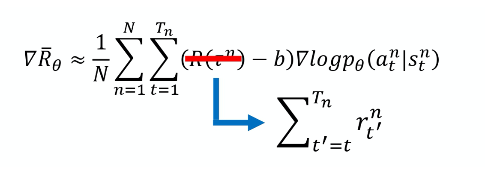

本来的 weight 是整场游戏的 reward 的总和。那现在改成从某个时间 $t$ 开始，假设这个 action 是在 t 这个时间点所执行的，从 $t$ 这个时间点，一直到游戏结束所有 reward 的总和，才真的代表这个 action 是好的还是不好的。 

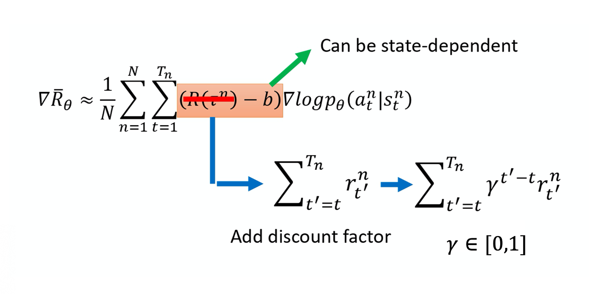
**接下来再更进一步，我们把未来的 reward 做一个 discount**，由此得到的回报被称为 `Discounted Return(折扣回报)`。为什么要把未来的 reward 做一个 discount 呢？因为虽然在某一个时间点，执行某一个 action，会影响接下来所有的结果，有可能在某一个时间点执行的 action，接下来得到的 reward 都是这个 action 的功劳。但在比较真实的情况下， 如果时间拖得越长，影响力就越小。 比如说在第二个时间点执行某一个 action， 那我在第三个时间点得到的 reward 可能是在第二个时间点执行某个 action 的功劳，但是在 100 个 timestamp 之后，又得到 reward，那可能就不是在第二个时间点执行某一个 action 得到的功劳。 所以我们实际上在做的时候，你会在 R 前面乘上一个 `discount factor`  $\gamma$， $\gamma \in [0,1] $ ，一般会设个 0.9 或 0.99，

* $\gamma = 0$ : 只关心即时奖励； 
* $\gamma = 1$ : 未来奖励等同于即时奖励。

 如果 time stamp $t'$ 越大，它前面就乘上越多次的 $\gamma$，就代表说现在在某一个 state $s_t$， 执行某一个 action $a_t$ 的时候，它真正的 credit 是在执行这个 action 之后所有 reward 的总和，而且你还要乘上 $\gamma$。

举一个例子， 你就想成说，这是游戏的第 1、2、3、4 回合，那你在游戏的第二回合的某一个  $s_t$ 你执行 $a_t$，它真正的 credit 得到的分数应该是，假设你这边得到 +1 分 这边得到 +3 分，这边得到 -5 分，它的真正的 credit，应该是 1 加上一个 discount 的 credit 叫做 $\gamma$ 乘上 3，再加上 $\gamma^2$ 乘上 -5。

如果大家可以接受这样子的话， 实际上就是这么 implement 的。这个 b 可以是 state-dependent 的，事实上 b 它通常是一个 network 估计出来的，它是一个 network 的 output。

把 $R-b$ 这一项合起来，我们统称为` advantage function`， 用 `A` 来代表 advantage function。Advantage function 是 dependent on s and a，我们就是要计算的是在某一个 state s 采取某一个 action a 的时候，advantage function 有多大。

在算 advantage function 时，你要计算 $\sum_{t^{\prime}=t}^{T_{n}} r_{t^{\prime}}^{n}$ ，你需要有一个互动的结果。你需要有一个 model 去跟环境做互动，你才知道接下来得到的 reward 会有多少。这个 advantage function 的上标是 $\theta$，$\theta$ 就是代表说是用 $\theta$ 这个 model 跟环境去做互动，然后你才计算出这一项。从时间 t 开始到游戏结束为止，所有 r 的加和减掉 b，这个就叫 advantage function。

Advantage function 的意义就是，假设我们在某一个 state $s_t$ 执行某一个 action $a_t$，相较于其他可能的 action，它有多好。它在意的不是一个绝对的好，而是相对的好，即`相对优势(relative advantage)`。因为会减掉一个 b，减掉一个 baseline， 所以这个东西是相对的好，不是绝对的好。 $A^{\theta}\left(s_{t}, a_{t}\right)$ 通常可以是由一个 network estimate 出来的，这个 network 叫做 critic。 

## REINFORCE

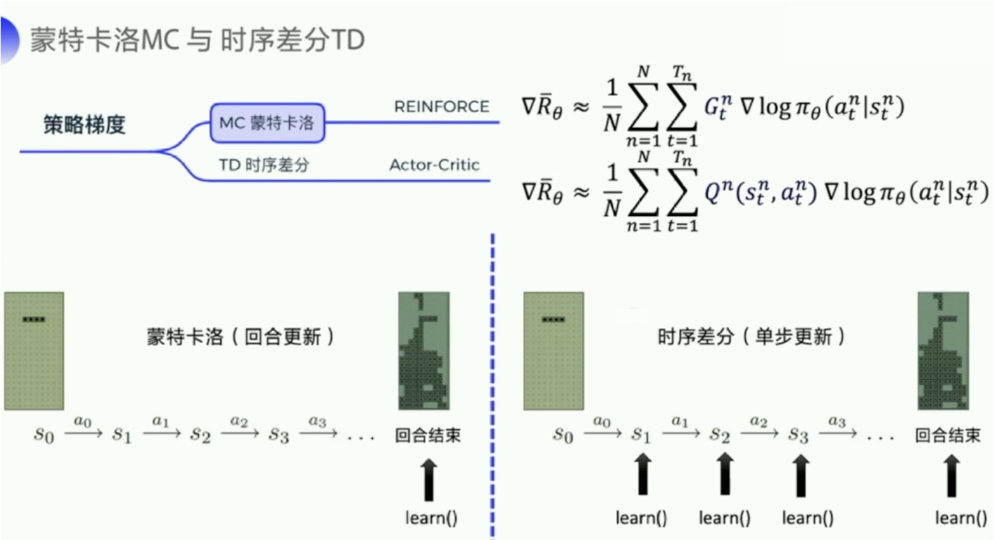

蒙特卡洛可以理解为算法完成一个 episode 之后，再拿这个 episode 的数据来去 learn 一下，做一次更新。因为我们已经拿到了一整个 episode 的数据的话，也能够拿到每一个 step 的 reward，我们可以很方便地去计算每个 step 的未来总收益，就是我们的期望，就是我们的回报 $G_t$ 。$G_t$ 是我们的未来总收益，$G_t$ 代表是从这个 step 后面，我能拿到的收益之和是多少。$G_1$是说我从第一步开始，往后能够拿到多少的收益。$G_2$ 是说从第二步开始，往后一共能够拿到多少的收益。

相比蒙特卡洛还是一个 episode 更新一次这样子的方式，时序差分就是每个 step 都更新一下。每走一步，我就更新下，这样的更新频率会更高一点。它拿的是 Q-function 来去近似地表示我的未来总收益 $G_t$。

举个例子来解释时序差分强化学习和蒙特卡洛强化学习的区别，

* 时序差分强化学习是指在不清楚马尔可夫状态转移概率的情况下，以采样的方式得到不完整的状态序列，估计某状态在该状态序列完整后可能得到的收益，并通过不断地采样持续更新价值。
* 蒙特卡洛强化学习则需要经历完整的状态序列后，再来更新状态的真实价值。

例如，你想获得开车去公司的时间，每天上班开车的经历就是一次采样。假设今天在路口 A 遇到了堵车，

* 时序差分强化学习会在路口 A 就开始更新预计到达路口 B、路口 C $\cdots \cdots$, 以及到达公司的时间；
* 而蒙特卡洛强化学习并不会立即更新时间，而是在到达公司后，再修改到达每个路口和公司的时间。

**时序差分强化学习能够在知道结果之前就开始学习，相比蒙特卡洛强化学习，其更快速、灵活。**

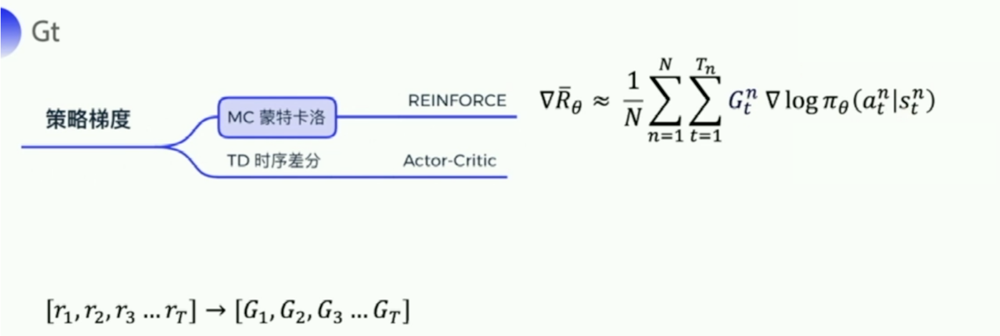

我们介绍下策略梯度最简单的也是最经典的一个算法 `REINFORCE`。REINFORCE 用的是回合更新的方式。它在代码上的处理上是先拿到每个 step 的 reward，然后计算每个 step 的未来总收益 $G_t$ 是多少，然后拿每个 $G_t$ 代入公式，去优化每一个 action 的输出。所以编写代码时会有这样一个函数，输入每个 step 拿到的 reward，把这些 reward 转成每一个 step 的未来总收益。因为未来总收益是这样计算的：
$$
\begin{aligned}
G_{t} &=\sum_{k=t+1}^{T} \gamma^{k-t-1} r_{k} \\
&=r_{t+1}+\gamma G_{t+1}
\end{aligned}
$$
上一个 step 和下一个 step 的未来总收益可以有这样子的一个关系。所以在代码的计算上，我们就是从后往前推，一步一步地往前推，先算 $G_T$，然后往前推，一直算到 $G_1$ 。

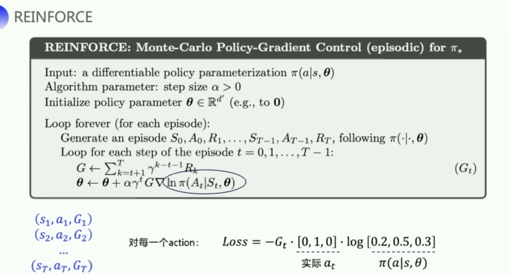

REINFORCE 的伪代码主要看最后四行，先产生一个 episode 的数据，比如 $(s_1,a_1,G_1),(s_2,a_2,G_2),\cdots,(s_T,a_T,G_T)$。然后针对每个 action 来计算梯度。 在代码上计算时，我们要拿到神经网络的输出。神经网络会输出每个 action 对应的概率值，然后我们还可以拿到实际的 action，把它转成 one-hot 向量乘一下，我们可以拿到 $\ln \pi(A_t|S_t,\theta)$  。

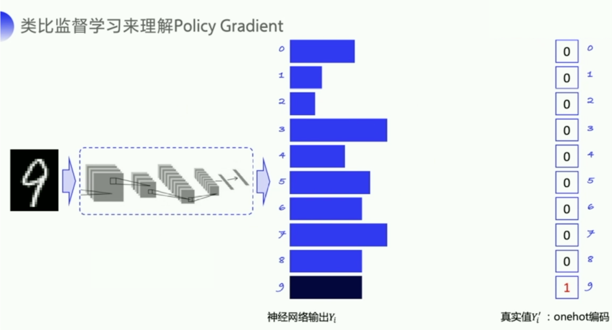

手写数字识别是一个经典的多分类问题，就是输入一张手写数字的图片，经过神经网络输出的是各个分类的一个概率。目的是希望输出的这个概率的分布尽可能地去贴近真实值的概率分布。因为真实值只有一个数字 9，你用这个 one-hot 向量的形式去给它编码的话，也可以把这个真实值理解为一个概率分布，9 的概率就是1，其他的概率就是 0。神经的网络输出一开始可能会比较平均，通过不断地迭代，训练优化之后，我会希望 9 输出的概率可以远高于其他数字输出的概率。

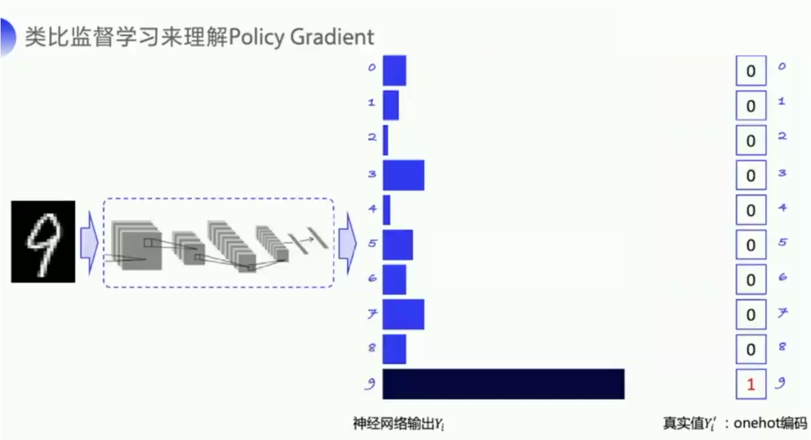

如上图所示，就是提高 9 对应的概率，降低其他数字对应的概率，让神经网络输出的概率能够更贴近这个真实值的概率分布。我们可以用`交叉熵(Cross Entropy)`来去表示两个概率分布之间的差距。

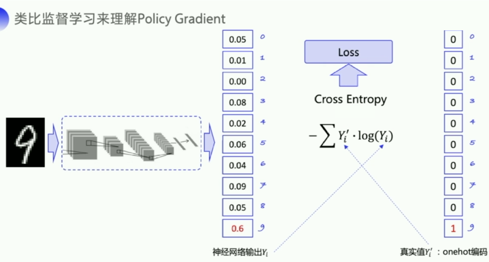

我们看一下它的优化流程，就是怎么让这个输出去逼近这个真实值。它的优化流程就是将图片作为输入传给神经网络，神经网络会判断这个图片属于哪一类数字，输出所有数字可能的概率，然后再计算这个交叉熵，就是神经网络的输出 $Y_i$ 和真实的标签值 $Y_i'$ 之间的距离 $-\sum Y_{i}^{\prime} \cdot \log \left(Y_{i}\right)$。我们希望尽可能地缩小这两个概率分布之间的差距，计算出来的 cross entropy 可以作为这个 loss 函数传给神经网络里面的优化器去优化，去自动去做神经网络的参数更新。

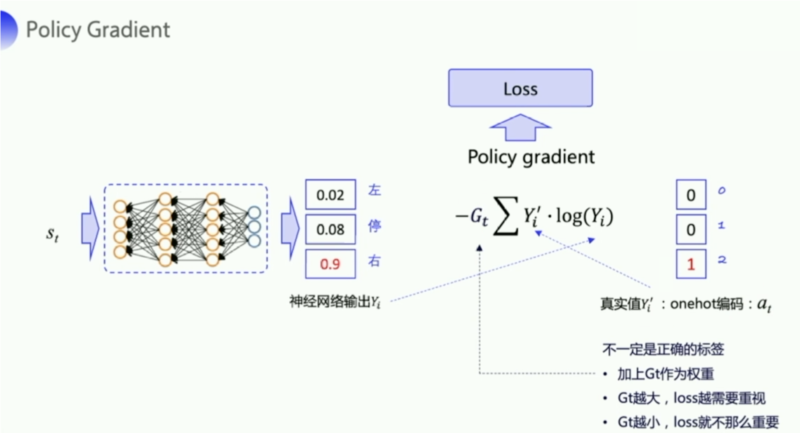

类似地，policy gradient 预测每一个状态下面应该要输出的这个行动的概率，就是输入状态 $s_t$，然后输出动作的概率，比如 0.02，0.08，0.09。实际上输出给环境的动作是随机选了一个 action，比如说我选了右这个 action，它的 one-hot 向量就是 0，0，1。我们把神经网络的输出和实际动作带入 cross entropy 的公式就可以求出输出的概率和实际的动作之间的差距。但这个实际的动作 $a_t$ 只是我们输出的真实的 action，它并不一定是正确的 action，它不能像手写数字识别一样作为一个正确的标签来去指导神经网络朝着正确的方向去更新，所以我们在这里会需要乘以一个奖励回报 $G_t$。这个奖励回报相当于是对这个真实 action 的评价，$G_t$ 具体越大，未来总收益越大，说明当前输出的这个真实的 action 就越好，这个 loss 就越需要重视。如果 $G_t$ 越小，那就说明做这个 action $a_t$ 并没有那么的好，loss 的权重就要小一点，优化力度就小一点。通过这个和那个手写输入识别的一个对比，我们就知道为什么 loss 会构造成这个样子。

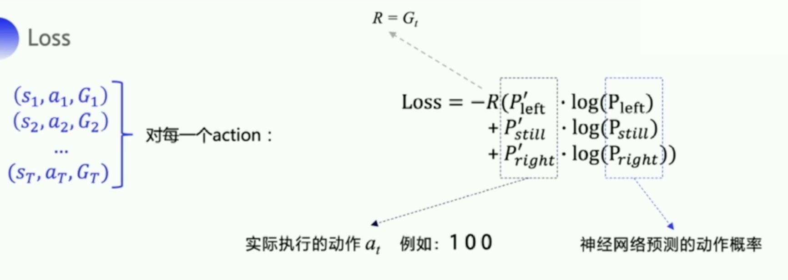

实际上我们在计算这个 loss 的时候，我们要拿到那个 $\ln \pi(A_t|S_t,\theta)$。我就拿我实际执行的这个动作，先取个 one-hot 向量，然后再拿到神经网络预测的动作概率，这两个一相乘，我就可以拿到算法里面的那个  $\ln \pi(A_t|S_t,\theta)$。这个就是我们要构造的 loss。因为我们会拿到整个 episode 的所有的轨迹，所以我们可以对这一条整条轨迹里面的每个 action 都去计算一个 loss。把所有的 loss 加起来之后，我们再扔给那个 adam 的优化器去自动更新参数就好了。

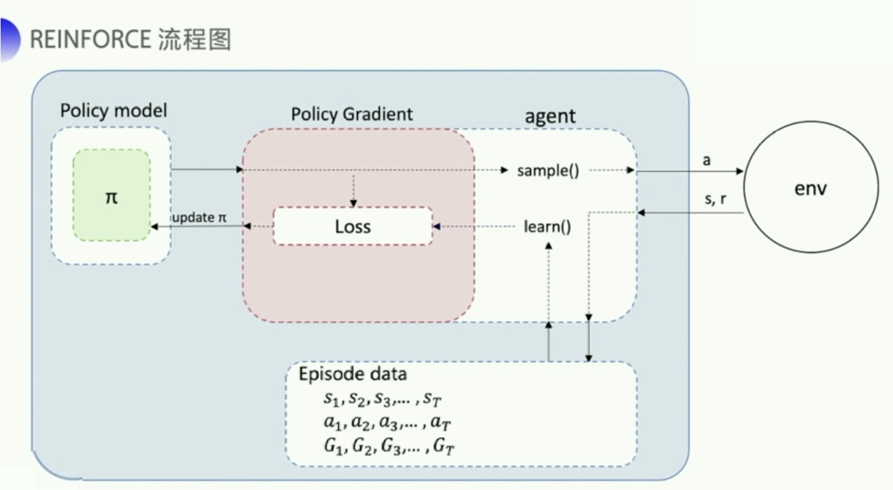

上图是 REINFORCE 的流程图。首先我们需要一个 policy model 来输出动作概率，输出动作概率后，我们用 sample 函数去得到一个具体的动作，然后跟环境交互过后，我们可以得到一整个 episode 的数据。拿到 episode 数据之后，我再去执行一下 learn() 函数，在 learn() 函数里面，我就可以拿这些数据去构造 loss function，扔给这个优化器去优化，去更新我的 policy model。

## References

* [Intro to Reinforcement Learning (强化学习纲要）](https://github.com/zhoubolei/introRL)
* [神经网络与深度学习](https://nndl.github.io/)

* [百面深度学习](https://book.douban.com/subject/35043939/)

