# PPO
## From On-policy to Off-policy
在讲 PPO 之前，我们先讲一下 on-policy 和 off-policy 这两种 training 方法的区别。
在 reinforcement learning 里面，我们要 learn 的就是一个 agent。

* 如果要 learn 的 agent 跟和环境互动的 agent 是同一个的话， 这个叫做`on-policy(同策略)`。 
* 如果要 learn 的 agent 跟和环境互动的 agent 不是同一个的话， 那这个叫做`off-policy(异策略)`。

比较拟人化的讲法是如果要学习的那个 agent，一边跟环境互动，一边做学习这个叫 on-policy。 如果它在旁边看别人玩，通过看别人玩来学习的话，这个叫做 off-policy。

为什么我们会想要考虑 off-policy ？让我们来想想 policy gradient。Policy gradient 是 on-policy 的做法，因为在做 policy gradient 时，我们需要有一个 agent、一个 policy 和一个 actor。这个 actor 先去跟环境互动去搜集资料，搜集很多的 $\tau$，根据它搜集到的资料，会按照 policy gradient 的式子去 update policy 的参数。所以 policy gradient 是一个 on-policy 的 algorithm。

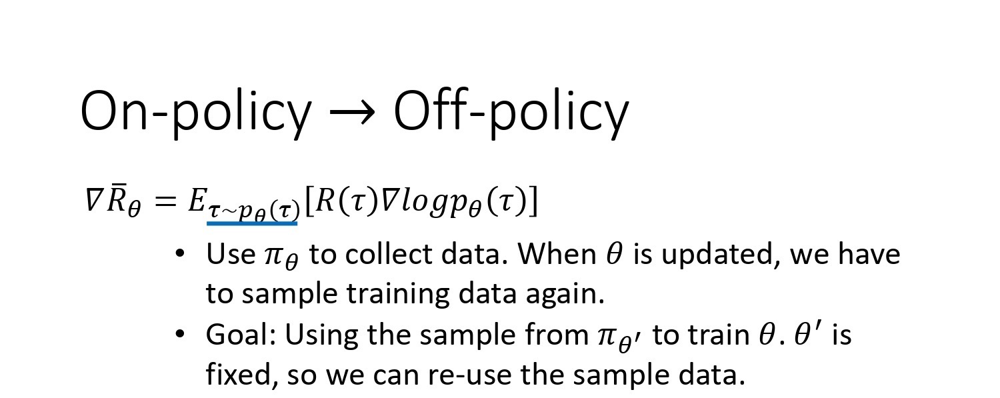

PPO 是 policy gradient 的一个变形，它是现在 OpenAI default reinforcement learning 的 algorithm。

$$
\nabla \bar{R}_{\theta}=E_{\tau \sim p_{\theta}(\tau)}\left[R(\tau) \nabla \log p_{\theta}(\tau)\right]
$$

问题是上面这个 update 的式子中的 $E_{\tau \sim p_{\theta}(\tau)}$  应该是你现在的 policy $\theta$ 所 sample 出来的 trajectory $\tau$ 做 expectation。一旦 update 了参数，从 $\theta$ 变成 $\theta'$ ，$p_\theta(\tau)$这个概率就不对了，之前 sample 出来的 data 就变的不能用了。所以 policy gradient 是一个会花很多时间来 sample data 的 algorithm，你会发现大多数时间都在 sample data，agent 去跟环境做互动以后，接下来就要 update 参数。你只能 update 参数一次。接下来你就要重新再去 collect data， 然后才能再次update 参数，这显然是非常花时间的。所以我们想要从 on-policy 变成 off-policy。 这样做就可以用另外一个 policy， 另外一个 actor $\theta'$  去跟环境做互动。用 $\theta'$  collect 到的 data 去训练 $\theta$。假设我们可以用 $\theta'$  collect 到的 data 去训练 $\theta$，意味着说我们可以把 $\theta'$  collect 到的data 用非常多次。我们可以执行 gradient ascent 好几次，我们可以 update 参数好几次， 都只要用同一笔 data 就好了。因为假设 $\theta$ 有能力学习另外一个 actor $\theta'$ 所 sample 出来的 data 的话， 那 $\theta'$  就只要sample 一次，也许s ample 多一点的data， 让 $\theta$ 去 update 很多次，这样就会比较有效率。

### Importance Sampling

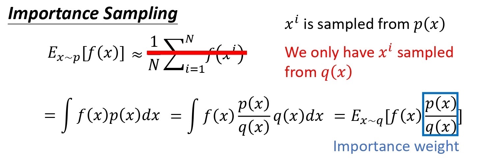

具体怎么做呢？这边就需要介绍 `importance sampling` 的概念。假设你有一个 function $f(x)$，你要计算从 p 这个 distribution sample $x$，再把 $x$ 带到 $f$ 里面，得到 $f(x)$。你要该怎么计算这个 $f(x)$ 的期望值？假设你不能对 p 这个distribution 做积分的话，那你可以从 p 这个 distribution 去 sample 一些 data $x^i$。把 $x^i$ 代到 $f(x)$ 里面，然后取它的平均值，就可以近似 $f(x)$ 的期望值。

现在有另外一个问题，我们没有办法从 p 这个 distribution 里面 sample data。假设我们不能从 p sample data，只能从另外一个 distribution q 去 sample data，q  可以是任何 distribution。我们不能够从 p 去 sample data，但可以从 q 去 sample $x$。我们从 q 去 sample $x^i$ 的话就不能直接套下面的式子。
$$
E_{x \sim p}[f(x)] \approx \frac{1}{N} \sum_{i=1}^N f(x^i)
$$
因为上式是假设你的 $x$ 都是从 p sample 出来的。所以做一个修正，修正是这样子的。期望值$E_{x \sim p}[f(x)]$其实就是$\int f(x) p(x) dx$，我们对其做如下的变换：
$$
\int f(x) p(x) d x=\int f(x) \frac{p(x)}{q(x)} q(x) d x=E_{x \sim q}[f(x){\frac{p(x)}{q(x)}}]
$$
我们就可以写成对 q 里面所 sample 出来的 x 取期望值。我们从 q 里面 sample x，然后再去计算 $f(x) \frac{p(x)}{q(x)}$，再去取期望值。所以就算我们不能从 p 里面去 sample data，只要能够从 q 里面去 sample data，然后代入上式，你就可以计算从 p 这个 distribution sample $x$ 代入 $f$ 以后所算出来的期望值。

这边是从 q 做 sample，所以从 q 里 sample 出来的每一笔 data，你需要乘上一个 weight 来修正这两个 distribution 的差异，weight 就是 $\frac{p(x)}{q(x)}$。$q(x)$ 可以是任何 distribution，唯一的限制就是 $q(x)$ 的概率是 0 的时候，$p(x)$ 的概率不为 0，不然这样会没有定义。假设  $q(x)$ 的概率是 0 的时候，$p(x)$ 的概率也都是 0 的话，那这样 $p(x)$ 除以 $q(x)$是有定义的。所以这个时候你就可以 apply importance sampling 这个技巧。你就可以从 p 做 sample 换成从 q 做 sample。

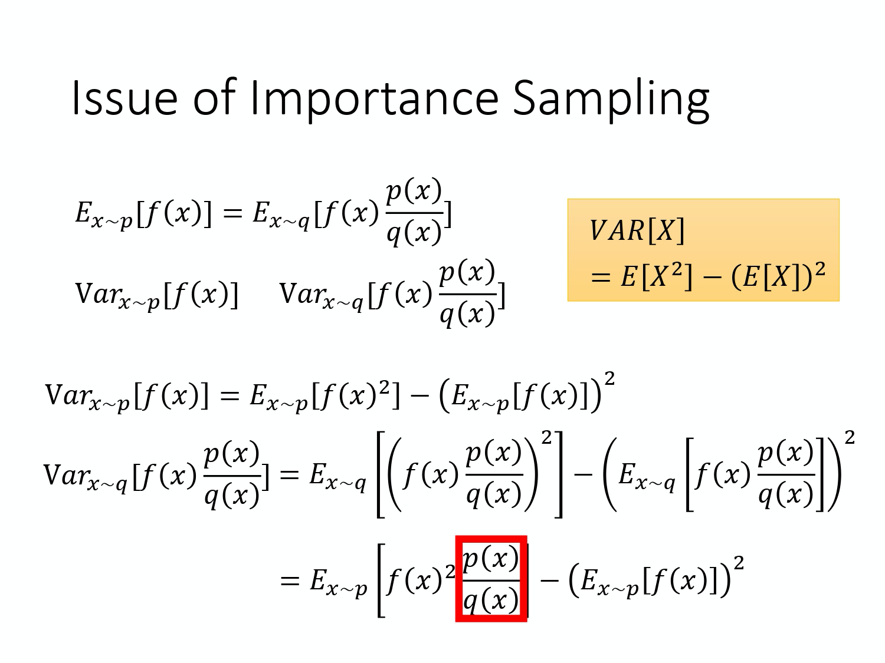

Importance sampling 有一些 issue。虽然理论上你可以把 p 换成任何的 q。但是在实现上， p 和 q 不能差太多。差太多的话，会有一些问题。什么样的问题呢？

$$
E_{x \sim p}[f(x)]=E_{x \sim q}\left[f(x) \frac{p(x)}{q(x)}\right]
$$
虽然上式成立。但上式左边是 $f(x)$ 的期望值，它的 distribution 是 p，上式右边是 $f(x) \frac{p(x)}{q(x)}$ 的期望值，它的 distribution 是 q。如果不是算期望值，而是算 variance 的话。这两个 variance 是不一样的。两个 random variable 的 mean 一样，并不代表它的 variance 一样。

我们可以代一下方差的公式：
$$
\operatorname{Var}_{x \sim p}[f(x)]=E_{x \sim p}\left[f(x)^{2}\right]-\left(E_{x \sim p}[f(x)]\right)^{2}
$$

$$
\begin{aligned}
\operatorname{Var}_{x \sim q}\left[f(x) \frac{p(x)}{q(x)}\right] &=E_{x \sim q}\left[\left(f(x) \frac{p(x)}{q(x)}\right)^{2}\right]-\left(E_{x \sim q}\left[f(x) \frac{p(x)}{q(x)}\right]\right)^{2} \\
&=E_{x \sim p}\left[f(x)^{2} \frac{p(x)}{q(x)}\right]-\left(E_{x \sim p}[f(x)]\right)^{2}
\end{aligned}
$$

$\operatorname{Var}_{x \sim p}[f(x)]$ 和 $\operatorname{Var}_{x \sim q}\left[f(x) \frac{p(x)}{q(x)}\right]$ 的差别在第一项是不同的， $\operatorname{Var}_{x \sim q}\left[f(x) \frac{p(x)}{q(x)}\right]$ 的第一项多乘了$\frac{p(x)}{q(x)}$，如果$\frac{p(x)}{q(x)}$ 差距很大的话， $\operatorname{Var}_{x \sim q}\left[f(x) \frac{p(x)}{q(x)}\right]$的 variance 就会很大。所以虽然理论上它们的 expectation 一样，也就是说，你只要对 p 这个 distribution sample 够多次，q 这个 distribution sample 够多，你得到的结果会是一样的。但是假设你 sample 的次数不够多，因为它们的 variance 差距是很大的，所以你就有可能得到非常大的差别。

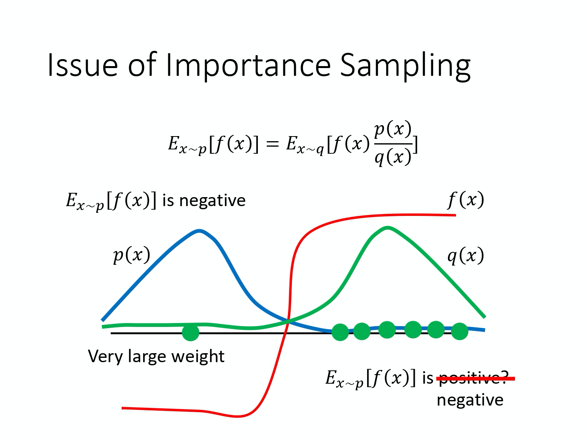

举个例子，当 $p(x)$ 和 $q(x)$ 差距很大的时候，会发生什么样的问题。假设蓝线是 $p(x)$  的distribution，绿线是 $q(x)$  的 distribution，红线是 $f(x)$。如果我们要计算$f(x)$的期望值，从 $p(x)$  这个distribution 做 sample 的话，那显然 $E_{x \sim p}[f(x)]$ 是负的，因为左边那块区域 $p(x)$ 的概率很高，所以要 sample 的话，都会 sample 到这个地方，而 $f(x)$ 在这个区域是负的， 所以理论上这一项算出来会是负。

接下来我们改成从 $q(x)$ 这边做 sample，因为 $q(x)$ 在右边这边的概率比较高，所以如果你sample 的点不够的话，那你可能都只 sample 到右侧。如果你都只 sample 到右侧的话，你会发现说，算 $E_{x \sim q}\left[f(x) \frac{p(x)}{q(x)}\right]$这一项，搞不好还应该是正的。你这边 sample 到这些点，然后你去计算它们的 $f(x) \frac{p(x)}{q(x)}$都是正的，所以你 sample 到这些点都是正的。 你取期望值以后，也都是正的。为什么会这样，因为你 sample 的次数不够多，因为假设你 sample 次数很少，你只能 sample 到右边这边。左边这边虽然概率很低，但也不是没有可能被 sample 到。假设你今天好不容易 sample 到左边的点，因为左边的点，$p(x)$ 和 $q(x)$ 是差很多的， 这边 $p(x)$ 很小，$q(x)$ 很大。今天 $f(x)$ 好不容易终于 sample 到一个负的，这个负的就会被乘上一个非常大的 weight ，这样就可以平衡掉刚才那边一直 sample 到 positive 的 value 的情况。最终你算出这一项的期望值，终究还是负的。但前提是你要 sample 够多次，这件事情才会发生。但有可能 sample 不够，$E_{x \sim p}[f(x)]$跟$E_{x \sim q}\left[f(x) \frac{p(x)}{q(x)}\right]$就有可能有很大的差距。这就是 importance sampling 的问题。

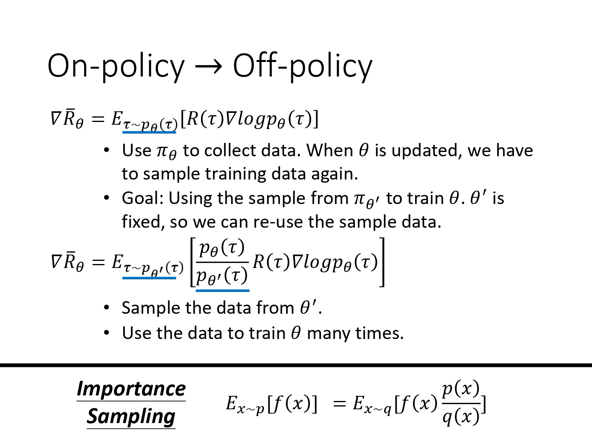

现在要做的事情就是把 importance sampling 用在 off-policy 的 case。把 on-policy training 的 algorithm 改成 off-policy training 的 algorithm。怎么改呢，之前我们是拿 $\theta$ 这个 policy 去跟环境做互动，sample 出 trajectory $\tau$，然后计算 $R(\tau) \nabla \log p_{\theta}(\tau)$。

现在我们不用 $\theta$ 去跟环境做互动，假设有另外一个 policy  $\theta'$，它就是另外一个actor。它的工作是他要去做demonstration，$\theta'$ 的工作是要去示范给$\theta$ 看。它去跟环境做互动，告诉 $\theta$ 说，它跟环境做互动会发生什么事。然后，借此来训练$\theta$。我们要训练的是 $\theta$ ，$\theta'$  只是负责做 demo，负责跟环境做互动。

我们现在的 $\tau$ 是从 $\theta'$ sample 出来的，是拿 $\theta'$ 去跟环境做互动。所以 sample 出来的 $\tau$ 是从 $\theta'$ sample 出来的，这两个distribution 不一样。但没有关系，假设你本来是从 p 做 sample，但你发现你不能够从 p 做sample，所以我们不拿$\theta$ 去跟环境做互动。你可以把 p 换 q，然后在后面这边补上一个 importance weight。现在的状况就是一样，把 $\theta$ 换成 $\theta'$ 后，要补上一个importance weight $\frac{p_{\theta}(\tau)}{p_{\theta^{\prime}}(\tau)}$。这个 importance weight 就是某一个 trajectory $\tau$ 用 $\theta$ 算出来的概率除以这个 trajectory $\tau$，用 $\theta'$ 算出来的概率。这一项是很重要的，因为今天你要 learn 的是 actor $\theta$ 和 $\theta'$ 是不太一样的。$\theta'$ 会见到的情形跟 $\theta$ 见到的情形不见得是一样的，所以中间要做一个修正的项。

Q: 现在的 data 是从 $\theta'$ sample 出来的，从 $\theta$ 换成 $\theta'$ 有什么好处呢？

A: 因为现在跟环境做互动是 $\theta'$ 而不是 $\theta$。所以 sample 出来的东西跟 $\theta$ 本身是没有关系的。所以你就可以让 $\theta'$ 做互动 sample 一大堆的 data，$\theta$ 可以 update 参数很多次，一直到 $\theta$  train 到一定的程度，update 很多次以后，$\theta'$ 再重新去做 sample，这就是 on-policy 换成 off-policy 的妙用。

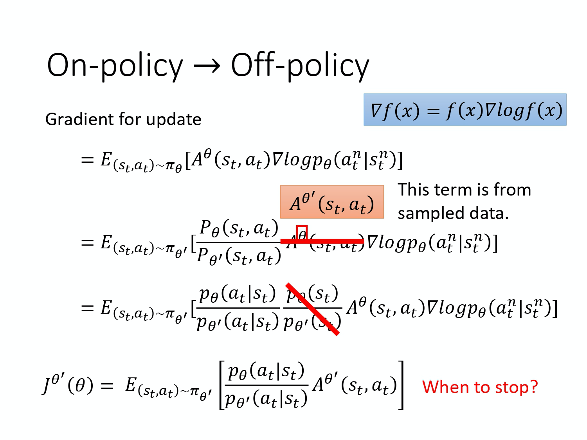

实际在做 policy gradient 的时候，我们并不是给整个 trajectory $\tau$ 都一样的分数，而是每一个 state-action 的 pair 会分开来计算。实际上 update gradient 的时候，我们的式子是长这样子的。
$$
=E_{\left(s_{t}, a_{t}\right) \sim \pi_{\theta}}\left[A^{\theta}\left(s_{t}, a_{t}\right) \nabla \log p_{\theta}\left(a_{t}^{n} | s_{t}^{n}\right)\right]
$$

我们用 $\theta$ 这个 actor 去 sample 出 $s_t$ 跟 $a_t$，sample 出 state 跟 action 的 pair，我们会计算这个 state 跟 action pair 它的 advantage， 就是它有多好。$A^{\theta}\left(s_{t}, a_{t}\right)$就是 accumulated 的 reward 减掉 bias，这一项就是估测出来的。它要估测的是，在 state $s_t$ 采取 action $a_t$ 是好的，还是不好的。那接下来后面会乘上$\nabla \log p_{\theta}\left(a_{t}^{n} | s_{t}^{n}\right)$，也就是说如果$A^{\theta}\left(s_{t}, a_{t}\right)$是正的，就要增加概率， 如果是负的，就要减少概率。

那现在用了 importance sampling 的技术把 on-policy 变成 off-policy，就从 $\theta$ 变成 $\theta'$。所以现在$s_t$、$a_t$ 是$\theta'$ ，另外一个actor 跟环境互动以后所 sample 到的data。 但是拿来训练要调整参数是 model $\theta$。因为 $\theta'$  跟 $\theta$ 是不同的 model，所以你要做一个修正的项。这项修正的项，就是用 importance sampling 的技术，把 $s_t$、$a_t$ 用 $\theta$ sample 出来的概率除掉$s_t$、$a_t$  用 $\theta'$  sample 出来的概率。

$$
=E_{\left(s_{t}, a_{t}\right) \sim \pi_{\theta^{\prime}}}\left[\frac{P_{\theta}\left(s_{t}, a_{t}\right)}{P_{\theta^{\prime}}\left(s_{t}, a_{t}\right)} A^{\theta}\left(s_{t}, a_{t}\right) \nabla \log p_{\theta}\left(a_{t}^{n} | s_{t}^{n}\right)\right]
$$

这边 $A^{\theta}(s_t,a_t)$ 有一个上标 $\theta$，$\theta$  代表说这个是 actor $\theta$ 跟环境互动的时候所计算出来的 A。但是实际上从 $\theta$ 换到 $\theta'$  的时候，$A^{\theta}(s_t,a_t)$ 应该改成 $A^{\theta'}(s_t,a_t)$，为什么？A 这一项是想要估测说现在在某一个 state 采取某一个 action，接下来会得到 accumulated reward 的值减掉 base line 。你怎么估 A 这一项，你就会看在 state $s_t$，采取 action $a_t$，接下来会得到的 reward 的总和，再减掉 baseline。之前是 $\theta$ 在跟环境做互动，所以你观察到的是 $\theta$ 可以得到的 reward。但现在是 $\theta'$  在跟环境做互动，所以你得到的这个 advantage， 其实是根据 $\theta'$  所 estimate 出来的 advantage。但我们现在先不要管那么多， 我们就假设这两项可能是差不多的。

那接下来，我们可以拆解 $p_{\theta}\left(s_{t}, a_{t}\right)$ 和 $p_{\theta'}\left(s_{t}, a_{t}\right)$，即
$$
\begin{aligned}
p_{\theta}\left(s_{t}, a_{t}\right)&=p_{\theta}\left(a_{t}|s_{t}\right) p_{\theta}(s_t) \\
p_{\theta'}\left(s_{t}, a_{t}\right)&=p_{\theta'}\left(a_{t}|s_{t}\right) p_{\theta'}(s_t) 
\end{aligned}
$$
于是我们得到下式：
$$
=E_{\left(s_{t}, a_{t}\right) \sim \pi_{\theta^{\prime}}}\left[\frac{p_{\theta}\left(a_{t} | s_{t}\right)}{p_{\theta^{\prime}}\left(a_{t} | s_{t}\right)} \frac{p_{\theta}\left(s_{t}\right)}{p_{\theta^{\prime}}\left(s_{t}\right)} A^{\theta^{\prime}}\left(s_{t}, a_{t}\right) \nabla \log p_{\theta}\left(a_{t}^{n} | s_{t}^{n}\right)\right]
$$

然后这边需要做一件事情是，假设 model 是 $\theta$ 的时候，你看到$s_t$ 的概率，跟 model 是$\theta'$  的时候，你看到$s_t$ 的概率是差不多的，即$p_{\theta}(s_t)=p_{\theta'}(s_t)$。因为它们是一样的，所以你可以把它删掉，即
$$
=E_{\left(s_{t}, a_{t}\right) \sim \pi_{\theta^{\prime}}}\left[\frac{p_{\theta}\left(a_{t} | s_{t}\right)}{p_{\theta^{\prime}}\left(a_{t} | s_{t}\right)} A^{\theta^{\prime}}\left(s_{t}, a_{t}\right) \nabla \log p_{\theta}\left(a_{t}^{n} | s_{t}^{n}\right)\right]  \tag{1}
$$

为什么可以假设它是差不多的。举例来说，会看到什么 state 往往跟你会采取什么样的action 是没有太大的关系的。比如说你玩不同的 Atari 的游戏，其实你看到的游戏画面都是差不多的，所以也许不同的 $\theta$  对 $s_t$ 是没有影响的。但是有一个更直觉的理由就是这一项到时候真的要你算，你会算吗？因为想想看这项要怎么算，这一项你还要说我有一个参数$\theta$，然后拿$\theta$ 去跟环境做互动，算$s_t$ 出现的概率，这个你根本很难算。尤其是你如果 input 是image 的话， 同样的 $s_t$ 根本就不会出现第二次。你根本没有办法估这一项， 所以干脆就无视这个问题。

但是 $p_{\theta}(a_t|s_t)$很好算。你手上有 $\theta$ 这个参数，它就是个 network。你就把$s_t$ 带进去，$s_t$ 就是游戏画面，你把游戏画面带进去，它就会告诉你某一个 state 的 $a_t$ 概率是多少。我们其实有个  policy 的 network，把 $s_t$ 带进去，它会告诉我们每一个 $a_t$ 的概率是多少。所以 $\frac{p_{\theta}\left(a_{t} | s_{t}\right)}{p_{\theta^{\prime}}\left(a_{t} | s_{t}\right)}$ 这一项，你只要知道$\theta$ 和 $\theta'$ 的参数就可以算。

现在我们得到一个新的objective function。

$$
J^{\theta^{\prime}}(\theta)=E_{\left(s_{t}, a_{t}\right) \sim \pi_{\theta^{\prime}}}\left[\frac{p_{\theta}\left(a_{t} | s_{t}\right)}{p_{\theta^{\prime}}\left(a_{t} | s_{t}\right)} A^{\theta^{\prime}}\left(s_{t}, a_{t}\right)\right]
$$

式(1)是 gradient，其实我们可以从 gradient 去反推原来的 objective function。这边有一个公式

$$
\nabla f(x)=f(x) \nabla \log f(x)
$$

我们可以用这个公式来反推 objective  function，要注意一点，对 $\theta$ 求梯度时，$p_{\theta^{\prime}}(a_{t} | s_{t})$ 和 $A^{\theta^{\prime}}\left(s_{t}, a_{t}\right)$ 都是常数。

所以实际上，当我们 apply importance sampling 的时候，要去 optimize 的那一个 objective function 就长这样子，我们把它写作 $J^{\theta^{\prime}}(\theta)$。为什么写成 $J^{\theta^{\prime}}(\theta)$ 呢，这个括号里面那个 $\theta$ 代表我们要去 optimize 的那个参数。$\theta'$  是说我们拿 $\theta'$  去做 demonstration，就是现在真正在跟环境互动的是 $\theta'$。因为 $\theta$ 不跟环境做互动，是 $\theta'$  在跟环境互动。

然后你用 $\theta'$  去跟环境做互动，sample 出 $s_t$、$a_t$ 以后，你要去计算 $s_t$ 跟 $a_t$ 的 advantage，然后你再去把它乘上 $\frac{p_{\theta}\left(a_{t} | s_{t}\right)}{p_{\theta^{\prime}}\left(a_{t} | s_{t}\right)}$。$\frac{p_{\theta}\left(a_{t} | s_{t}\right)}{p_{\theta^{\prime}}\left(a_{t} | s_{t}\right)}$ 是好算的，$A^{\theta^{\prime}}\left(s_{t}, a_{t}\right)$ 可以从这个 sample 的结果里面去估测出来的，所以 $J^{\theta^{\prime}}(\theta)$ 是可以算的。实际上在 update 参数的时候，就是按照式(1) 来 update 参数。

## PPO

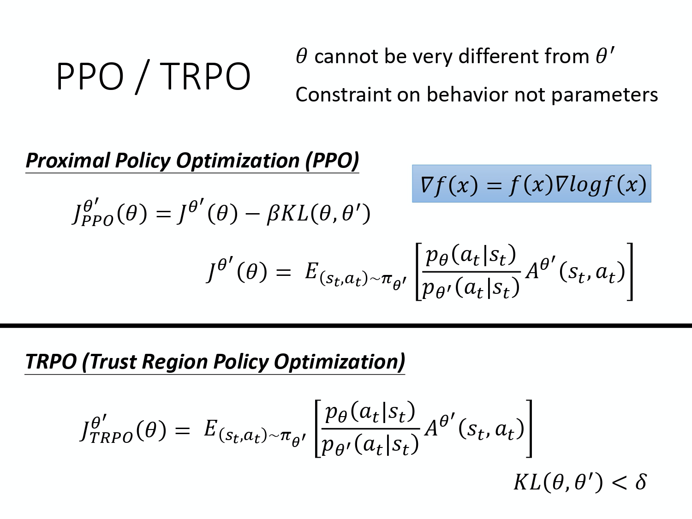

我们可以把 on-policy 换成 off-policy，但 importance sampling 有一个 issue，如果 $p_{\theta}\left(a_{t} | s_{t}\right)$ 跟 $p_{\theta'}\left(a_{t} | s_{t}\right)$ 差太多的话，这两个 distribution 差太多的话，importance sampling 的结果就会不好。怎么避免它差太多呢？这个就是 `Proximal Policy Optimization (PPO) ` 在做的事情。它实际上做的事情就是这样，在 off-policy 的方法里要 optimize 的是 $J^{\theta^{\prime}}(\theta)$。但是这个 objective function 又牵涉到 importance sampling。在做 importance sampling 的时候，$p_{\theta}\left(a_{t} | s_{t}\right)$ 不能跟 $p_{\theta'}\left(a_{t} | s_{t}\right)$差太多。你做 demonstration 的 model 不能够跟真正的 model 差太多，差太多的话 importance sampling 的结果就会不好。我们在 training 的时候，多加一个 constrain。这个 constrain 是 $\theta$  跟 $\theta'$  output 的 action 的 KL divergence，简单来说，这一项的意思就是要衡量说 $\theta$ 跟 $\theta'$  有多像。

然后我们希望在 training 的过程中，learn 出来的 $\theta$ 跟 $\theta'$  越像越好。因为如果 $\theta$ 跟 $\theta'$ 不像的话，最后的结果就会不好。所以在 PPO 里面有两个式子，一方面是 optimize 本来要 optimize 的东西，但再加一个 constrain。这个 constrain 就好像那个 regularization 的 term 一样，在做 machine learning 的时候不是有 L1/L2 的 regularization。这一项也很像 regularization，这样 regularization 做的事情就是希望最后 learn 出来的 $\theta$ 不要跟 $\theta'$ 太不一样。

PPO 有一个前身叫做 TRPO，TRPO 的式子如下式所示。
$$
\begin{aligned}
J_{T R P O}^{\theta^{\prime}}(\theta)=E_{\left(s_{t}, a_{t}\right) \sim \pi_{\theta^{\prime}}}\left[\frac{p_{\theta}\left(a_{t} | s_{t}\right)}{p_{\theta^{\prime}}\left(a_{t} | s_{t}\right)} A^{\theta^{\prime}}\left(s_{t}, a_{t}\right)\right] \\ \\
\mathrm{KL}\left(\theta, \theta^{\prime}\right)<\delta
\end{aligned}
$$

它与 PPO 不一样的地方 是 constrain 摆的位置不一样，PPO是直接把 constrain 放到你要 optimize 的那个式子里面，然后你就可以用 gradient ascent 的方法去 maximize 这个式子。但 TRPO 是把 KL divergence 当作 constrain，它希望 $\theta$ 跟 $\theta'$ 的 KL divergence 小于一个$\delta$。如果你是用 gradient based optimization 时，有 constrain 是很难处理的。

PPO 是很难处理的，因为它是把 KL divergence constrain 当做一个额外的 constrain，没有放 objective 里面，所以它很难算。所以不想搬石头砸自己的脚的话， 你就用 PPO 不要用 TRPO。看文献上的结果是，PPO 跟 TRPO 可能 performance 差不多，但 PPO 在实现上比 TRPO 容易的多。

Q: KL divergence 到底指的是什么？

A: 这边我是直接把 KL divergence 当做一个 function，input 是 $\theta$ 跟 $\theta'$，但我的意思并不是说把 $\theta$ 或 $\theta'$  当做一个distribution，算这两个distribution 之间的距离，我不是这个意思。所谓的 $\theta$ 跟 $\theta'$  的距离并不是参数上的距离，而是 behavior 上的距离。

假设你有一个 model，有一个 actor 它是 $\theta$，你有另外一个 actor 的参数是 $\theta'$ ，所谓参数上的距离就是你算这两组参数有多像。我今天所讲的不是参数上的距离， 而是它们行为上的距离。就是你先带进去一个 state s，它会对这个 action 的 space output 一个 distribution。假设你有 3 个 actions，3 个可能的 actions 就 output 3 个值。那今天所指的 distance 是 behavior distance。也就是说，给同样的 state 的时候，输出 action 之间的差距。这两个 actions 的 distribution 都是一个概率分布。所以就可以计算这两个概率分布的 KL divergence。把不同的 state output 的这两个 distribution 的 KL divergence 平均起来才是我这边所指的两个 actor 间的 KL divergence。你可能说怎么不直接算这个 $\theta$ 或 $\theta'$ 之间的距离，甚至不要用 KL divergence 算，L1 跟 L2 的 norm 也可以保证 $\theta$ 跟 $\theta'$ 很接近。在做 reinforcement learning 的时候，之所以我们考虑的不是参数上的距离，而是 action 上的距离，是因为很有可能对 actor 来说，参数的变化跟 action 的变化不一定是完全一致的。有时候你参数小小变了一下，它可能 output 的行为就差很多。或是参数变很多，但 output 的行为可能没什么改变。**所以我们真正在意的是这个actor 的行为上的差距，而不是它们参数上的差距。**所以在做 PPO 的时候，所谓的 KL divergence 并不是参数的距离，而是 action 的距离。

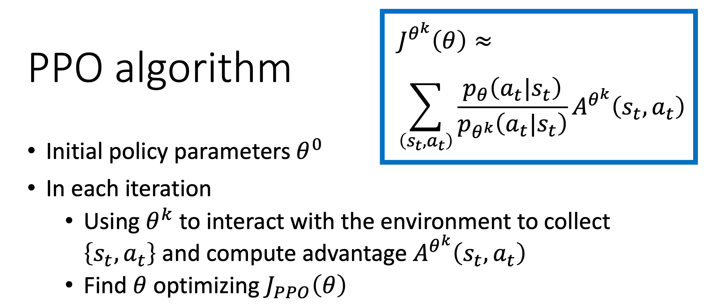

我们来看一下 `PPO1` 的 algorithm。它先 initial 一个 policy 的参数$\theta^0$。然后在每一个 iteration 里面呢，你要用参数$\theta^k$，$\theta^k$ 就是你在前一个 training 的 iteration得到的 actor 的参数，你用 $\theta^k$ 去跟环境做互动，sample 到一大堆 state-action 的pair。

然后你根据 $\theta^k$ 互动的结果，估测一下$A^{\theta^{k}}\left(s_{t}, a_{t}\right)$。然后你就 apply PPO 的 optimization 的 formulation。但跟原来的policy gradient 不一样，原来的 policy gradient 只能 update 一次参数，update 完以后，你就要重新 sample data。但是现在不用，你拿 $\theta^k$ 去跟环境做互动，sample 到这组 data 以后，你可以让 $\theta$ update 很多次，想办法去 maximize objective function。这边 $\theta$ update 很多次没有关系，因为我们已经有做 importance sampling，所以这些experience，这些 state-action 的 pair 是从 $\theta^k$ sample 出来的没有关系。$\theta$ 可以 update 很多次，它跟 $\theta^k$ 变得不太一样也没有关系，你还是可以照样训练 $\theta$。

在 PPO 的 paper 里面还有一个 `adaptive KL divergence`，这边会遇到一个问题就是 $\beta$  要设多少，它就跟那个regularization 一样。regularization 前面也要乘一个weight，所以这个 KL divergence 前面也要乘一个 weight，但 $\beta$  要设多少呢？所以有个动态调整 $\beta$ 的方法。在这个方法里面呢，你先设一个 KL divergence，你可以接受的最大值。然后假设你发现说你 optimize 完这个式子以后，KL divergence 的项太大，那就代表说后面这个 penalize 的 term 没有发挥作用，那就把 $\beta$ 调大。那另外你定一个 KL divergence 的最小值。如果发现 optimize 完上面这个式子以后，KL divergence 比最小值还要小，那代表后面这一项的效果太强了，你怕他只弄后面这一项，那 $\theta$ 跟 $\theta^k$ 都一样，这不是你要的，所以你这个时候你叫要减少 $\beta$。所以 $\beta$ 是可以动态调整的。这个叫做 `adaptive KL penalty`。

如果你觉得算 KL divergence 很复杂。有一个`PPO2`。PPO2 要去 maximize 的 objective function 如下式所示，它的式子里面就没有 KL divergence 。
$$
\begin{aligned}
J_{P P O 2}^{\theta^{k}}(\theta) \approx \sum_{\left(s_{t}, a_{t}\right)} \min &\left(\frac{p_{\theta}\left(a_{t} | s_{t}\right)}{p_{\theta^{k}}\left(a_{t} | s_{t}\right)} A^{\theta^{k}}\left(s_{t}, a_{t}\right),\right.\\
&\left.\operatorname{clip}\left(\frac{p_{\theta}\left(a_{t} | s_{t}\right)}{p_{\theta^{k}}\left(a_{t} | s_{t}\right)}, 1-\varepsilon, 1+\varepsilon\right) A^{\theta^{k}}\left(s_{t}, a_{t}\right)\right)
\end{aligned}
$$
这个式子看起来有点复杂，但实际 implement 就很简单。我们来实际看一下说这个式子到底是什么意思。
min 这个 operator 做的事情是第一项跟第二项里面选比较小的那个。第二项前面有个 clip function，clip 这个 function 的意思是说，在括号里面有 3 项，如果第一项小于第二项的话，那就 output $1-\varepsilon$ 。第一项如果大于第三项的话，那就output $1+\varepsilon$。 $\varepsilon$ 是一个 hyper parameter，你要 tune 的，你可以设成 0.1 或 设 0.2 。
假设这边设 0.2 的话，如下式所示
$$
\operatorname{clip}\left(\frac{p_{\theta}\left(a_{t} | s_{t}\right)}{p_{\theta^{k}}\left(a_{t} | s_{t}\right)}, 0.8, 1.2\right)
$$

如果$\frac{p_{\theta}\left(a_{t} | s_{t}\right)}{p_{\theta^{k}}\left(a_{t} | s_{t}\right)}$算出来小于 0.8，那就当作 0.8。如果算出来大于 1.2，那就当作1.2。

我们先看一下下面这项这个算出来到底是什么的东西。
$$
\operatorname{clip}\left(\frac{p_{\theta}\left(a_{t} | s_{t}\right)}{p_{\theta^{k}}\left(a_{t} | s_{t}\right)}, 1-\varepsilon, 1+\varepsilon\right)
$$

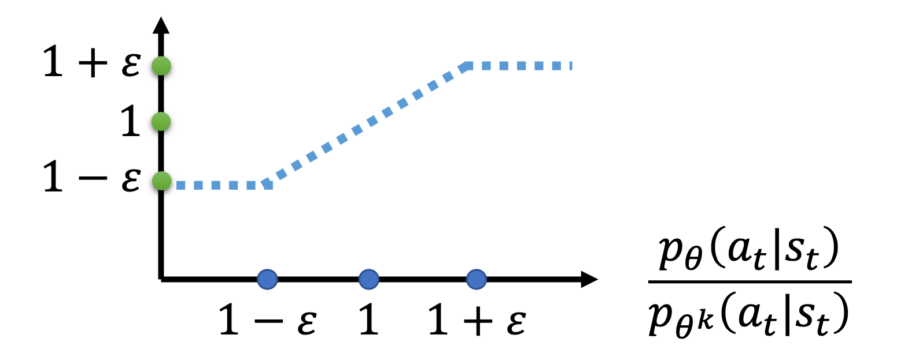

上图的横轴是 $\frac{p_{\theta}\left(a_{t} | s_{t}\right)}{p_{\theta^{k}}\left(a_{t} | s_{t}\right)}$，纵轴是 clip function 实际的输出。

* 如果 $\frac{p_{\theta}\left(a_{t} | s_{t}\right)}{p_{\theta^{k}}\left(a_{t} | s_{t}\right)}$ 大于$1+\varepsilon$，输出就是 $1+\varepsilon$。
* 如果小于 $1-\varepsilon$， 它输出就是 $1-\varepsilon$。
* 如果介于 $1+\varepsilon$ 跟 $1-\varepsilon$ 之间， 就是输入等于输出。

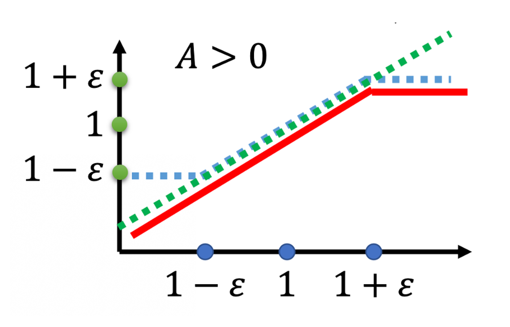

*  $\frac{p_{\theta}\left(a_{t} | s_{t}\right)}{p_{\theta^{k}}\left(a_{t} | s_{t}\right)}$ 是绿色的线；
* $\operatorname{clip}\left(\frac{p_{\theta}\left(a_{t} | s_{t}\right)}{p_{\theta^{k}}\left(a_{t} | s_{t}\right)}, 1-\varepsilon, 1+\varepsilon\right)$ 是蓝色的线；
* 在绿色的线跟蓝色的线中间，我们要取一个最小的。假设前面乘上的这个 term A，它是大于0 的话，取最小的结果，就是红色的这一条线。

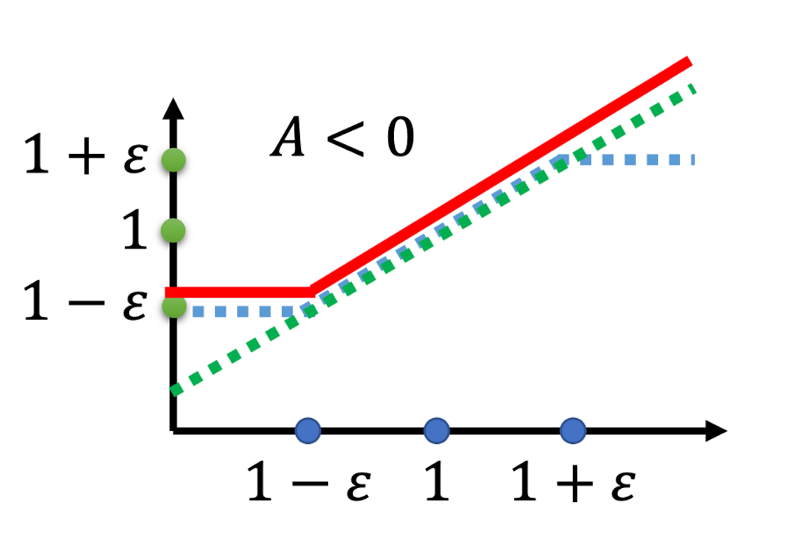

如果 A 小于0 的话，取最小的以后，就得到红色的这一条线。
这一个式子虽然看起来有点复杂，实现起来是蛮简单的，因为这个式子想要做的事情就是希望 $p_{\theta}(a_{t} | s_{t})$ 跟$p_{\theta^k}(a_{t} | s_{t})$，也就是你拿来做 demonstration 的那个model， 跟你实际上 learn 的 model，在 optimize 以后不要差距太大。那你要怎么让它做到不要差距太大呢？

如果 A 大于 0，也就是某一个 state-action 的pair 是好的。那我们希望增加这个 state-action pair 的概率。也就是说，我们想要让  $p_{\theta}(a_{t} | s_{t})$ 越大越好，但它跟 $p_{\theta^k}(a_{t} | s_{t})$ 的比值不可以超过 $1+\varepsilon$。如果超过 $1+\varepsilon$  的话，就没有 benefit 了。红色的线就是我们的 objective function，我们希望 objective 越大越好，我们希望 $p_{\theta}(a_{t} | s_{t})$ 越大越好。但是$\frac{p_{\theta}\left(a_{t} | s_{t}\right)}{p_{\theta^{k}}\left(a_{t} | s_{t}\right)}$只要大过 $1+\varepsilon$，就没有 benefit 了。

所以今天在 train 的时候，当 $p_{\theta}(a_{t} | s_{t})$ 被 train 到 $\frac{p_{\theta}\left(a_{t} | s_{t}\right)}{p_{\theta^{k}}\left(a_{t} | s_{t}\right)}$大于 $1+\varepsilon$ 时，它就会停止。

假设 $p_{\theta}(a_{t} | s_{t})$  比 $p_{\theta^k}(a_{t} | s_{t})$ 还要小，那我们的目标是要让 $p_{\theta}(a_{t} | s_{t})$ 越大越好。

* 假设这个 advantage 是正的，我们希望 $p_{\theta}(a_{t} | s_{t})$ 越大越好。假设这个 action 是好的，我们当然希望这个 action 被采取的概率越大越好。所以假设 $p_{\theta}(a_{t} | s_{t})$ 还比 $p_{\theta^k}(a_{t} | s_{t})$  小，那就尽量把它挪大，但只要大到 $1+\varepsilon$ 就好。
* 负的时候也是一样，如果某一个 state-action pair 是不好的，我们希望把 $p_{\theta}(a_{t} | s_{t})$ 减小。如果 $p_{\theta}(a_{t} | s_{t})$ 比$p_{\theta^k}(a_{t} | s_{t})$  还大，那你就尽量把它压小，压到$\frac{p_{\theta}\left(a_{t} | s_{t}\right)}{p_{\theta^{k}}\left(a_{t} | s_{t}\right)}$是$1-\epsilon$ 的时候就停了，就不要再压得更小。

这样的好处就是， 你不会让 $p_{\theta}(a_{t} | s_{t})$ 跟 $p_{\theta^k}(a_{t} | s_{t})$ 差距太大。要 implement 这个东西，很简单。

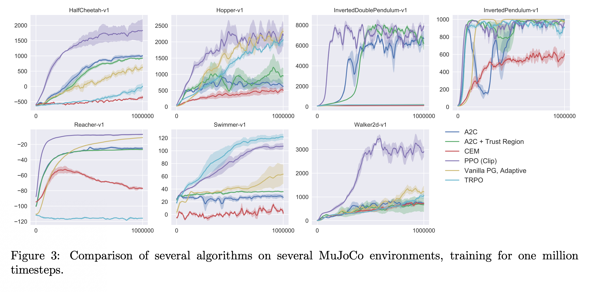
上图是 PPO 跟其它方法的比较。Actor-Critic 和 A2C+Trust Region 方法是 actor-critic based 的方法。PPO 是紫色线的方法，这边每张图就是某一个 RL 的任务，你会发现说在多数的 cases 里面，PPO 都是不错的，不是最好的，就是第二好的。

