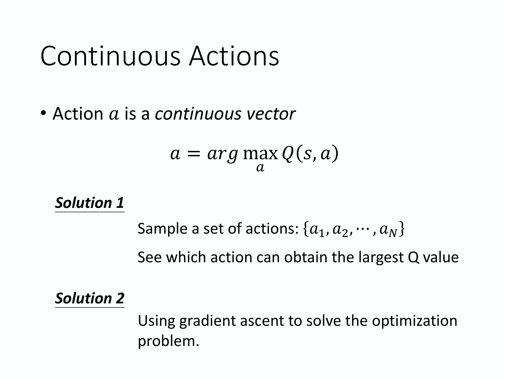
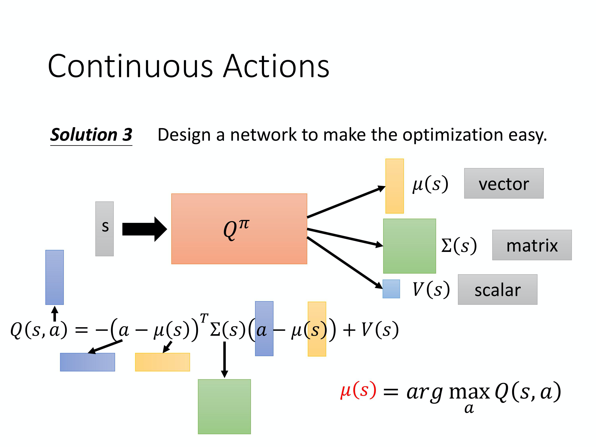
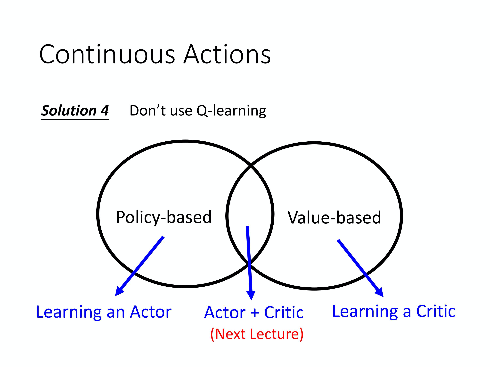

# Q-learning for Continuous Actions

继续讲一下 Q-learning，其实跟 policy gradient based 方法比起来，Q-learning 其实是比较稳的。policy gradient 其实是没有太多游戏是玩得起来的。policy gradient 其实比较不稳，尤其在没有 PPO 之前，你很难用 policy gradient 做什么事情。Q-learning 相对而言是比较稳的。最早 deepmind 的 paper 拿 deep reinforcement learning 来玩 Atari 的游戏，用的就是 Q-learning。那我觉得 Q-learning 比较容易 train 的一个理由是：在 Q-learning 里面，你只要能够 estimate 出Q-function，就保证你一定可以找到一个比较好的 policy。也就是你只要能够 estimate 出 Q-function，就保证你可以 improve 你的 policy。而 estimate Q-function 这件事情，是比较容易的，为什么？因为它就是一个 regression 的 problem。在这个 regression 的 problem 里面， 你可以轻易地知道说，你现在的 model learn 的是不是越来越好，你只要看那个 regression 的 loss 有没有下降，你就知道说你的 model learn 的好不好。所以 estimate Q-function 相较于 learn 一个 policy 是比较容易的。你只要 estimate Q-function，就可以保证说现在一定会得到比较好的 policy。

所以一般而言 Q-learning 是比较容易操作。那 Q-learning 有什么问题呢？最大的问题是它不太容易处理 continuous action，很多时候你的 action 是 continuous 的。什么时候你的 action 会是 continuous 的呢？我们玩 Atari 的游戏，你的 agent 只需要决定比如说上下左右，这种 action 是 discrete 的。那很多时候你的 action 是 continuous 的。举例来说假设你的 agent 要做的事情是开自驾车，它要决定说它方向盘要左转几度， 右转几度，这是 continuous 的。假设你的 agent 是一个机器人，假设它身上有 50 个 关节，它的每一个 action 就对应到它身上的这 50 个关节的角度。而那些角度也是 continuous 的。所以很多时候你的 action，并不是一个 discrete 的东西，它是一个 vector，这个 vector 里面，它的每一个 dimension 都有一个对应的 value，都是 real number，它是 continuous 的。

假设 action 是 continuous 的，做 Q-learning 就会有困难。因为在做 Q-learning 里面一个很重要的一步是你要能够解这个 optimization 的 problem。你 estimate 出Q-function $Q(s,a)$ 以后,必须要找到一个 a，它可以让 $Q(s,a)$ 最大。假设 a 是 discrete 的，那 a 的可能性都是有限的。举例来说，Atari 的小游戏里面，a 就是上下左右跟开火，它是有限的，你可以把每一个可能的 action 都带到 Q 里面算它的 Q value。但假如 a 是 continuous 的，你无法穷举所有可能 continuous action，试试看哪一个 continuous action 可以让 Q 的 value 最大。所以怎么办呢？在概念上，我们就是要能够解这个问题。怎么解这个问题呢？就有各种不同的 solution。

第一个 solution 是假设你不知道怎么解这个问题，因为 a 是很多的，a 是没有办法穷举的。怎么办？用 sample 的。Sample 出 N 个 可能的 a，一个一个带到 Q-function 里面，看谁最快？这个方法其实也不会太不 efficient， 因为你真的在运算的时候，你会用 GPU，所以你一次会把 N 个 continuous action都丢到 Q-function 里面，一次得到 N 个 Q value，然后看谁最大。当然这个不是一个 非常精确的做法，因为你真的没有办法做太多的 sample， 所以你 estimate 出来的 Q value，你最后决定的 action 可能不是非常的精确， 这是第一个 solution。

第二个 solution 是什么呢？既然要解的是一个 optimization problem，其实是要 maximize objective function，要 maximize 一个东西， 就可以用 gradient ascent。你就把 a 当作是 parameter，然后你要找一组 a 去 maximize 你的 Q-function，你就用 gradient ascent 去 update a 的 value，最后看看你能不能找到一个 a 去 maximize 你的 Q-function，也就是你的 objective function。当然这样子你会遇到的问题，就是 global maximum 的问题， 就不见得能够真的找到 optimal 的结果，而且这个运算量显然很大， 因为你要迭代地 update a。我们 train 一个 network 就很花时间了。如果你用 gradient ascent 的方法来处理 continuous 的 problem， 等于是你每次要决定要 take 哪一个 action 的时候，你都还要做一次 train network 的 process，显然运算量是很大的。这是第二个 solution。

第三个 solution 是特别 design 一个 network 的架构，特别 design 你的 Q-function，使得解那个 arg max 的 problem 变得非常容易。也就是这边的 Q-function 不是一个 general 的 Q-function，特别设计一下它的样子，让你要找让这个 Q-function 最大的 a 的时候非常容易。这边是一个例子，这边有我们的 Q-function，然后这个 Q-function 它的做法是这样。

* Input state s，通常它就是一个 image，可以用一个向量或一个 matrix 来表示。
* Input 这个 s，这个 Q-function 会 output 3 个东西。它会 output $\mu(s)$，这是一个 vector。它会 output $\Sigma(s)$ ，这是一个 matrix。它会 output $V(s)$，是一个 scalar。
* output 这 3 个东西以后， 我们知道 Q-function 其实是吃一个 s 跟 a，然后决定一个 value。Q-function 意思是说在某一个 state，take 某一个 action 的时候，你 expected 的 reward 有多大。到目前为止这个 Q-function 只吃 s，它还没有吃 a 进来，a 在那里呢，当这个 Q-function 吐出 $\mu$、 $\Sigma$ 跟 $V$ 的时候，我们才把 s 引入，用 a 跟 $\mu(s)、\Sigma(s)、V$  互相作用一下，你才算出最终的 Q value。

* a 怎么和这 3 个东西互相作用呢？实际上 $Q(s,a)$，你的 Q-function 的运作方式是先 input s，让你得到 $\mu,\Sigma$ 跟 V。然后再 input a，然后接下来把 a 跟 $\mu$ 相减。注意一下 a 现在是 continuous 的 action，所以它也是一个 vector，假设你现在是要操作机器人的话，这个 vector 的每一个 dimension，可能就对应到机器人的某一个关节，它的数值就是那关节的角度，所以 a 是一个 vector。把 a 的这个 vector减掉 $\mu$ 的这个 vector，取 transpose，所以它是一个横的 vector。$\Sigma$ 是一个 matrix。然后 a 减掉 $\mu(s)$ ，a 和 $\mu(s)$ 都是 vector，减掉以后还是一个竖的 vector。所以 $-(a-\mu(s))^{T} \Sigma(s)(a-\mu(s))+V(s)$ 是一个 scalar，这一个数值就是你的 Q value $Q(s,a)$，。

* 假设 $Q(s,a)$ 定义成这个样子，我们要怎么找到一个 a 去 maximize 这个 Q value 呢？其实这个 solution 非常简单，什么样的 a， 可以让这一个 Q-function 最终的值最大呢？。因为 $(a-\mu(s))^{T} \Sigma(s)(a-\mu(s))$ 一定是正的，它前面乘上一个负号，所以第一项就假设我们不要看这个负号的话，第一项这个值越小，你最终的这个 Q value 就越大。因为我们是把 V(s) 减掉第一项，所以第一项的值越小，最后的 Q value 就越大。怎么让第一项的值最小呢？你直接把 a 带 $\mu$，让它变成 0，就会让第一项的值最小。

* $\Sigma$ 一定是正定的。因为你知道这个东西就像是那个 Gaussian distribution，所以 $\mu$ 就是 Gaussian 的 mean，$\Sigma$ 就是 Gaussian 的 variance。但 variance 是一个 positive definite 的 matrix，怎么样让这个 $\Sigma$ 一定是 positive definite 的 matrix 呢？其实在 $Q^{\pi}$ 里面，它不是直接 output $\Sigma$，如果直接 output 一个 $\Sigma$， 它不一定是 positive definite 的 matrix。它其实是 output 一个 matrix，然后再把那个 matrix 跟另外一个 matrix 做 transpose 相乘， 然后可以确保 $\Sigma $ 是 positive definite 的。这边要强调的点就是说，实际上它不是直接 output 一个 matrix，你再去那个 paper 里面 check 一下它的 trick，它可以保证说 $\Sigma$ 是 positive definite 的。
* 你把 a 带 $\mu(s)$ 以后呢，你可以让 Q 的值最大。所以今天假设要你 arg max 这个东西，虽然 in general 而言，若 Q 是一个 general function， 你很难算，但是我们这边 design 了 Q 这个 function，a 只要设 $\mu(s)$，我们就得到 maximum 的 value。你在解这个 arg max 的 problem 的时候就变得非常容易。所以 Q-learning 也可以用在 continuous 的 case，只是就是有一些局限，就是你的 function 就是不能够随便乱设，它必须有一些限制。 

第 4 招就是不要用 Q-learning。用 Q-learning 处理 continuous 的 action 还是比较麻烦。

我们讲了 policy based 的方法 PPO ，讲了 value based 的方法 Q-learning。这两者其实是可以结合在一起的， 也就是 Actor-Critic 的方法。